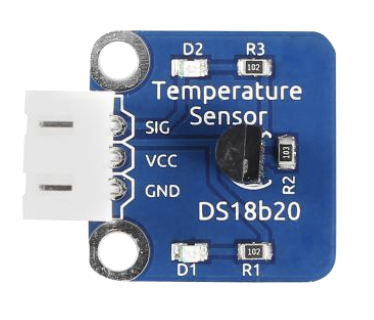

### Cybersecurity First Principles in this lesson

* __Abstraction__: An abstraction is a representation of an object or concept. It could be something such as a door, a speedometer, or a data structure in computer science. Abstraction decouples the design from the implementation. The gauges in an automobile are an abstraction of the performance of a car. A map is an abstraction of the earth.

* __Data Hiding__: Data hiding is the technique that does not allow certain aspects of an object to be observed or accessed. Data and information hiding keeps the programmer from having complete access to data structures. It allows access to only what is necessary.

* __Minimization__: Minimization refers to having the least functionality necessary in a program or device. The goal of minimization is to simplify and decrease the number of ways that software can be exploited. This can include **turning off ports that are not needed**, reducing the amount of code running on a machine, and/or turning off unneeded features in an application.

* __Modularization__: The concept of modularity is like building blocks. Each block (or module) can be put in or taken out from a bigger project. Each module has its own separate function that is interchangeable with other modules.

* __Resource Encapsulation__: Encapsulation is an object oriented concept where all data and functions required to use the resource are packaged into a single self-contained component. The goal is to only allow access or manipulation of the resource in the way the designer intended. An example, assume a flag pole is the object. There are fixed methods on how the flag pole is to be used. Put the flag on, take the flag off, raise or lower the flag. Nothing else can be done to the flag pole.

### Introduction and goals
In this lesson, we will learn use Raspberry PI components to build a weather station and connect it to the internet of things using IFTTT. Raspberry PI follows a _component-based design_ paradigm using _GPIO_ (or general purpose input/output) to let you easily make apps. These components also work with web services on IFTTT using the `maker webook service`.

### Goals
By the end of this tutorial, you will be able to:
* Connect components to Raspberry PI GPIO pins and configure them to work with programs.
* Build a raspberry PI weather station using a temperature sensor, barometer, and humidity sensor.
<!-- * Connect a Raspberry PI Weather station to IFTTT
* Transmit weather station data to other web services programmatically -->

### Materials Required

<!-- * A free IFTTT Account (instructions to create one in this lesson) -->
* (Raspberry PI 4 (Labists kit or equivalent))[https://www.amazon.com/LABISTS-Raspberry-Complete-Preloaded-Heatsinks/dp/B07YRSYR3M/]
* (Raspberry PI 4 touchscreen)[https://www.amazon.com/Miuzei-Raspberry-Full-Angle-Heatsinks-Raspbian/dp/B07XBVF1C9/]
* (SunFoundry sensor modules kit)https://www.amazon.com/SunFounder-Modules-Sensor-Raspberry-Extension/dp/B014PF05ZA/
* USB Keyboard and Mouse
* Power outlet nearby

### Prerequisite lessons

* [Introduction to Components with Raspberry PI](../intro_to_components/README.md)
* [Computational Thinking](../introduction_to_computational_thinking_and_design_process/README.md)
<!-- * [Web services and IFTTT](../web_services_and_ifttt/README.md) -->

### Table of Contents
<!-- TOC START min:1 max:3 link:true asterisk:false update:true -->
        - [Cybersecurity First Principles in this lesson](#cybersecurity-first-principles-in-this-lesson)
        - [Introduction and goals](#introduction-and-goals)
        - [Goals](#goals)
        - [Materials Required](#materials-required)
        - [Prerequisite lessons](#prerequisite-lessons)
        - [Table of Contents](#table-of-contents)
        - [Before We Start](#before-we-start)
        - [Design thinking, User Story, and Storyboard](#design-thinking-user-story-and-storyboard)
        - [Using a temperature component](#using-a-temperature-component)
        - [Using a barometer component](#using-a-barometer-component)
        - [Using a humidity sensor](#using-a-humidity-sensor)
        - [Connecting your weather station to IFTTT web services](#connecting-your-weather-station-to-ifttt-web-services)
        - [Self Exploration 1](#self-exploration-1)
        - [Self Exploration 2](#self-exploration-2)
        - [Cybersecurity First Principle Reflections](#cybersecurity-first-principle-reflections)
    - [Lead Author](#lead-author)
        - [Acknowledgements](#acknowledgements)
        - [License](#license)
<!-- TOC END -->


### Before We Start
In the [last raspberry pi lesson](../intro_to_components/README.md), you learned how to setup a Raspberry PI. You also learned about `GPIO` pins that can be used to hook up `modular` components to your Pi. You also learned how to follow recipes or `design patterns` to read and write data to a component.

In the [last lesson](../web_services_and_ifttt/README.md), you learned how to use `IFTTT` to create `applets` that could be used to integrate two different `web services` together. You also learned about the `maker webhook` service that allows for programmatic interaction with IFTTT. This lesson will extend these concepts to work with Raspberry PI and weather stations.

This lesson takes these to the next level. Here you will build a weather station and connects it to a web service.

### Design thinking, User Story, and Storyboard
To follow-up and reinforce the computational thinking lesson, let's contextualize the design you will be building.

Assume the following:

You will be designing a prototype solution for the following user story that was constructed by a 

You are part of a design team building a new app called `NG-Weather` (short for _Nebraska GenCyber Weather_). Other members of your team have already conducted a focus group of potential product users for the app have have determined that a key stakeholder is a type of gardener. The design team has determined that the following user story is of the highest priority. You have been tasked you with prototyping it, testing the design, and providing them with system usage data.

As a `home gardener that prides themself on always having fresh herbs`, I want to `closely monitor the micro weather of my back yard`, so that I `know when to adjust the growing conditions of my plants`.

For this user story, a designer created the following storyboard:


Your job is to prototype this story.

### Using a temperature component
To setup the temperature component, we will follow Lesson 26 in the SunFounder booklet. This lesson starts on page 135. Follow the steps provided to configure your PI to work with a digital temperature sensor. 

For simplicity, the content from their booklet is copied into this tutorial. Their content is copied consistent with their license, which allows for non-commercial use with attribution. You can find their full guide [here](https://github.com/sunfounder/SunFounder_SensorKit_for_RPi2/blob/master/docs/(EN)%20Sensor_kit_V2.0_for_Raspberry_Pi_4%20Model_B.pdf). 

Areas of their guide have also been enhanced with comments that look like this:
> example comment

These comments are meant to provide extra context or detail.

##### Introduction to the Temperature Component
Temperature Sensor DS18B20 is a commonly used digital temperature sensor featured with small size, low-cost hardware, strong anti-interference capability and high precision. The digital temperature sensor is easy to wire and can be applied a various occasions after packaging. Different from conventional AD collection temperature sensors, it uses a 1-wire bus and can directly output temperature data.



##### Required Components
- 1 * Raspberry Pi
- 1 * Breadboard
- 1 * DS18B20 Temperature Sensor module
- 1 * 3-Pin anti-reverse cable

##### Wiring Diagram
With a unique single-wire interface, DS18B20 requires only one pin for a two-way
communication with a microprocessor. It supports multi-point networking to measure
multi-point temperatures. Eight sensors can be connected at most, because it will
consume too much power supply and cause low voltage thus harming the stability of
transmission.

##### Step 1: Build the circuit
Build the circuit according to the following method.


##### Step 2: Update libraries
Update your kernel

> We need to do this, to make sure that any installed libraries are up-to-date to work with the required components 

```
sudo apt-get update
sudo apt-get upgrade
```

##### Step 3: Configure the device 
> This step requires you to find your unique temperature device code so that the program included in the SunFounder kit can recognize and connect to it correctly

Edit the config.txt file with nano.
> config.txt is a configuration file that tells your PI what to do when it boots up. The changes we are making next will tell your PI to setup the necessary drivers to handle single pin GPIO operations required for your temperature component to work properly

Type the following in a terminal:
```
sudo nano /boot/config.txt
```

Then scroll to the bottom of the file and type.

```
dtoverlay=w1-gpio
```

> this command enables 1 wire (aka w1) operations on GPIO. By default, Raspberry PI enables w1 operations on GPIO pin 4 (the one we wired our pi to in the circuit diagram above)

Then reboot with:

```
sudo reboot
```

Mount the device drivers and confirm whether the device is connected or not.

```
sudo modprobe w1-gpio
sudo modprobe w1-therm
cd /sys/bus/w1/devices/
ls
```

The result of the ls command should look like:
```
root@rasberrypi:/sys/bus/w1/devices# ls
28-00000495db35 w1_bus_master1
```

`28-00000495db35` is an external temperature sensor device id. The number you see will vary as it is the serial number of your ds18b20 temperature sensor.

##### Step 4: Test the temperature
In the terminal type:

```
cd 28-00000495db35
ls
```

The result should look like:
```
root@rasberrypi:/sys/bus/w1/devices/28-00000495db35# ls
driver id name power subsystem uevent w1_slave
```

Type:
```
cat w1_slave
```

The result should look like:
```
root@raspberrypi:/sys/bus/w1_slave/28-00000495db35# cat w1_slave
a3 01 4b 46 7f ff 0d 10 ce : crc=ce YES
a3 01 4b 46 7f ff 0d 10 ce t=26187
```

The second line `t=26187` is the current temperature value. If you want to convert it to degree Celsius, you can divide by 1000, that is, the current temperature is `26187/1000=26.187` degrees Celsius.

##### Step 5: Edit the code
Change directory and edit the program.
> Here the program is named 26_ds18b20 (the lesson number, followed by the name of the component). We need to edit the file to replace the serial number of the temperature sensor in the code with the serial number you found before. Carefully type your serial number in after typing the following:

```
cd /home/pi/SunFounder_SensorKit_for_RPi2/Python/
nano 26_ds18b20.py
```

##### Step 6: Run the temperature demo program
```
sudo python3 26_ds18b20.py
```
Now, you should see the current temperature value displayed on the screen.


> This is the end of lesson 26 in your booklet, I've included the expected output below.

##### Output
When you are done, you should be able to run your program and begin getting temperature output like this:


### Using a barometer component
Next, lets setup a barometer component. For this part, we will use lesson 31 in the SunFounder booklet (page 152). Once again, the lesson is excerpted here, with additional comments and context provided.

##### Introduction to the barometer
A `barometer` measures air pressure. The BMP180 barometer measures temperature and pressure is the new digital barometric pressure sensor, with a very high performance, which enables applications in advanced mobile devices, such as smart phones, tablets and sports devices. It complies with the BMP085 but boasts many improvements, like a smaller size and more digital interfaces.


##### Required Components
- 1 * Raspberry Pi - 1 * Breadboard
- 1 * Barometer module
- 1 * 4-Pin anti-reverse cable

##### Step 1: Build the circuit


##### Step 3: Install the system management bus driver
Install smbus for I2C.

> i2c is a type of communication protocol used for serial devices like the barometer 
```
sudo apt-get install python3-smbus i2c-tools
```
##### Step 4: Installing utilities
We'll need to install some utilities for the Raspberry Pi to communicate over I2C.
```
git clone https://github.com/adafruit/Adafruit_Python_BMP.git
cd Adafruit_Python_BMP
sudo python3 setup.py install
```
##### Step 5: Change directory.
```
cd /home/pi/SunFounder_SensorKit_for_RPi2/Python/
Step 6: Run.
sudo python3 31_barometer.py
```
Now you can see the temperature and pressure value displayed on the screen.

### Using a humidity sensor
For the humidity sensor, we will use lesson 28 (page 143). As with prior components, the lesson is excerpted here with additional commentary.

##### Introduction
The digital temperature and humidity sensor DHT11 is a composite sensor that contains a calibrated digital signal output of temperature and humidity. The technology of a dedicated digital modules collection and the temperature and humidity sensing technology are applied to ensure that the product has high reliability and excellent long-term stability.

> The sensor works by collecting small samples of air in the small holes on the board. The increased water content decreases resistance in a way that is measurable on the electrical components. This change in resistance is what is computed as % humidity. 


##### Required Components
- 1 * Raspberry Pi
- 1 * Breadboard
- 1 * Humiture module
- 1 * 3-Pin anti-reverse cable

Only three pins are available for use: VCC, GND, and DATA. The communication process begins with the DATA line sending start signal to DHT11, and DHT11 receives the signal and returns an answer signal, then the host receives the answer signal and begins to receive 40-bit humiture data (8-bit humidity integer + 8-bit humidity decimal + 8-bit temperature integer + 8-bit temperature decimal + 8-bit checksum). 

For more information, please refer to the datasheet of DHT11.

##### Step 1: Build the circuit


##### Step 2: Change directory.
```
cd /home/pi/SunFounder_SensorKit_for_RPi2/Python/
```
##### Step 3: Run.
```
sudo python3 28_humiture.py
```
Now, you can see humidity and temperature value printed on the screen.


### Connecting your weather station to IFTTT web services
Now that we have a little weather station built, we need to connect it to a service to get it off of the station and into an email (per our storyboard design).

Let's use IFTTT to prototype this!

Start by making a new `IFTTT` applet. Your *IF* input will be the `maker webhook` service we used before. For the webhook, give it an event name called `ng-weather`.

On the *THEN* service, configure it as follows: 


This takes care of the webservice side of the app. Now we need to connect the sensors on the PI to IFTTT.

For that, you've been given a small library that `encapsulates` the IFTTT resource by creating some class methods that can be used to trigger the maker service. 

Here is the class: [iftttlib.py](./iftttlib.py)

The class has a few methods:
- **setKey**:

```
This method sets a private secret key to be used with requests to the maker endpoint. Find your key at https://ifttt.com/maker_webhooks/settings

Parameters:
keyval (string) : This is the secret key provided by the maker endpoint
```
- **invokeWebhookTrigger**

```
This method triggers a webhook endpoint on IFTTT.

Parameters:
event (string)  :   This is the name of the webhook endpoint defined on IFTTT
val1 (string)   :   This is an optional data field that can be included in the IFTTT request. 
                    Passed data is provided to the triggered IFTTT service.
val2 (string)   :   This is an optional data field that can be included in the IFTTT request. 
                    Passed data is provided to the triggered IFTTT service.
val3 (string)   :   This is an optional data field that can be included in the IFTTT request. 
                    Passed data is provided to the triggered IFTTT service.
debug (boolean) :   Setting debug to true displays additional detail about requests and responses.
```

To use the library you can do the following:
```
from iftttlib import IFTTTLib
ifttt = IFTTTLib()
ifttt.setKey("your_key")
ifttt.invokeWebhookTrigger("your_event_name","21")
```

Let's add this code to the barometer program we used.

```
cd /home/pi/SunFounder_SensorKit_for_RPi2/Python/
```

Instead of overwriting our program, lets copy it.

```
cp 31_barometer.py ng_weather.py
```

Now edit `ng_weather.py` to add in our necessary code to send data to IFTTT:

```
sudo nano ng_weather.py
```

> Make sure to replace the "your_key" value below with your secret webhook key from IFTTT
```
#
# Modified barometer example from https://github.com/sunfounder/SunFounder_SensorKit_for_RPi2/blob/master/Python/31_barometer.py to work with IFTTTlib by Matt Hale
#
import Adafruit_BMP.BMP085 as BMP085
import time
from iftttlib import IFTTTLib

ifttt = IFTTTLib()

def setup():
	print ('\n Barometer begins...')
    ifttt.setKey("your_key")
    

def loop():
	while True:
		sensor = BMP085.BMP085()
		temp = sensor.read_temperature()	# Read temperature to veriable temp
		pressure = sensor.read_pressure()	# Read pressure to veriable pressure

		print ('')
		print ('      Temperature = {0:0.2f} C'.format(temp))		# Print temperature
		print ('      Pressure = {0:0.2f} Pa'.format(pressure))	# Print pressure
        ifttt.invokeWebhookTrigger("ng-weather",temp,pressure,"N/A",) # send pressure and temp to IFTTT
		time.sleep(1)			
		print ('')

def destroy():
	pass

if __name__ == '__main__':		# Program start from here
	setup()
	try:
		loop()
	except KeyboardInterrupt:
		destroy()
```

When done, type `CTRL+O` then `CTRL+X`. This will save and exit your editor. 

Now you can run your new program and see what happens:
```
sudo python3 ng_weather.py
```

### Self Exploration 1
How might you bring the data from the temperature sensor, humidity sensor, AND barometer all into the same python program?

### Self Exploration 2
Try some different designs yourself. You can combine any services with any Raspberry PI sensors. 


<!-- ### Test you Bits, err... Wits!
TBA -->

### Cybersecurity First Principle Reflections
In this lesson, we saw web services, such as `IFTTT`, can __abstract__ away details about devices and instead focus on recipes or `design patterns` to describe how things work. We also saw that by keeping functionality __modular__, `IFTTT` can combine `Littlebits` with many other services.

Web services use __resource encapsulation__ to ensure that all functions related to the execution of an app or service are neatly within the scope of the service itself. `IFTTT` relies on services to be encapsulated so that they can provide external services with the ability to use them without worrying about connecting to multiple other related services.

__Data hiding__ is also important to prevent internal data in the service from being released outside of the `service invocation`. Local data remains hidden, while `interfaces` expose only what the service wants to release (for instance to `IFTTT`). This also relates to __minimization__ because services can turn ports and other access off except for the specific interfaces it wants to leave open for other services to use.


## Lead Author

- Matt Hale

### Acknowledgements
Special thanks to [Dr. Robin Gandhi](http://faculty.ist.unomaha.edu/rgandhi/) for reviewing and editing this lesson.

### License
[Nebraska GenCyber](https://github.com/MLHale/nebraska-gencyber) <a rel="license" href="http://creativecommons.org/licenses/by-nc-sa/4.0/"></a><br /> is licensed under a <a rel="license" href="http://creativecommons.org/licenses/by-nc-sa/4.0/">Creative Commons Attribution-NonCommercial-ShareAlike 4.0 International License</a>.

Overall content: Copyright (C) 2017-2021  [Dr. Matthew L. Hale](http://faculty.ist.unomaha.edu/mhale/), [Dr. Robin Gandhi](http://faculty.ist.unomaha.edu/rgandhi/), [Dr. Briana B. Morrison](http://www.brianamorrison.net), and Brian Dorn.

Lesson content: Copyright (C) [Dr. Matthew L. Hale](http://faculty.ist.unomaha.edu/mhale/) 2017-2021.  
<a rel="license" href="http://creativecommons.org/licenses/by-nc-sa/4.0/"></a><br /><span xmlns:dct="http://purl.org/dc/terms/" property="dct:title">This lesson</span> is licensed by the author under a <a rel="license" href="http://creativecommons.org/licenses/by-nc-sa/4.0/">Creative Commons Attribution-NonCommercial-ShareAlike 4.0 International License</a>.
