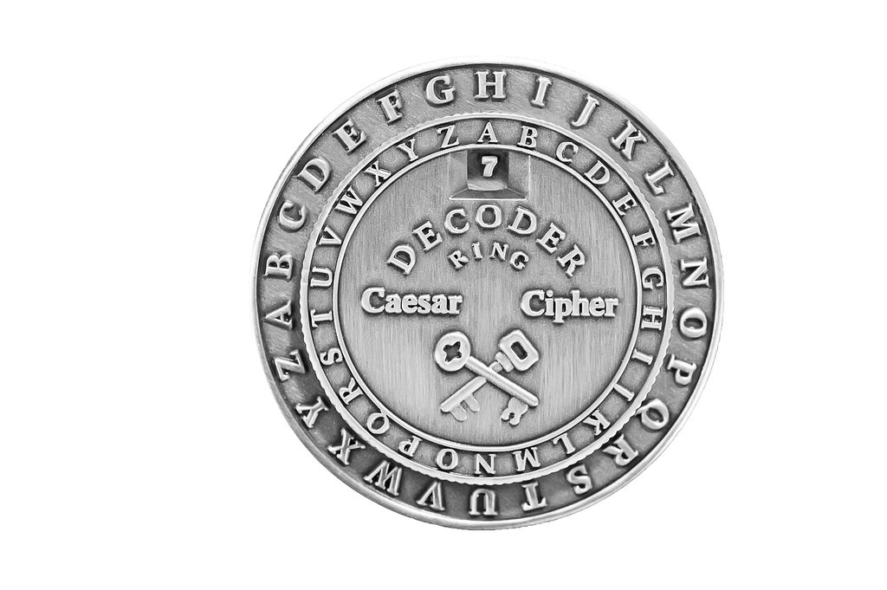
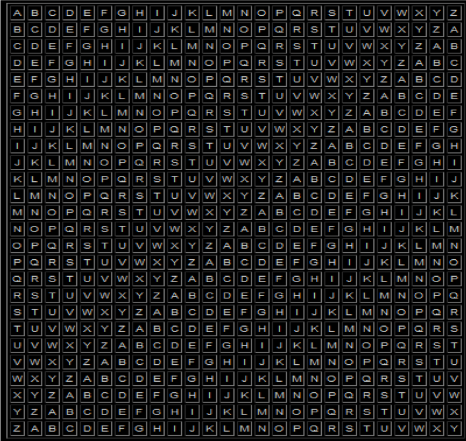

### Cybersecurity First Principles in this lesson

* __Data Hiding__: Data hiding is the technique that does not allow certain aspects of an object to be observed or accessed. Data and information hiding keeps the programmer from having complete access to data structures. It allows access to only what is necessary.

* __Layering__: Cyber security uses multiple layers of defense or protecting information. If one layer is defeated, the next layer should catch it.

* __Least Privilege__: One of the ways to protect information is by limiting what people can see and do with your information and resources. The principle of least privilege says to allow the minimum number of privileges necessary to accomplish the task.

* __Pre-digital era Ciphers__: _Transposition ciphers_ rearrange the order of the characters of plaintext also called permutation ciphers. The arrangement becomes the key.
_Substitution ciphers_, on the other hand, replace  characters with something else (e.g. another character or number). The replacement function becomes the key.

### Introduction
In this lesson, we will learn about ciphers and basic cryptography and how it can apply to cybersecurity and other areas of education.  We will go over a brief history of the usage of ciphers and how they work.  

### Goals
By the end of this tutorial, you will be able to:
* Understand and be able to describe `data hiding`, `layering`, and `least privilege` in terms of cryptography
* Encrypt and decrypt simple messages using different Ciphers

### Materials Required

* Cipher Wheels
* Vigenere Square

### Prerequisite lessons
None

### Table of Contents
<!-- TOC START min:1 max:3 link:true update:true -->
- [Cybersecurity First Principles in this lesson](#cybersecurity-first-principles-in-this-lesson)
- [Introduction](#introduction)
- [Goals](#goals)
- [Materials Required](#materials-required)
- [Prerequisite lessons](#prerequisite-lessons)
- [Table of Contents](#table-of-contents)
- [Step 1: Learn all the words!](#step-1-learn-all-the-words)
- [Step 2: Ciphers](#step-2-ciphers)
- [Step 3: Cryptoanalysis](#step-3-cryptoanalysis)
- [Step 4: Practice Decrypting and Encrypting](#step-4-tpractice-decrypting-encrypting)
- [Partner Activity](#partner-activity)
- [Additional Resources](#additional-resources)
- [Acknowledgements](#acknowledgements)
- [License](#license)

<!-- TOC END -->

### Step 1: Learn all the words!
__Plaintext/Cleartext__ - an unaltered message as it's intended to be read

__Ciphertext__ – message that has been changed so its meaning is concealed

__Encryption/enciphering__ – changing plaintext to ciphertext

__Decryption/deciphering__ – changing ciphertext back into plaintext

__Key__ – secret value needed to encrypt and/or decrypt

__Cryptographic Algorithm/cipher__ – a standard sequence of computational steps to encrypt or decrypt a message using a key

__Cryptanalysis__ – practice of analyzing encrypted messages to reveal the plaintext without knowing the key

__Strength__ – determines how much effort and how long it takes to break a ciphertext

### Step 2: Ciphers

We will discuss the usages and history of each of these ciphers:

- Zig-Zag and Route Crypto
- Civil War Crypto Sticks
- Enigma Machine

- __Caesar Ciphers__
> 

- __Vigenere Square__
> 

### Step 3: Cryptanalysis

- __Frequency:__   
Frequency analysis is used to see which letters appear most often in the message. Substituting most frequent plain text letter after analysis could break the cipher.

- __Language characteristics:__    
If spaces are left in, then characteristics like single-letter and 2-letter words are still intact and knowledge of these can be utilized to break the cipher.

A longer message makes both frequency and language characteristics easier to spot.

### Step 4: Decrypting and Encrypting

__How to decrypt:__

* Line up the letter 'A' on the inner wheel with the number of the key on the outer wheel.
* Find the first letter of the encrypted phrase on the outer wheel. Write down the letter on the inner wheel that lines up with it - this is the decrypted letter.
* Repeat step 2 with each letter until you see the decrypted phrase.

__How to encrypt:__
* Come up with a phrase you would like to write in code.
* Choose a number to use as your key, then line up this number on the outer wheel with the 'A' on the inner wheel.
* Find the letter of your phrase on the inner wheel, then write down the letter on the outer wheel that lines up with it.
* Repeat step 3 for every letter in your phrase.

### Partner Activity
Encrypt up with a phrase of your own, and give it to a partner to decrypt using the Caesar cipher.

### Reflection
Which cybersecurity principles are applied in this activity?

### Additional Resources
For more information, investigate the following:

* [NSA Cytptochallenges](http://cryptochallenge.io) - Puzzle of the week
* [NSA CryptoKids](https://www.nsa.gov/resources/everyone/digital-media-center/publications/cryptokids/)

## Lead Author

- Chris Daniels

### Acknowledgements
Special thanks to [Dr. Robin Gandhi](http://faculty.ist.unomaha.edu/rgandhi/) for reviewing and editing earlier versions of this lesson.

### License
[Nebraska GenCyber](https://github.com/MLHale/nebraska-gencyber)   is licensed under a <a rel="license" href="http://creativecommons.org/licenses/by-nc-sa/4.0/">Creative Commons Attribution-NonCommercial-ShareAlike 4.0 International License</a>.

Overall content: Copyright (C) 2017-2018  [Dr. Matthew L. Hale](http://faculty.ist.unomaha.edu/mhale/), [Dr. Robin Gandhi](http://faculty.ist.unomaha.edu/rgandhi/), [Dr. Briana B. Morrison](http://www.brianamorrison.net), and [Doug Rausch](http://www.bellevue.edu/about/leadership/faculty/rausch-douglas).

Lesson content: Copyright (C) [Chris Daniels](https://www.unomaha.edu/college-of-information-science-and-technology/about/faculty-staff/chris-daniels.php) 2017.  
 This lesson is licensed by the author under a <a rel="license" href="http://creativecommons.org/licenses/by-nc-sa/4.0/">Creative Commons Attribution-NonCommercial-ShareAlike 4.0 International License</a>.
