### Cybersecurity First Principles in this lesson

* __Abstraction__: An abstraction is a representation of an object or concept. It could be something such as a door, a speedometer, or a data structure in computer science. Abstraction decouples the design from the implementation. The gauges in an automobile are an abstraction of the performance of a car. A map is an abstraction of the earth.

* __Modularization__: The concept of modularity is like building blocks. Each block (or module) can be put in or taken out from a bigger project. Each module has its own separate function that is interchangeable with other modules.

* __Simplicity__: Simplicity allows a person to better understand hardware and software. Without the clutter of unnecessarily complicated code and interfaces, the software will be more understandable by people that will update the code when requirements change. It will be easier to understand by the testers and they will be able to spot problems sooner. By keeping software as simple and as focused as possible, the reliability and security is greatly increased.

* __Resource Encapsulation__: Encapsulation is an object oriented concept where all data and functions required to use the resource are packaged into a single self-contained component. The goal is to only allow access or manipulation of the resource in the way the designer intended. An example, assume a flag pole is the object. There are fixed methods on how the flag pole is to be used. Put the flag on, take the flag off, raise or lower the flag. Nothing else can be done to the flag pole.


### Introduction
In this lesson, we will explore a cool hands-on technology called [Raspberry Pi](https://www.raspberrypi.org/). Raspberry Pi follows a _component-based design_ paradigm using _GPIOs_ (or general purpose input/outputs) to let you easily write apps and connect them to hardware components. In this lesson, you will build your Raspberry Pi and connect it to a sensor. Raspberry Pi will be the central platform used for the rest of camp.  Multiple other camp lessons build onto this one.

### Goals
By the end of this module, you will be able to:
* Build a Raspberry PI
* Connect your PI to an LCD Screen
* Use GPIOs to make a simple sensor platform
* Define and relate the `modularity` principle to component-based design frameworks like Raspberry PI
* Come up with some of your own app ideas

### Materials Required

* (Raspberry PI 4 (Labists kit or equivalent))[https://www.amazon.com/LABISTS-Raspberry-Complete-Preloaded-Heatsinks/dp/B07YRSYR3M/]
* (Raspberry PI 4 touchscreen)[https://www.amazon.com/Miuzei-Raspberry-Full-Angle-Heatsinks-Raspbian/dp/B07XBVF1C9/]
* (SunFoundry sensor modules kit)https://www.amazon.com/SunFounder-Modules-Sensor-Raspberry-Extension/dp/B014PF05ZA/
* USB Keyboard and Mouse
* Power outlet nearby

### Prerequisite lessons
None

### Table of Contents
<!-- TOC START min:1 max:3 link:true asterisk:false update:true -->
        - [Cybersecurity First Principles in this lesson](#cybersecurity-first-principles-in-this-lesson)
        - [Introduction](#introduction)
        - [Goals](#goals)
        - [Materials Required](#materials-required)
        - [Prerequisite lessons](#prerequisite-lessons)
        - [Table of Contents](#table-of-contents)
        - [Step 1: Unbox it!](#step-1-unbox-it)
        - [Step 2: Gotta start somewhere](#step-2-gotta-start-somewhere)
        - [Step 3: Setting up the bread board](#step-3-setting-up-the-bread-board)
        - [Step 4: Install the LCD Touch Screen Display](#step-4-install-the-lcd-touch-screen-display)
        - [Step 4: Peripherals, Power, and First Boot-up](#step-4-peripherals-power-and-first-boot-up)
        - [Step 5: Password and OS Setup](#step-5-password-and-os-setup)
        - [Step 6: Welcome to your Raspbian Desktop and Connecting to the internet](#step-6-welcome-to-your-raspbian-desktop-and-connecting-to-the-internet)
        - [Step 7: Landscape Screen Setup](#step-7-landscape-screen-setup)
        - [Step 8: Ready for some component-based design action!](#step-8-ready-for-some-component-based-design-action)
        - [Step 9: Use a temperature modules](#step-9-use-a-temperature-modules)
        - [Self Exploration](#self-exploration)
        - [Lead Author](#lead-author)
        - [Acknowledgements](#acknowledgements)
        - [License](#license)
<!-- TOC END -->

### Step 1: Unbox it!
First, open your Raspberry PI box. Take a second to look at the different components you have. 

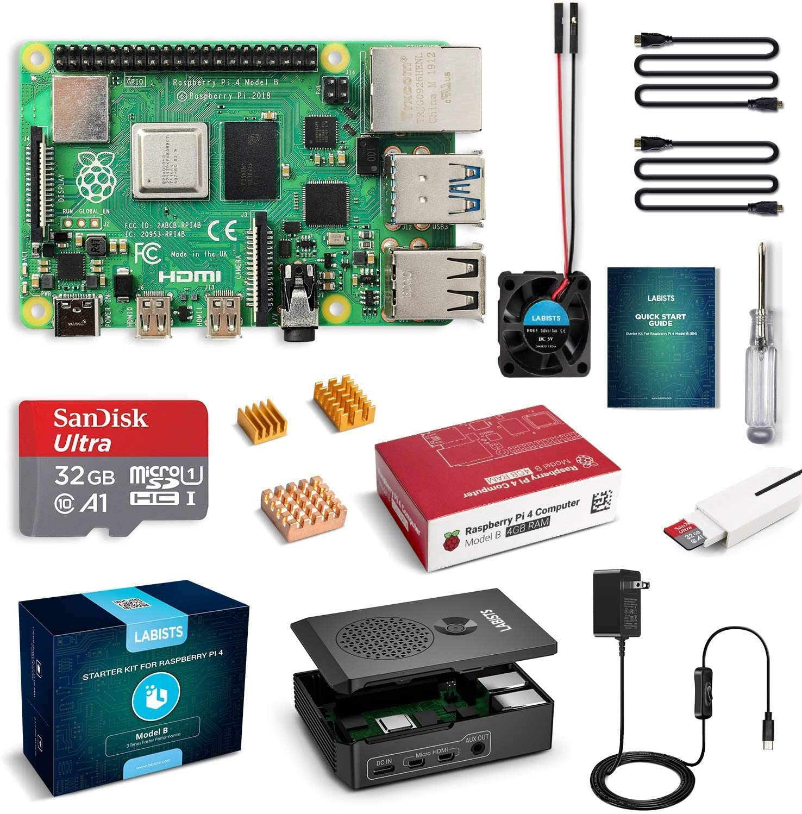


Here is a diagram of the different `modular interfaces` on your PI.

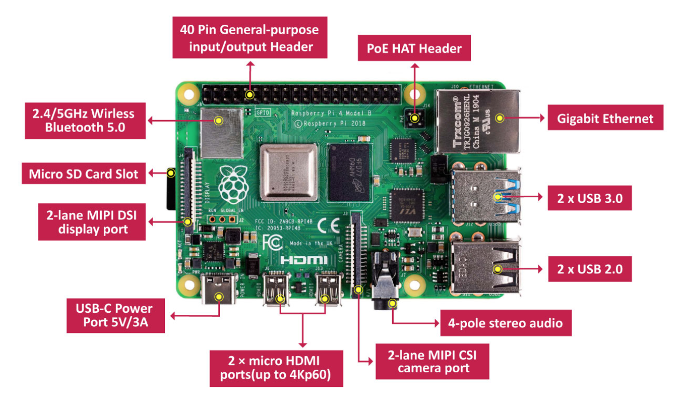

### Step 2: Gotta start somewhere
Find your `Quick Start Guide` and turn to page 03. Follow the steps shown to `install the heatsinks`.

Once your heatsinks are installed, insert the `SD Card` into the slot on the bottom of the board.

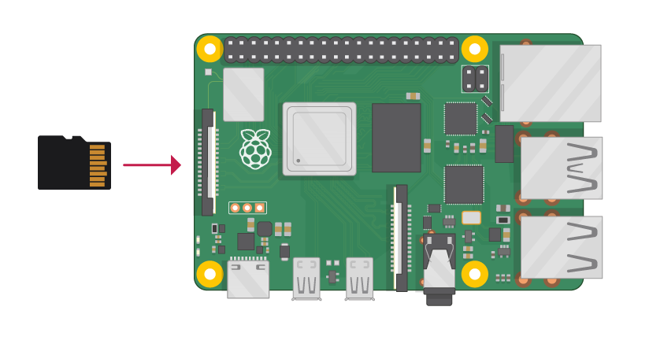

This SD card has an operating system called `Raspbian` pre-installed on it. Raspbian is like other operating systems you may be familiar with like windows, linux, or MacOS.

The operating system also has several programs we will use during the camp pre-installed on it.

### Step 3: Setting up the bread board
Next, we are going to configure your Pi to interface with a range of different components using `GPIO` ports. 

GPIO ports, an acronym for `General-purpose input/output` ports are simplified interfaces that allow a device to read or write data to the PI. Programs on your PI can control the ports to allow code to `interface` with `sensors` or `actuators`. 

`GPIO` is a form of `modularity` that arises from using a standard interface. The nice part of standard interfaces is that it means the device **doesn't need to understand or know anything about what they are connected to**. This is a great example of the `modularity` cybersecurity first principle.

Your PI has a `40 pin GPIO header block` (See labeled diagram above). Since it can be tricky to directly connect to these pins, it is often easier to use a `breadboard`. A breadboard is just a circuit board with multiple pin slots that can be used to wire components together.

Find your breadboard by unboxing your SunFounder Sensor Kit.

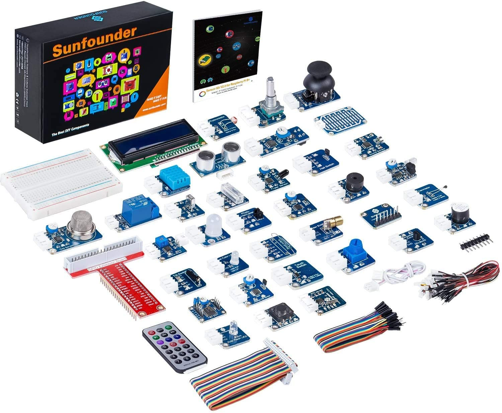

The breadboard is the component in the upper left of the diagram above. 

Also locate your `GPIO Extension Board` component. It is a read chip with multiple labels on it (third from top left in the diagram above.)

Finally, locate the `ribbon cable` (rainbow colored cable on the lower left of the diagram above).

Carefully socket your `GPIO Extension Board` into the broad board as shown below, then connect the `ribbon cable` to the `GPIO Extension Board` and finally, using the other end, carefully connect it to your Raspberry PI. The resulting setup should look like this:

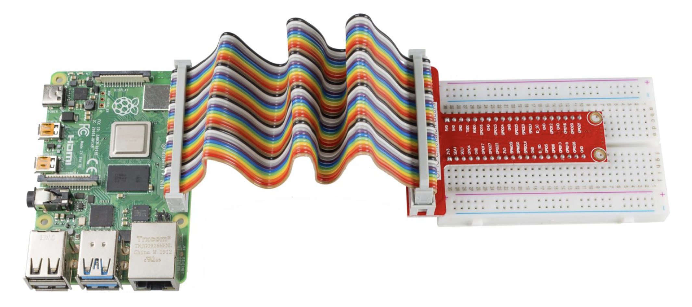

Page 34 of your Sunfounder Sensor kit booklet also has additional information that you might want to read.

### Step 4: Install the LCD Touch Screen Display
Next we will install a 4in LCD Touch Screen, so that you can see and interact with your PI.

Go ahead and open the box. The components inside, should look something like this:

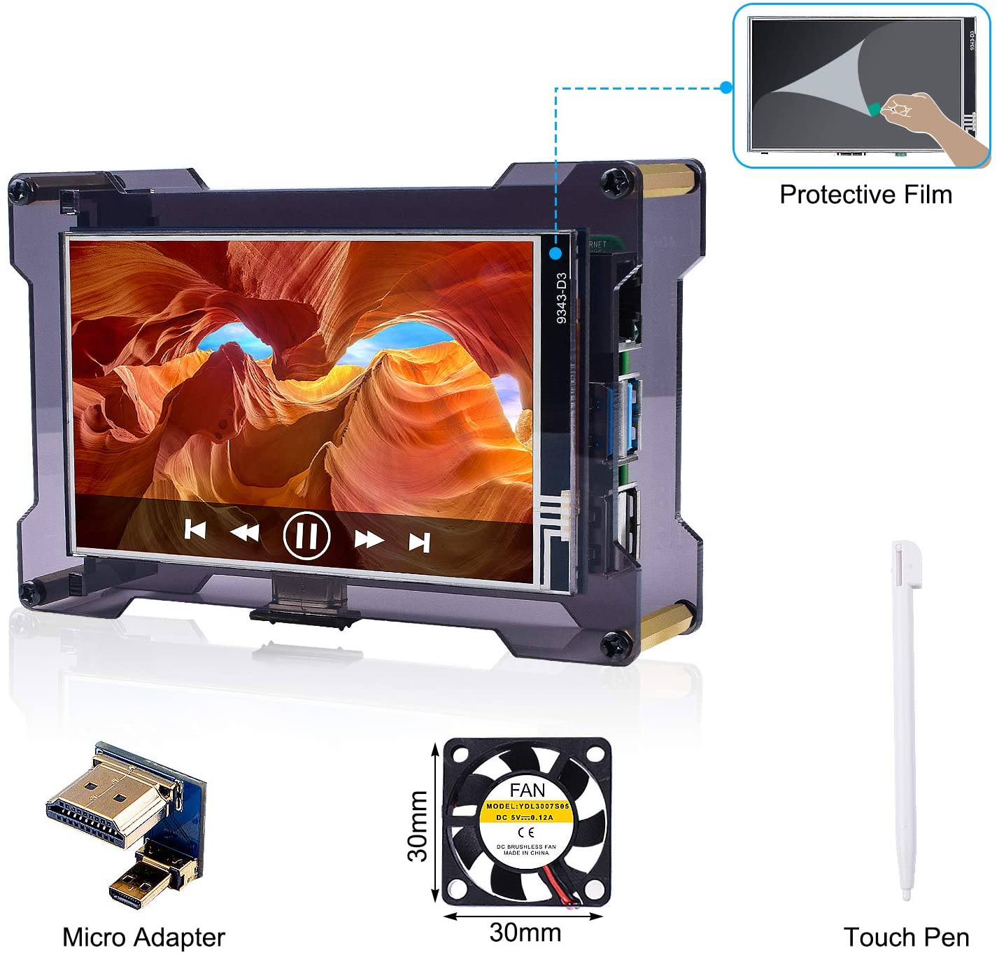

I recommend you keep the packaging so that you can house your screen in it.

Locate a 2-pin red/black cable from your Sunfounder kit package. Connect the `2-pin cable` to the back of the LCD screen as follows.

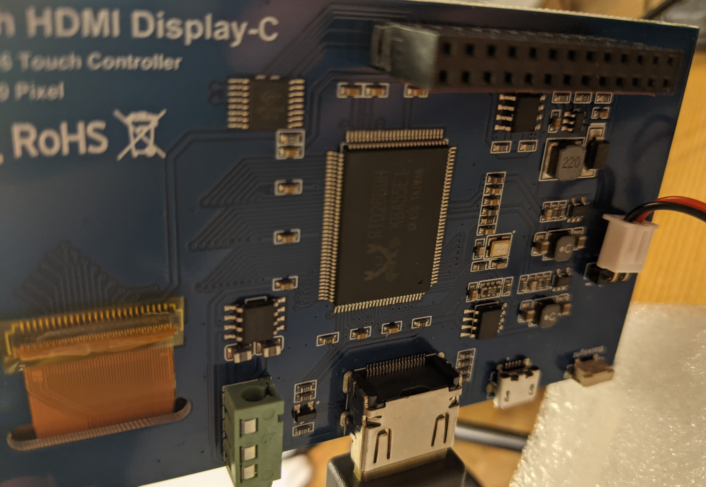

Connect the ends of the `2-pin cable` to the `breadboard` like as shown in the upper left of the image below. The black cable should connect to the `-` sign and the red should connect to the `+` symbol.

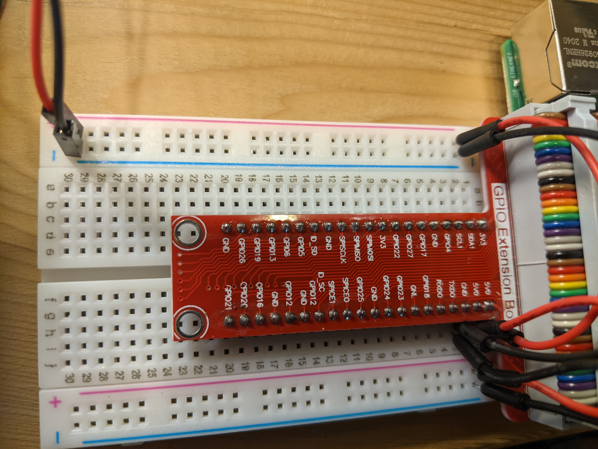

Now, use some additional `male-to-male jumper cables` from your SunFounder kit to connect the `5VD` pin on the `GPIO Extension Board` to the `+` channels on your breadboard. Also connect the `GND` pin to the `-` channels on your breadboard.

Your setup should look like the image below. I like to use red cables to represent power (or 5v) and black to be the ground (GND).

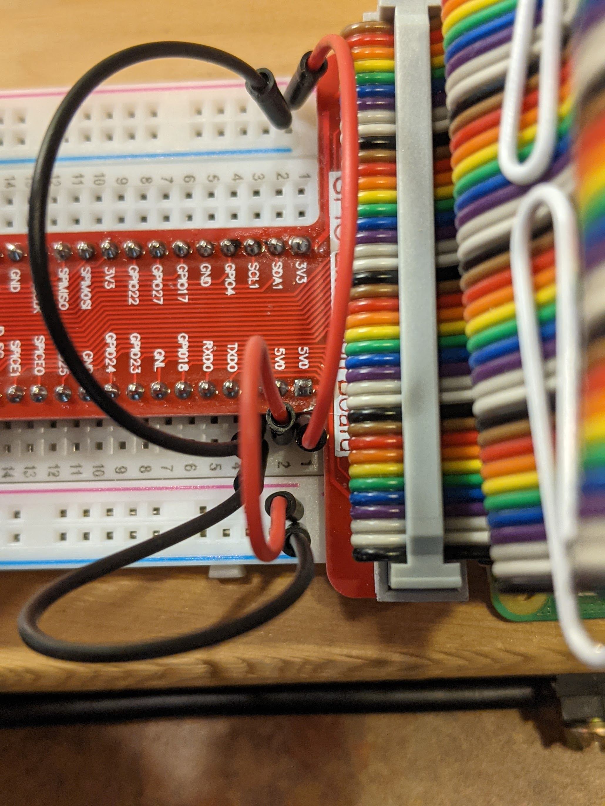

### Step 4: Peripherals, Power, and First Boot-up
Alright, we have a screen, we have a computer (the PI), now we need to connect the keyboard and mouse to the usb ports on the PI.

Once you have those connected, connect the power cable to the PI and turn it on, by flipping the switch.

Your PI should light up and start booting up. 

### Step 5: Password and OS Setup
Once your PI has booted up, it will step you through a wizard with a few screens to setup a password and configure the device.

It should look something like this:
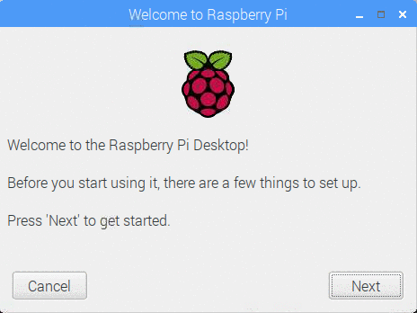

We recommend you use a easy to remember password that you can share with the students or other device users in your classroom. For the purposes of this example, we recommend using `nebraskagencyber` as the password and use the default username `pi`.

In practice, if you were to deploy this device as an actual IoT device on a production network, you would want to follow a more secure configuration.

At this point, you can click `skip` for updates and `skip` for connecting to WiFi.

### Step 6: Welcome to your Raspbian Desktop and Connecting to the internet
Once setup, you should see a Raspbian default desktop that looks like this:


- *If you are running this lesson at your school or testing this lesson at home*, 
  - Click on the `bi-directional arrows` in the top right of the screen. 
  - Open the menu and connect to your preferred WiFi network.*
- *If you are following along with this module at our Nebraska GenCyber camp*
  - We will need to connect your device to the NU-IoT network. 
  - To do this, open the `command terminal` by clicking on the `red Raspberry PI icon` on the upper left, then select `accessories`, then select `terminal`.
  - Once there you should see this screen:
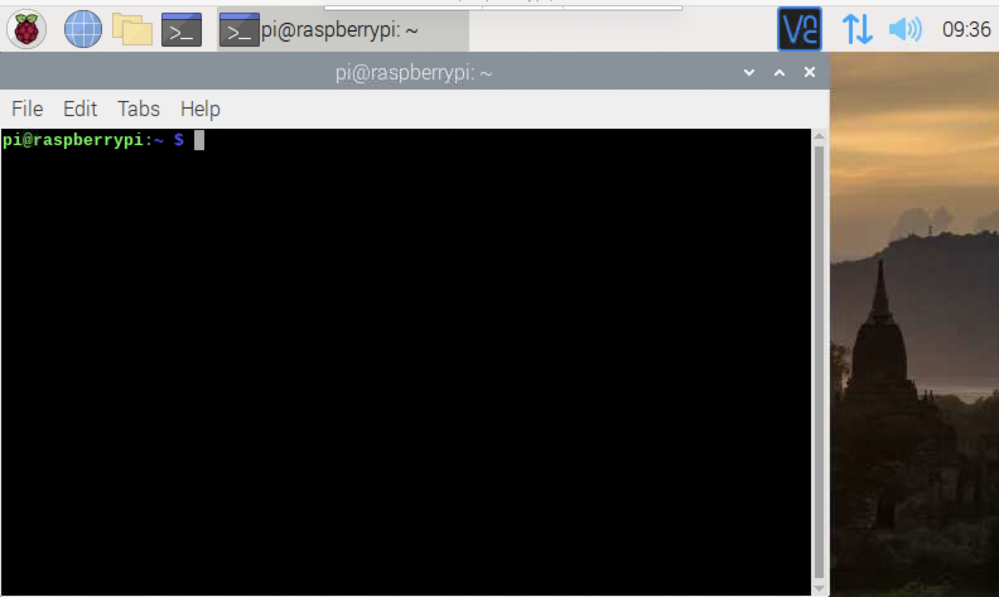
  - Type the command `ifconfig`
  - You should see some information about your networks that looks like this:
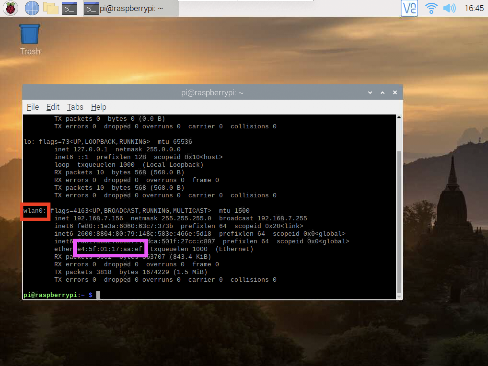
  - Locate the `wlan0` interface (shown in a red box), then find the `mac address` information in the pink box next to the word `ether`. Wlan0 is just a fancy name for the `0th wireless local area network interface`. The mac address is kind of like your device's unique name that differentiates itself from all other devices. We are going to use this information to setup your connection. Just come talk to a Nebraska GenCyber staff member, bring us this address, and we will give you a password to connect to the NU-IoT WiFi network.
  - To do so, click the the `bi-directional arrows` in the top right of the screen.
  - Select `NU-IoT` and then enter the password we give you as the `pre-shared key` it asks for.

### Step 7: Landscape Screen Setup
Your Raspberry PI touch screen is by default in `portrait mode.` We need to install `a driver` to help your PI better use the screen and to allow it to use `landscape mode` to make it easier to see.

To do this, go back to the terminal and type the following command:

```
sudo rm -rf LCD-show
git clone https://github.com/goodtft/LCD-show.git
chmod -R 755 LCD-show
cd LCD-show
sudo ./MPI4008-show
```

Wait a bit as the driver is installed. Once it is done, you can restart your PI and it should be in landscape mode.

### Step 8: Ready for some component-based design action!
Your Sunfounder box contains a whole range of sensors and actuators. A diagram of every part can be found on pages 1 to 8 of the Sunfounder guide booklet.

Each part is a `component`. Components generally all need `power` (often labeled as `vcc`), `ground` (labeled as `gnd`), and a `signal` (labeled `sig`).

We will be wiring up the components to create inventions and solve problems in the internet of things.

Before we start working with our first components, we need to setup a few libraries. Go back to the terminal on your pi and type the following, one line at a time.

```
cd /tmp
wget https://project-downloads.drogon.net/wiringpi-latest.deb
sudo dpkg -i wiringpi-latest.deb
cd ~
```

Then check to make sure you see v 2.52 when you type `gpio -v`

```
cd /home/pi
git clone https://github.com/sunfounder/SunFounder_SensorKit_for_RPi2
```

These instructions are also located in the SunFounder booklet on pages 37-39.

Now that we have our component libraries installed, lets try out some of the lessons from the SunFounder booklet to learn about individual components.

The booklet has numbered lessons, starting on page 40, that showcase each component. Each lesson includes a `wiring diagram`, a code sample, and details about what the component does. Lets take a look at Lesson 1 for the `LED module`.

The Lesson has you prepare a wiring diagram that looks like this:
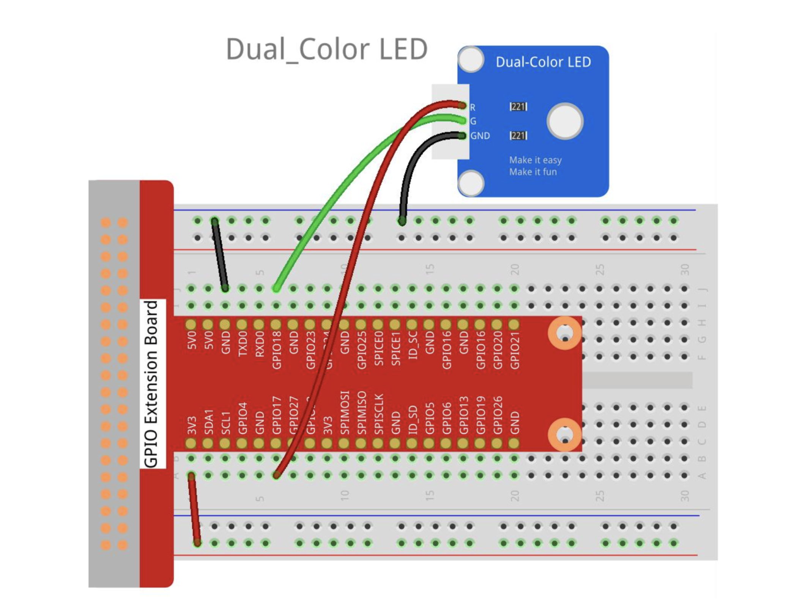
> credit [SunFounder_SensorKit_for_RPi2 manual](https://github.com/sunfounder/SunFounder_SensorKit_for_RPi2/blob/master/docs/(EN)%20Sensor_kit_V2.0_for_Raspberry_Pi_4%20Model_B.pdf)

Follow the instructions for the python code. We will be using python throughout the rest of the camp. 

Run the code sample by executing the following commands on your terminal:

```
cd /home/pi/SunFounder_SensorKit_for_RPi2/Python/
sudo python3 01_dule_color_led.py
```

This should result in a flashing light like this:


### Step 9: Use a temperature modules
Turn to page 135 of your booklet and follow the steps provided to configure your PI to work with a digital temperature sensor. 

### Self Exploration
Try out some other components in the box - find the lesson number for each one.

<!-- ### Test Your Bits, err... Wits!
[Quiz](https://www.qzzr.com/c/quiz/430545/all-about-littlebits-introduction)

<div class="quizz-container" data-width="100%" data-iframe-title="QUIZ: All About Littlebits - Introduction" data-height="auto" data-quiz="430545"></div> -->

-->
<!-- ### Additional Resources
For more information, investigate the following:
 -->


### Lead Author
Matt Hale 

### Acknowledgements
Special thanks to [Dr. Robin Gandhi](http://faculty.ist.unomaha.edu/rgandhi/) for reviewing and editing this lesson.

### License
[Nebraska GenCyber](https://github.com/MLHale/nebraska-gencyber) <a rel="license" href="http://creativecommons.org/licenses/by-nc-sa/4.0/"></a><br /> is licensed under a <a rel="license" href="http://creativecommons.org/licenses/by-nc-sa/4.0/">Creative Commons Attribution-NonCommercial-ShareAlike 4.0 International License</a>.

Overall content: Copyright (C) 2017-2021  [Dr. Matthew L. Hale](http://faculty.ist.unomaha.edu/mhale/) and [Dr. Robin Gandhi](http://faculty.ist.unomaha.edu/rgandhi/).

Lesson content: Copyright (C) [Dr. Matthew L. Hale](http://faculty.ist.unomaha.edu/mhale/) 2021.  
<a rel="license" href="http://creativecommons.org/licenses/by-nc-sa/4.0/"></a><br /><span xmlns:dct="http://purl.org/dc/terms/" property="dct:title">This lesson</span> is licensed by the author under a <a rel="license" href="http://creativecommons.org/licenses/by-nc-sa/4.0/">Creative Commons Attribution-NonCommercial-ShareAlike 4.0 International License</a>.
