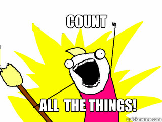
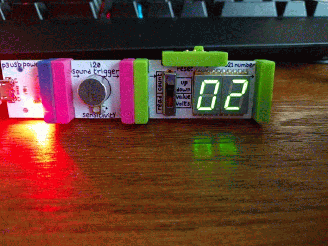
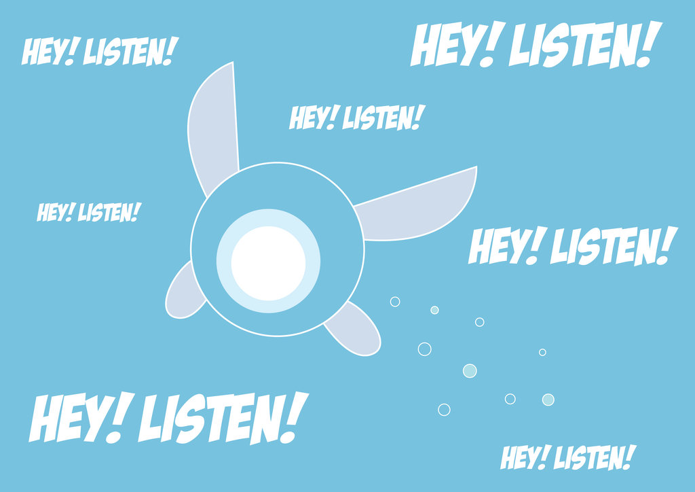

### Cybersecurity First Principles in this lesson

* __Abstraction__: An abstraction is a representation of an object or concept. It could be something such as a door, a speedometer, or a data structure in computer science. Abstraction decouples the design from the implementation. The gauges in an automobile are an abstraction of the performance of a car. A map is an abstraction of the earth.

* __Modularization__: The concept of modularity is like building blocks. Each block (or module) can be put in or taken out from a bigger project. Each module has its own separate function that is interchangeable with other modules.

* __Simplicity__: Simplicity allows a person to better understand hardware and software. Without the clutter of unnecessarily complicated code and interfaces, the software will be more understandable by people that will update the code when requirements change. It will be easier to understand by the testers and they will be able to spot problems sooner. By keeping software as simple and as focused as possible, the reliability and security is greatly increased.

* __Resource Encapsulation__: Encapsulation is an object oriented concept where all data and functions required to use the resource are packaged into a single self-contained component. The goal is to only allow access or manipulation of the resource in the way the designer intended. An example, assume a flag pole is the object. There are fixed methods on how the flag pole is to be used. Put the flag on, take the flag off, raise or lower the flag. Nothing else can be done to the flag pole.


### Introduction
In this lesson, we will explore a cool hands-on technology called [Raspberry Pi](https://www.raspberrypi.org/). Raspberry Pi follows a _component-based design_ paradigm using _GPIOs_ (or general purpose input/outputs) to let you easily write apps and connect them to hardware components. In this lesson, you will build your Raspberry Pi and connect it to a sensor. Raspberry Pi will be the central platform used for the rest of camp.  Multiple other camp lessons build onto this one.

### Goals
By the end of this module, you will be able to:
* Build a Raspberry PI
* Connect your PI to an LCD Screen
* Use GPIOs to make a simple sensor platform
* Define and relate the `modularity` principle to component-based design frameworks like Raspberry PI
* Come up with some of your own app ideas

### Materials Required

* (Raspberry PI 4 (Labists kit or equivalent))[https://www.amazon.com/LABISTS-Raspberry-Complete-Preloaded-Heatsinks/dp/B07YRSYR3M/]
* (Raspberry PI 4 touchscreen)[https://www.amazon.com/Miuzei-Raspberry-Full-Angle-Heatsinks-Raspbian/dp/B07XBVF1C9/]
* (SunFoundry sensor modules kit)https://www.amazon.com/SunFounder-Modules-Sensor-Raspberry-Extension/dp/B014PF05ZA/
* USB Keyboard and Mouse
* Power outlet nearby

### Prerequisite lessons
None

### Table of Contents
<!-- TOC START min:1 max:3 link:true asterisk:false update:true -->
        - [Cybersecurity First Principles in this lesson](#cybersecurity-first-principles-in-this-lesson)
        - [Introduction](#introduction)
        - [Goals](#goals)
        - [Materials Required](#materials-required)
        - [Prerequisite lessons](#prerequisite-lessons)
        - [Table of Contents](#table-of-contents)
        - [Step 1: Unbox it!](#step-1-unbox-it)
        - [Step 2: Gotta start somewhere](#step-2-gotta-start-somewhere)
        - [Step 3: Setting up the bread board](#step-3-setting-up-the-bread-board)
        - [Step 4: Install the LCD Touch Screen Display](#step-4-install-the-lcd-touch-screen-display)
        - [Step 4: Peripherals, Power, and First Boot-up](#step-4-peripherals-power-and-first-boot-up)
        - [Step 5: Passwords and Internet Setup](#step-5-passwords-and-internet-setup)
        - [Additional Resources](#additional-resources)
        - [Lead Author](#lead-author)
        - [Acknowledgements](#acknowledgements)
        - [License](#license)
<!-- TOC END -->

### Step 1: Unbox it!
First, open your Raspberry PI box. Take a second to look at the different components you have. 


Here is a diagram of the different `modular interfaces` on your PI.


### Step 2: Gotta start somewhere
Find your `Quick Start Guide` and turn to page 03. Follow the steps shown to `install the heatsinks`.

Once your heatsinks are installed, insert the `SD Card` into the slot on the bottom of the board.


This SD card has an operating system called `Raspbian` pre-installed on it. Raspbian is like other operating systems you may be familiar with like windows, linux, or MacOS.

The operating system also has several programs we will use during the camp pre-installed on it.

### Step 3: Setting up the bread board
Next, we are going to configure your Pi to interface with a range of different components using `GPIO` ports. 

GPIO ports, an acronym for `General-purpose input/output` ports are simplified interfaces that allow a device to read or write data to the PI. Programs on your PI can control the ports to allow code to `interface` with `sensors` or `actuators`. 

`GPIO` is a form of `modularity` that arises from using a standard interface. The nice part of standard interfaces is that it means the device **doesn't need to understand or know anything about what they are connected to**. This is a great example of the `modularity` cybersecurity first principle.

Your PI has a `40 pin GPIO header block` (See labeled diagram above). Since it can be tricky to directly connect to these pins, it is often easier to use a `breadboard`. A breadboard is just a circuit board with multiple pin slots that can be used to wire components together.

Find your breadboard by unboxing your SunFounder Sensor Kit.


The breadboard is the component in the upper left of the diagram above. 

Also locate your `GPIO Extension Board` component. It is a read chip with multiple labels on it (third from top left in the diagram above.)

Finally, locate the `ribbon cable` (rainbow colored cable on the lower left of the diagram above).

Carefully socket your `GPIO Extension Board` into the broad board as shown below, then connect the `ribbon cable` to the `GPIO Extension Board` and finally, using the other end, carefully connect it to your Raspberry PI. The resulting setup should look like this:


Page 34 of your Sunfounder Sensor kit booklet also has additional information that you might want to read.

### Step 4: Install the LCD Touch Screen Display
Next we will install a 4in LCD Touch Screen, so that you can see and interact with your PI.

Go ahead and open the box. The components inside, should look something like this:


I recommend you keep the packaging so that you can house your screen in it.

Locate a 2-pin red/black cable from your Sunfounder kit package. Connect the `2-pin cable` to the back of the LCD screen as follows.


Connect the ends of the `2-pin cable` to the `breadboard` like as shown in the upper left of the image below. The black cable should connect to the `-` sign and the red should connect to the `+` symbol.


Now, use some additional `male-to-male jumper cables` from your SunFounder kit to connect the `5VD` pin on the `GPIO Extension Board` to the `+` channels on your breadboard. Also connect the `GND` pin to the `-` channels on your breadboard.

Your setup should look like the image below. I like to use red cables to represent power (or 5v) and black to be the ground (GND).


### Step 4: Peripherals, Power, and First Boot-up
Alright, we have a screen, we have a computer (the PI), now we need to connect the keyboard and mouse to the usb ports on the PI.

Once you have those connected, connect the power cable to the PI and turn it on, by flipping the switch.

Your PI should light up and start booting up. 

### Step 5: Passwords and Internet Setup


<!-- ### Step 3: Count all the things!

Press the button and the light turns on. That was easy!
Ok, we've made our first circuit - but it's pretty simple. Let's add some more modules:

* Find the green ```o21 number``` output module

Time to extend your previous circuit to 

* Connect the ```o21 number``` to the ```bright led```
* Set the switch to the up position on the ```o21 number``` module. This puts it into **count** mode instead of **voltage** mode.

Press the button!

Pretty simple. Notice we can **chain the output modules together** (```bright led``` and a ```counter``` in this case). Any number of output modules can be chained together.

Now, lets switch up our circuit a bit.

* Find the pink ```sound trigger``` input module
* Find the pink ```light sensor``` input module

Lets swap some components around.

* Remove the ```bright led``` module (it is really bright!)

Press the button. Everything still works!

* Connect the ```light sensor``` to the ```power``` and then to the ```button```

Press the button. Does it work? How about if you cover up the light sensor?

This shows you that you can also **chain multiple input modules together** and their **total behavior is a combination of their input designs**. In this case, our counter only worked if the light was detected **AND** the button was pressed.

Lets try one more combo:

* Remove the ```button``` module.
* Remove the ```light sensor``` module.
* Connect the ```sound trigger``` between the ```power``` and the ```o21 number``` module.

Snap your fingers or tap the table near your device.



### Step 4: The world is more than True or False - Variable Inputs
So far, we have outputs and inputs that result in an **on** (True) or **off** (False) behavior.

.

The world is not always **on** or **off**

* Find the pink ```temperature sensor``` input module.
* Find the pink ```i23 threshold``` input module.
* Get the ```light sensor``` and ```bright led``` out again

We are going to make a circuit that shows off variable voltage.

* Remove all components.
* Connect the ```temperature sensor``` to the ```o21 number``` module.
* Set the ```o21 number``` switch to **value** (middle position)
* Set the ```temperature sensor``` switch to **f** (for Fahrenheit)

You should see the current temperature in the room near the device.


* Replace the ```temperature sensor``` with the ```light sensor```
* Put the ```o21 number``` module back into **voltage** mode by moving the switch to the bottom position.
* Move your finger closer to and further away from the light sensor

You should see that the more light it gets, the more voltage it outputs.

* Now connect the ```bright led``` to the right-hand side of the ```o21 number``` module
* Move your finger closer to and further away from the light sensor

You should notice the light dimming and brightening depending on the voltage it receives.

Ok, last part!

* Connect the ```i23 threshold``` module between the ```o21 number``` and ```bright led``` modules
* Set the threshold on the ```i23 threshold``` by turning the knob.
* Keep turning until a voltage of roughly 3 or greater turns on the ```bright led```
* You can put your finger over the light sensor to change the voltage

So, what did we learn? The thresholder can **set a voltage tolerance and output a 1 (True) if its input is greater than the threshold***. This can be helpful if you want to do **sound**, **light**, or **temperature** detection, but you only want to output True if the value is greater than some value.

### Step 5: Hey, Listen - Audio

> Photo Credit: CmOrigins@deviantart http://cmorigins.deviantart.com/art/Navi-Hey-Listen-322389835

Sometimes you want your inventions to have some sound. The next design we will explore involves using audio.

* Find the pink ```mp3 player``` input module
* Find the green ```synth speaker``` output module
* Get the pink ```button``` module again

Lets play a sound when a button is pressed:

* Remove all components
* Connect the ```button``` to the ```power```
* Connect the ```mp3 player``` to the ```button```
* Connect the ```synth speaker``` to the ```mp3 player```

Press the button. This plays **all** of the tracks. If you move the ```mp3 player``` switch to **next**, it will allow you to press the ```button``` to switch tracks. You can also use the buttons on the ```mp3 player``` board.


By default, the ```mp3 player``` comes loaded with stock Littlebits tutorial audio. You can replace it using the ```sdcard``` in the board to load it with your own audio.

### Step 6: Turning on an outlet with the IR transmitter
The next module to explore is the ```ir transmitter``` and ```power outlet``` combo.

* Find the green ```ir transmitter``` output module
* Find the outlet with IR sensor (hard to miss)
* Get your pink ```button``` module

Lets wire this up so that when you press the button the outlet comes on.

* Remove all components
* Connect the ```button``` up to the ```power```
* Plug the outlet into a nearby power outlet
* Plug something up to the outlet (optional)
* Connect the ```ir transmitter``` to the ```button```

Pressing the button should turn on the device. The first time you press it, you will see the outlet light blink. It is pairing up. Once its paired, press the button a few times. You can see the red light turn on and off as you do.

> Note: Since it is IR, the IR transmitter needs line-of-sight to the IR sensor on the outlet.

### Step 7: Motoring onward
The last module we will explore is the ```servo``` which can bring actual movement into your inventions!

* Remove all components
* Connect the ```button``` to the ```power```.
* Connect the ```servo``` to the ```button```.
* Open the packet of black attachments and pick one of the arms.
* Attach the arm by pushing it down onto the ```white plastic gear``` on the ```servo```
* Set the switch on the ```servo``` board to ```turn```.

> Note you don't need to use the screw, but hang onto it for later - it should be used in production to secure the turner down

When you press the button, it should rotate the arm 90 degrees.

This can be used for all kinds of purposes! 

### Self Exploration
Try some different designs yourself.

### Test Your Bits, err... Wits!
[Quiz](https://www.qzzr.com/c/quiz/430545/all-about-littlebits-introduction)

<div class="quizz-container" data-width="100%" data-iframe-title="QUIZ: All About Littlebits - Introduction" data-height="auto" data-quiz="430545"></div>

-->
### Additional Resources
For more information, investigate the following:


### Lead Author
Matt Hale 

### Acknowledgements
Special thanks to [Dr. Robin Gandhi](http://faculty.ist.unomaha.edu/rgandhi/) for reviewing and editing this lesson.

### License
[Nebraska GenCyber](https://github.com/MLHale/nebraska-gencyber) <a rel="license" href="http://creativecommons.org/licenses/by-nc-sa/4.0/"></a><br /> is licensed under a <a rel="license" href="http://creativecommons.org/licenses/by-nc-sa/4.0/">Creative Commons Attribution-NonCommercial-ShareAlike 4.0 International License</a>.

Overall content: Copyright (C) 2017-2018  [Dr. Matthew L. Hale](http://faculty.ist.unomaha.edu/mhale/), [Dr. Robin Gandhi](http://faculty.ist.unomaha.edu/rgandhi/), and [Doug Rausch](http://www.bellevue.edu/about/leadership/faculty/rausch-douglas).

Lesson content: Copyright (C) [Dr. Matthew L. Hale](http://faculty.ist.unomaha.edu/mhale/) 2017-2018.  
<a rel="license" href="http://creativecommons.org/licenses/by-nc-sa/4.0/"></a><br /><span xmlns:dct="http://purl.org/dc/terms/" property="dct:title">This lesson</span> is licensed by the author under a <a rel="license" href="http://creativecommons.org/licenses/by-nc-sa/4.0/">Creative Commons Attribution-NonCommercial-ShareAlike 4.0 International License</a>.
