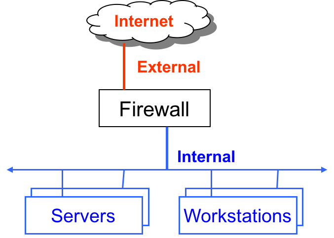
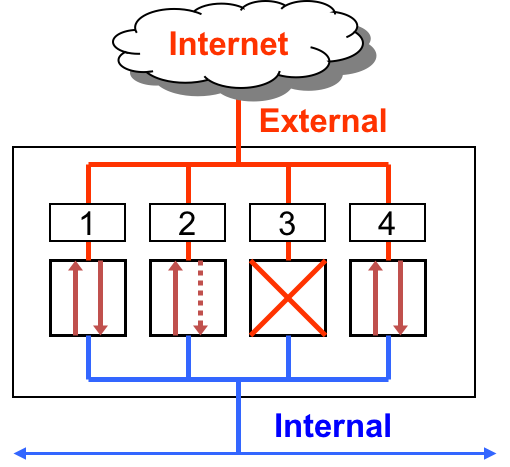

IoT devices often seem helpless against the villains of the Internet. This might seem in part due to the resource constraints of a small IoT device or in part due to neglect (out of sight, out of mind). But it does not have to be that way. There a few simple things (five in this lesson) that can go a long way to make your IoT devices a bit more harder to discover and attack.  

### Cybersecurity First Principles

* __Domain Separation__: Domain separation allows for enforcement of rules governing the entry and use of resources in the domains by entities outside the domain.

* __Minimization__: Minimization refers to having the least functionality necessary in a program or device. The goal of minimization is to simplify and decrease the number of ways that software can be exploited. This can include **turning off ports that are not needed**, reducing the amount of code running on a machine, and/or turning off unneeded features in an application. A part of this lesson specifically focuses specifically on turning off ports and limiting network connections that aren't required for correct operation.

* __Abstraction__: Something complicated can be thought of and represented more simply using Abstraction. Network packets are abstractions that only provide necessary details to network operators, while reducing the complexity to a set of essential characteristics.

* __Layering__: Cyber security uses multiple layers of defense or protecting information. If one layer is defeated the next layer should catch it. Firewalls are a key aspect of any layered defense.

* __Least Privilege__: One of the ways to protect information is by limiting what people can see and do with your information and resources. The principle of least privilege says to allow the minimum number of privileges necessary to accomplish the task.

* __Information Hiding__: Information hiding is any attempt to prevent people from being able to see information. It can be hiding the content of a letter, or it can be applied to hiding how the letter is delivered. Both ways can prevent people from being able to see the information.

### Table of Contents  

[Hardening Overview](#hardening-overview)  
[Software Updates](#software-updates)  
[Change install-time Defaults](#change-install-time-defaults)  
[Review running services](#review-running-services)  
[Configure and enable a firewall](#configure-and-enable-a-firewall)  
[Setup anomaly monitoring](#setup-anomaly-monitoring)  
[Additional Readings](#additional-readings)  
[Acknowledgements](#special-thanks)  


## Hardening Overview

To attack a computer, an attacker needs access to weaknesses that can be exploited. Larger the attack surface, larger the chance the attacker can find an exploit to get in.

What can a user do to reduce exploitable weaknesses and the attack surface?

 __Hardening__ refers to the process of _minimizing_ the system resources exposed to the Internet and _layering_ the exposed parts with multiple defenses. In some cases it also involves _hiding information_ that can give additional clues to an attacker about the system's inner workings. Did you notice how I snuck in the first principles in to that definition?

 For IoT systems, I recommend five basic hardening steps that go a long way, and most importantly don't get in the way of normal operation (mostly).

 1. Software updates!
 1. Change install-time defaults
 1. Review running services
 1. Configure and enable a firewall
 1. Setup anomaly monitoring

While we will examine these hardening steps in the context of IoT devices, they also apply more generally to most IT systems

## Software Updates

No one likes to do software updates. It might even seem risky to update a system only to find out that it won't work anymore!

Before performing a software update, make sure that the update is downloaded from verified software repositories or app stores.

On a Raspberry Pi use the following command to update your software sources. Before you run this command, make sure you are connected to the Internet.

```
sudo apt-get update
```
`apt-get` is a tool to automatically update your Debian-based Linux machine and get and install debian packages/programs [[1]](https://wiki.debian.org/apt-get).

Next, we run a full-upgrade of the OS. Adding -y to the end of apt-get commands instructs the program to automatically answer yes to any questions rather than waiting for you to type Y or N. A full-upgrade may remove installed packages if that is needed to upgrade the whole system. This option may affect backward compatibility, but generally a better option.

```
sudo apt-get full-upgrade -y
```
The previous command may download a lot of software installers. To save storage space run the `clean` command.

```
sudo apt-get clean
```

If you are worried about storage space, here is a quick command to examine available storage.

```
sudo df -h
```

After a successful upgrade, it is best to restart the system for the changes to take effect. Do NOT skip this step.

```
sudo reboot
```
## Change install-time Defaults

Default usernames and passwords for IoT devices are usually a quick [Google search away](https://datarecovery.com/rd/default-passwords/). For Raspberry Pi's the default user is `pi`, and the password is `raspberry`, which could give someone root access!

For the GenCyber camp, you likely set it the password to `NebraskaGencyber`. This password is easily guessed, so now is your chance to update it to something that only you know.

Use the `raspi-config` command line utility to do so.

```
sudo raspi-config
```

Select `Option 1: System Option` by pressing `enter` and then use arrow keys to select `Option S3: Password`. Follow the instructions to change the password. You can also use the `passwd` command on any Linux to do the same thing.  

A default username like `pi`, makes it very easy for an attacker to write a script to brute-force this account's password. If the default username was changed or removed, such a script would simply fail. Please note that with the current Raspberry Pi OS distribution, there are some aspects that require the pi user to be present. So I recommend not to change the `pi` username. However, we can make `sudo` require a password!

Adding `sudo` in front of a command temporarily gives you superuser privilege. With great power comes great responsibility. But by default, `sudo` does not need a password! Let's change this. To force sudo to require a password, enter:

```
sudo nano /etc/sudoers.d/010_pi-nopasswd
```
and change the pi entry to:
```
pi ALL=(ALL) PASSWD: ALL
```
Then save the file: `Control + X`, followed by `Enter`. Once the file is saved, any subsequent use of `sudo` will require a password to be supplied. Try this command to test it out:

```
sudo su - pi
```

At this point, we changed the default password, and made it required every-time superuser privileges are required. This strategy is a good example of the _layering_ first principle.


## Review running services

Keeping an inventory of network services running on your system is important. Let's examine the network services currently running on the Pi that utilize the TCP network protocol.

```
sudo lsof -i -n -P | grep TCP | more
```

If you enabled SSH and/or VNC you should observe these services running on specific TCP ports. Make a note of these services and ports. We will need them later for firewall configuration.

To see the effect of adding a new service, let's add a webserver. Webservers run on port 80 by default.

We will install the Apache HTTP webserver.

```
sudo apt install apache2
sudo systemctl start apache2
```

Now, re-issue the following command.

```
sudo lsof -i -n -P | grep TCP | more
```

You should see `apache2` processes running on port 80.


## Configure and enable a firewall

With an inventory of running network services, we are now ready to configure and enable a firewall.

The name `firewall` is inspired from its physical manifestation in construction which refers to walls that are designed to stop a fire from spreading. While these firewalls are "cool", we are interested in a different kind of firewall. Namely, the ones that protect internal networks from external networks. These kinds of firewalls allow us to control the flow of information between networks. Firewalls __minimize__ the number of ways that internal networks and computers on them can be exploited. They also encourage __least functionality__ by turning off ports that are not needed. Firewalls can also drop network traffic that does not conform to expected patterns (such as malicious requests to an application server).

> 


Firewalls aren't just for networks. Each computer in a network can have its own `personal firewall`. Linux has a firewall called `iptables` built right into the OS kernel. But it is a bit hard to use. So we will install a frontend to `iptables` called the Uncomplicated Firewall or `ufw`. Let's install it.

```
sudo apt install ufw
```

Now before using such a powerful tool, it helps to understand how it works.

### Firewall as a Collection of Valves

A network packet filtering Firewall can be understood as a collection of valves  

* Each valve/port corresponds to single service at the application level (e.g. HTTP, SSH, VNC, etc,.)
* Each valve can  
  - Permit traffic in one or both directions  
  - Deny traffic  

  

Here are three basic scenarios to keep in mind.  

First, lets consider **Ports 1 and 4**. These ports are open. Which means they permit packets from internal and external sources.

In the case of **Port 2**, it allows unrestricted flow of information if the connection is initiated internally. However, it blocks all external requests to initiate an information flow. That is, it permits packets from external sources only if they correspond to a `connection` initiated by an internal source. The firewall will not permit connection requests from external sources. This restriction is useful when an internal web client initiates a web browsing request, then the firewall will allow the corresponding incoming response from an external webserver to pass through the firewall. Any connection initiated externally will not be allowed.

Finally, **Port 3** is closed. Which means that it denies all traffic.

### Firewall Rules

Always start firewall configuration with a `whitelisting` philosophy, where you **Deny by default** and allow only specific information flows. This means, start the firewall configuration by dropping all packets by default. Then add rules to `allow` specific traffic patterns as required by application needs.

As it turns out, for usability reasons, the default `iptables` firewall in Linux allows all incoming and outgoing traffic. See for yourself:

```
sudo iptables -nL
```

Since we are using the `ufw` firewall, let's configure it to deny all incoming traffic and allow all outgoing traffic by default.
```
sudo ufw default deny incoming
sudo ufw default allow outgoing
```

Now we add rules to `allow` specific ports and protocols as required. Since most end-users don't know much about ports and protocols, we first list the services that `ufw` can mediate access to on our machine.

```
sudo ufw app list
```

Investigate a service name further using the `ufw app info` command. This command describes the app and the port that it uses.
```
sudo ufw app info SSH
sudo ufw app info VNC
sudo ufw app info CUPS
sudo ufw app info WWW
```
We now know the ports for several services that were noted perviously in our review: SSH (port 22), VNC (port 5900), CUPS (port 631) and WWW (port 80).

Allowing these services through the firewall is as simple as this:

```
sudo ufw allow SSH
sudo ufw allow VNC
sudo ufw allow CUPS
sudo ufw allow WWW
```

Since our firewall is not enabled yet, we use the following command to see if the rules have been successfully added.

```
sudo ufw show added
```

If everything looks right, we can enable the firewall.

```
sudo ufw enable
```

You will notice that this command not only enables the firewall, but also enables the firewall on system startup.

Examine the status of the active firewall using this command:

```
sudo ufw status
```
You will notice that the firewall protects both ipv4 and ipv6 interfaces. Very useful!


`ufw` also supports connection rate limiting, which is useful for protecting against brute-force login attacks. When a limit rule is used, ufw will normally allow the connection but will deny connections if an IP address attempts to initiate 6 or more connections within 30 seconds. See [http://www.debian-administration.org/articles/187](http://www.debian-administration.org/articles/187) for details. We can enable rate limiting for SSH and VNC as follows:
```
sudo ufw limit SSH
sudo ufw limit VNC
```

Let's test if the firewall is really doing it's job. Visit the ip address of your Rasperry Pi in a browser on a different machine on the same network. You should see the default Apache webserver page.

Now let's delete the `ufw` rule that allows the Apache webserver (WWW app) to respond to incoming requests on port 80.

```
sudo ufw delete allow WWW
```
Now the webserver on the Raspberry Pi should be inaccessible to other machines on the network machines. You can restore connectivity by adding the rule again.

```
sudo ufw allow WWW
```
Explore other firewall operations using the help command. Be careful not to lock yourself out if you are remotely connected to the Pi.

```
sudo ufw help
```

`iptables` and `ufw` are a good example of __Domain Separation__, __Abstration__ and __Minimization__ principles applied to protection mechanisms.

## Setup anomaly monitoring

Anomaly monitoring complements firewalls by checking allowed services for suspicious behaviors. This is an example of the __Layering__ principle.

An IoT device, like the Raspberry Pi, will need certain services like ssh to be exposed by the firewall to allow required interactions. In these cases, it is prudent to monitor these services for anomalous behaviors like password brute-forcing or denial of service.

> Fail2ban, written in Python, is a scanner that examines the log files produced by the Raspberry Pi, and checks them for suspicious activity. It catches things like multiple brute-force attempts to log in, and can inform any installed firewall to stop further login attempts from suspicious IP addresses. It saves you having to manually check log files for intrusion attempts and then update the firewall (via iptables) to prevent them [[2](https://www.raspberrypi.org/documentation/configuration/security.md)].

You can install __fail2ban__ using the following command:
```
sudo apt install fail2ban
```

Copy the default configuration template to a file named `jail.local` to configure fail2ban.
```
sudo cp /etc/fail2ban/jail.conf /etc/fail2ban/jail.local
```

Now let's edit the `jail.local` configuration file to check for SSH anomalies.

```
sudo nano /etc/fail2ban/jail.local
```

Scroll through the file to locate a section titled JAILS. Edit the SSH Servers subsection to look like this:

```
#
# SSH servers
#

[sshd]

# To use more aggressive sshd modes set filter parameter "mode" in jail.local:
# normal (default), ddos, extra or aggressive (combines all).
# See "tests/files/logs/sshd" or "filter.d/sshd.conf" for usage example and det$
mode        = aggressive
port        = ssh
logpath     = /var/log/auth.log
maxretry    = 3
bantime     = 600
```

These settings instruct fail2ban to monitor the `/var/log/auth.log` system log file for ssh password brute-force attempts, with a max-retry threshold of 3 and a bantime of 600 second. A bantime of -1 will permanently bans an IP address after three failed attempts using a firewall rule.

Save the config file (`Control+X` followed by `Enter`).

Restart the fail2ban service to apply the configuration changes.

```
sudo systemctl restart fail2ban
```

Examine the number of active jails using this command

```
sudo fail2ban-client status
```

This command should show the `sshd` jail to be active.

```
pi@raspberrypi:/ $ sudo fail2ban-client status
Status
|- Number of jail:	1
`- Jail list:	sshd
```

Now let's test it. From another machine on the same network (For example, with IP address: `10.144.27.34`), ssh to the Raspberry Pi IP address. In the example below the IP address of the Raspberry Pi is: `10.66.224.224`

```
ssh -l root 10.66.224.224
```
Enter the a blank password repeatedly three times. The next time you try to connect you will see a __Connection Refused__ message. See these sample interactions below.

```
$ ssh -l root 10.66.224.224
root@10.66.224.224's password:
Permission denied, please try again.
root@10.66.224.224's password:
Permission denied, please try again.
root@10.66.224.224's password:
root@10.66.224.224: Permission denied (publickey,password).

$ ssh -l root 10.66.224.224
ssh: connect to host 10.66.224.224 port 22: Connection refused
```

The remote machine is banned for 600 seconds!

On the Raspberry Pi, examine the Fail2Ban status.

```
sudo fail2ban-client status sshd
```

It should show the banned IP address as follows:

```
pi@raspberrypi:/etc/fail2ban/filter.d $ sudo fail2ban-client status sshd

Status for the jail: sshd
|- Filter
|  |- Currently failed:	1
|  |- Total failed:	4
|  `- File list:	/var/log/auth.log
`- Actions
   |- Currently banned:	1
   |- Total banned:	1
   `- Banned IP list:	10.144.27.34
```

We see the `10.144.27.34` IP address in the banned list. To clear the ban on `10.144.27.34` run the following command on the Raspberry Pi.

```
sudo fail2ban-client set ssh unbanip 10.144.27.34
```
Examining the Fail2Ban status again shows the cleared banned IP list.

```
pi@raspberrypi:/ $ sudo fail2ban-client status sshd
Status for the jail: sshd
|- Filter
|  |- Currently failed:	1
|  |- Total failed:	4
|  `- File list:	/var/log/auth.log
`- Actions
   |- Currently banned:	0
   |- Total banned:	1
   `- Banned IP list:

```

You should be able to ssh into the Raspberry Pi again, from the machine that was perviously banned.

In summary, we see how all the hardening steps work together to slow down an attacker.

[Top](#table-of-contents)

## Additional Readings
* [Securing your Raspberry Pi](https://www.raspberrypi.org/documentation/configuration/security.md)
* [UFW - Uncomplicated Firewall for Ubuntu](https://help.ubuntu.com/community/UFW)
* [UFW Essentials: Common Firewall Rules and Commands](https://www.digitalocean.com/community/tutorials/ufw-essentials-common-firewall-rules-and-commands)
* [How Fail2Ban Works to Protect Services on a Linux Server](https://www.digitalocean.com/community/tutorials/how-fail2ban-works-to-protect-services-on-a-linux-server)
* [How To Protect SSH and Apache Using Fail2Ban on Ubuntu Linux](https://www.rapid7.com/blog/post/2017/02/13/how-to-protect-ssh-and-apache-using-fail2ban-on-ubuntu-linux/)

[Top](#table-of-contents)

## Lead Author

- Robin Gandhi

## Special Thanks

* A special thanks to Matt Hale for reviews of this module and thoughtful discussions.

[Top](#table-of-contents)

# License
[Nebraska GenCyber](https://github.com/MLHale/nebraska-gencyber) <a rel="license" href="http://creativecommons.org/licenses/by-nc-sa/4.0/"></a><br /> is licensed under a <a rel="license" href="http://creativecommons.org/licenses/by-nc-sa/4.0/">Creative Commons Attribution-NonCommercial-ShareAlike 4.0 International License</a>.

Overall content: Copyright (C) 2017-2021  [Dr. Matthew L. Hale](http://faculty.ist.unomaha.edu/mhale/), [Dr. Robin Gandhi](http://faculty.ist.unomaha.edu/rgandhi/), and [Dr. Briana B. Morrison](http://www.brianamorrison.net).

Lesson content: Copyright (C) [Robin Gandhi](http://faculty.ist.unomaha.edu/rgandhi/) 2017-2021.  
<a rel="license" href="http://creativecommons.org/licenses/by-nc-sa/4.0/"></a><br /><span xmlns:dct="http://purl.org/dc/terms/" property="dct:title">This lesson</span> is licensed by the author under a <a rel="license" href="http://creativecommons.org/licenses/by-nc-sa/4.0/">Creative Commons Attribution-NonCommercial-ShareAlike 4.0 International License</a>.
