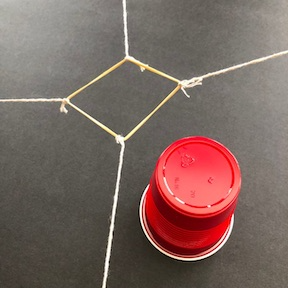
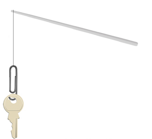
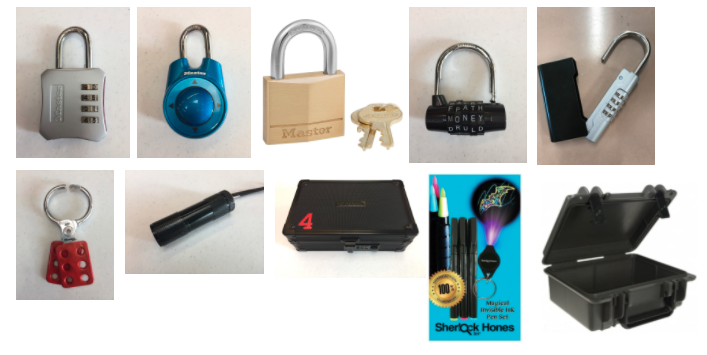

### Cybersecurity First Principles in this lesson

* **Data Hiding**: Data hiding is the technique that does not allow certain aspects of an object to be observed or accessed. Data and information hiding keeps the programmer from having complete access to data structures. It allows access to only what is necessary.
* **Least Privilege**: Giving only necessary privileges creates accountability and prevents misuse
* **Layering**: In the context of cybersecurity, layers make it more difficult for attackers to reach protected data and programs
* **Domain Separation**: Separating domains can help us secure each one separately. 

### Introduction and goals
In these lessons, you will learn about different icebreakers, games, and breakout boxes that you can use to teach others about concepts like cybersecurity, phishing, and digital etiquette. 

### Goals
By the end of this tutorial, you will be able to:
* Lead fun and engaging icebreakers
* Build a breakout box
* Use games and activities to teach others about phishing and digital etiquette

### Prerequisite lessons
None 

### Table of Contents

1. [Unit 6-1: Teaching tools (Icebreakers and Challenges)](#6.1)
2. [Unit 6-2: Teaching tools (Breakout Boxes)](#6.2)
3. [Unit 6.3: Teaching Tools (Phishing)](#6.3)
4. [Unit 5-4: Digital Etiquette](#5.4)
5. [Unplugged Activities and Computational Thinking Bins](#unplugged)
6. [Lead Author](#author)

# **Unit 6-1: Teaching tools (Icebreakers and Challenges)**

## Icebreakers

### **1. Nutstacker Game**

**Goal:** Create a free-standing tower of metal nuts stacked on top of each other.

**What You’ll Need:**
* [Chopsticks](https://www.amazon.com/Disposable-Chopsticks-pack-40-pair/dp/B01JJBV0NQ/ref=sr_1_7?dchild=1&keywords=chopsticks&qid=1623803086&s=home-garden&sr=1-7) or [cake pop sticks](https://www.amazon.com/Sticks-Lollipops-Bake-Shop-Supply/dp/B072855CLQ)
* Ten [5/8-inch metal nuts](https://www.amazon.com/Prime-Line-9086713-Finished-Plated-10-Pack/dp/B07BNY766R/ref=sr_1_14?dchild=1&keywords=5%2F8-inch+metal+nuts&qid=1623803144&sr=8-14) (make sure these are all exactly the same size and shape)
* Table for stacking

**How to Play:**
* If having students compete in groups, give each group one stick and 10 metal nuts. If having students compete individually, give each student one stick and 10 metal nuts.
* Lay all the metal nuts down flat on the table. 
* Before starting the one minute timer, explain that students will use the stick to pick up one metal nut and stack it upright on the table. The nuts must stand up on their sides so that you can see through the hole. If working in groups, pass the stick to the next person in their group to repeat the instructions but staking the second metal nut on top of the first metal nut.
* <ins>Alternate way to play this game:</ins> Put all the metal nuts on the stick and have students slide each metal nut off the stick individually, placing it on the table upright.
* The winner is the individual or team that has the most metal nuts stacked at the end of the minute timer.
_____________

### **2. Stack’em Up Game**

**Goal:** Work together as a team to create a 6 cup pyramid without using your hands.

**What You’ll Need:**
* 6 [plastic cups](https://www.amazon.com/Glad-Everyday-Disposable-Plastic-Occasions/dp/B08828K18F/ref=sr_1_7?crid=22QAPJWGU3K1R&dchild=1&keywords=red+solo+cups+16+oz+bulk&qid=1623804453&sprefix=red+solo+%2Caps%2C226&sr=8-7)
* [Thick rubber bands](https://www.amazon.com/Rubber-Band-Depot-Approximately-Measurements/dp/B096G86LXM/ref=sr_1_2_sspa?crid=2PJWI55BS2FZ5&dchild=1&keywords=thick+rubber+bands&qid=1623804523&sprefix=thick+rubber+%2Caps%2C494&sr=8-2-spons&psc=1&spLa=ZW5jcnlwdGVkUXVhbGlmaWVyPUExNDc2UE5PUVlUS0pNJmVuY3J5cHRlZElkPUEwMTgzMjQyM0QxSTQ2SVZFUjA3MSZlbmNyeXB0ZWRBZElkPUEwMDA1ODYxNUJFV1FHOVZNMzRGJndpZGdldE5hbWU9c3BfYXRmJmFjdGlvbj1jbGlja1JlZGlyZWN0JmRvTm90TG9nQ2xpY2s9dHJ1ZQ==)
* [12 inch zip ties](https://www.amazon.com/Electrical-Zipties-Resistant-Management-Electronics/dp/B08RBXVCYS/ref=sr_1_2_sspa?crid=9OGR9W5799IN&dchild=1&keywords=zip+ties+12+inch&qid=1623804579&sprefix=zip+ties%2Caps%2C247&sr=8-2-spons&psc=1&spLa=ZW5jcnlwdGVkUXVhbGlmaWVyPUEzVzMwTUM3U0E2RVJBJmVuY3J5cHRlZElkPUEwNTczNzkxMTkxMU5HRTNMUFg0WSZlbmNyeXB0ZWRBZElkPUEwNjM1MzQ0RVVPOFlKQUUyVURFJndpZGdldE5hbWU9c3BfYXRmJmFjdGlvbj1jbGlja1JlZGlyZWN0JmRvTm90TG9nQ2xpY2s9dHJ1ZQ==)

**Preparation Before Game:**

Take one rubber band and attach 4 zip ties to it, spacing them out (similar to picture below). This is the tool that students will use to stack the cups. <ins>NOTE: Each group will need one of these tools.</ins>

**How to Play:**
* Put students into groups of 4.
* Give each group a stack of 6 cups and a rubberband/zip tie tool.
* Place the stack of cups on the table. Remind students that the cups need to start in a stack. 
Before starting the one minute timer, explain that each student in a group of four will grab one of the zip ties attached to the rubberband. Students will work together as a team to expand the rubberband, put it over top of the stack of cups, grab the first cup in the stack, pull up, and then place the cup on the table. Students will repeat this process until they have created a 6 cup pyramid. 
* The winner is the team that has the most cups stacked at the end of the minute timer.
* <ins>Alternate way to play this game:</ins> Instead of using a timer, have groups race to see which group can create the 6 cup pyramid first.

---------------

### **3. Marshmallow Transfer Game**

**Goal:** Use a straw to transfer as many marshmallows from one plate to the other.

**What You’ll Need:**
* Bag of mini marshmallows
* [Straws](https://www.amazon.com/Colorful-Plastic-Flexible-Straws-diameter/dp/B07XXNC3GH/ref=sr_1_4?dchild=1&keywords=straws&qid=1623815152&sr=8-4) (one straw per student)

**How to Play:**
* Give each student a straw.
* Put students into groups of 4-5.
* Set up two tables 4-5 feet apart.
* On one table, give each group a plate of mini marshmallows. On the other table put an empty plate. 
* Before starting the one minute timer, explain that each student, one at a time, will use their straw to suck up one marshmallow and transfer it to the empty plate. If the marshmallow drops on the floor, students need to go back to the plate of marshmallows and suck up a new marshmallow. After one student transfers their marshmallow to the empty plate, the next student in the group will go.
* The winner is the group that has the most marshmallows transferred to the empty plate.

---------------

### **4. On the Hook Game**

**Goal:** Use a chopstick, string, and paperclip to collect three keys.

**What You’ll Need:**
* A paperclip
* Chopsticks
* String
* 3-4 keys

**Preparation Before Game:**
Create a fishing rod out of a chopstick, string, and paper clip. Cut a 12 inch piece of string and tie one end of the string to the chopstick. Make sure the string is tied tight so it does not fall off the chopstick. On the other end of the string, attach a paper clip. Bend the paperclip out on one side to create an upward-facing hook.

<ins>NOTE: Each student will need one of these fishing rods.</ins>

**How to Play:**

* Give each student a fishing rod.
* Place 3-4 keys on the edge of a table, with their handles hanging over the edge of the table.
* Before starting the one minute timer, explain that each student will place the chopstick in their mouth as a makeshift rod, and then using the paper clip as a hook, they must catch a total of four keys by hooking the paperclip through the hole on the key.
* The winner is the student that hooks all 4 keys first.

--------------------

### **Other Icebreakers and Challenges**

**Cyber Career Awareness Program:**

* https://start-engineering.com/cybersecurity-cybercap
* Magazine for students: https://start-engineering.com/cybersecurity-career-guide
* Student Workbook: https://start-engineering.com/cybersecurity-workbook

**Cybersecurity Games & Challenges:**

* **ELEMENTARY:** The Culture of Cybersecurity created the CyBear family to help engage and excite young learners about basic cybersecurity concepts and online safety tips. The CyBear family that teaches kids basic cybersecurity concepts and defense strategies. Downloadable activities and games.

    https://www.cultureofcybersecurity.com/kids/kids-activities/

* **ELEMENTARY:** Meet Faux Paw, an adventurous six-toed cat who loves technology. Downloadable books that teach cybersecurity and how to be safe online.
https://ikeepsafe.org/faux-paw-the-techno-cat/

* **ELEMENTARY:** An adventure-packed online game that makes learning about digital safety and citizenship
https://beinternetawesome.withgoogle.com/en_us/interland

* **SECONDARY:** Each year, the Texas A&M Division of Information Technology creates a campus-wide IT security game for National Cyber Security Awareness Month. Each game is designed to be fun and engaging, while educating students, faculty and staff about how to be safe online. https://it.tamu.edu/security/cybersecurity-games/index.php

* **SECONDARY:** Take cybersecurity into your own hands. In this Lab, you’ll defend a company that is the target of increasingly sophisticated cyber attacks. Your task is to strengthen your cyber defenses and thwart the attackers by completing a series of cybersecurity challenges. You’ll crack passwords, craft code, and defeat malicious hackers
https://www.pbs.org/wgbh/nova/labs/lab/cyber/

* **SECONDARY:** An opportunity to learn more about the cybersecurity profession, test your problem-solving skills.
https://go.cyberstart.com/challenges/

**Other fun cybersecurity, technology, and online safety activities:**
* Binary Counting - https://www.instructables.com/Binary-Counting/
* NetSmartzKids Games and Activities - https://www.netsmartzkids.org
* 10 Cybersecurity Lessons to Teach Kids
https://www.pandasecurity.com/en/mediacenter/technology/girls-in-tech/

------------------

# Unit 6-2: Teaching tools (Breakout Boxes)

**What is a Breakout Box?**

In a Breakout Box activity, students work together and think critically to "break into" a box that has several locks attached to it. Students must solve challenging puzzles and follow directions carefully to succeed at unlocking all the locks on the box. Breakout Box activities allow students to demonstrate and practice the "the four C's" (Critical Thinking, Creativity, Collaboration, and Communication) Social Emotional Learning.

* https://static1.squarespace.com/static/5501c7b2e4b00bf48b5640ca/t/5d5bd4d5a3c370000110ff17/1566299351578/SEL4Cs.pdf

**Supplies List** - https://drive.google.com/file/d/1bK-hhUF7nSGrsRSx3LVyUalVKbwR9xJh/view?usp=sharing

**Resources for from BreakoutEDU** (https://breakoutedu.com)

* **Brainstorming Document** - https://docs.google.com/document/d/1zTi1lTYoiXdMq5UwWEAZjGUNrD1HPXQ8PWHaT1EkfDA/edit?usp=sharing
* **Puzzle Resources** - https://resources.breakoutedu.com/puzzleresources
* **Design Videos** - https://resources.breakoutedu.com/designvideos
* **Signup for an account to view other Breakouts Boxes created by other teachers** -
    * NOTE: Some are Free to access and some you need to upgrade to a Platform Access.
    * https://platform.breakoutedu.com/login

**Other Resources**
* **How to Make a Digital Breakout Using Google Forms** - https://engagingandeffective.com/how-to-create-a-digital-breakout-for-the-classroom/

**Breakout Box Video Demonstrations:**
* https://www.youtube.com/watch?v=uI3ZRfYrFDM&t=850s
* https://www.youtube.com/watch?v=JoXLWZMwORA
* https://www.youtube.com/watch?v=e8vH5cLNpYU

-----------------

# Unit 6.3 Teaching Tools - Phishing

**Phishing Videos:**
* https://drive.google.com/file/d/1Ve2QukpYbLe-uB3fHv7vV2mLMb_JE1EP/view?usp=sharing
* https://drive.google.com/file/d/1V_kaEd8iXUa79C1IWuHZyfps-i_BTCos/view?usp=sharing

**Presentations**
* **Phishing** - https://docs.google.com/presentation/d/1ZDvLJnocni_qkq32P4Jjta1UJpqHDH27-IlJMHz5ch4/edit?usp=sharing
* **Analyzing a Link in a Phishing Email** - https://docs.google.com/presentation/d/1jlsBxaZ2yUGMphUy_TrTLRuu6SjMYzKdat3L6qKTW_8/edit?usp=sharing

**Analyze URL’s Phishing Game**
* **Game URL’s** - https://drive.google.com/file/d/1yv6hvNetRfEC2RejuYlMxNYU1mABqNpr/view?usp=sharing
* **Toy Fishing Rod** - https://www.amazon.com/TOMY-John-Deere-Farm-Adventure/dp/B000HAVGMY/ref=sr_1_18?crid=1Q8TR9HNN6X0N&dchild=1&keywords=toy+fishing+rod&qid=1624158101&sprefix=toy+fishing+ro%2Caps%2C221&sr=8-18

**Other Resources**
* **Phishing and Other Types of Scams** - https://www.bbb.org/scamtips/

-------------

# Unit 5-4: Digital Etiquette

**All documents for this The Digital Etiquette Breakout Box** - https://drive.google.com/drive/folders/1I7mtsB6Zosdj7mUMeQ1pM_wWSwPo_taP?usp=sharing

---------------

# Unplugged Activities and Computational Thinking bins
[Unplugged Activities Overview Slides](./images/unplugged-activities.pptx)
> Slides by Brian Dorn

[Computational Thinking Bins Slides](./images/ctbins-cryptography.pptx)
--------------

## Lead Author

Kristeen Shabram

### Acknowledgements
Special thanks to Victoria for reviewing and editing this lesson.

### License
[Nebraska GenCyber](https://github.com/MLHale/nebraska-gencyber)   is licensed under a <a rel="license" href="http://creativecommons.org/licenses/by-nc-sa/4.0/">Creative Commons Attribution-NonCommercial-ShareAlike 4.0 International License</a>.

Overall content: Copyright (C) 2017-2021  [Dr. Matthew L. Hale](http://faculty.ist.unomaha.edu/mhale/), [Dr. Robin Gandhi](http://faculty.ist.unomaha.edu/rgandhi/), and [Dr. Briana B. Morrison](http://www.brianamorrison.net).

Lesson content: Copyright (C) [Dr. Matthew L. Hale](http://faculty.ist.unomaha.edu/mhale/) 2017-2018.  
 This lesson is licensed by the author under a <a rel="license" href="http://creativecommons.org/licenses/by-nc-sa/4.0/">Creative Commons Attribution-NonCommercial-ShareAlike 4.0 International License</a>.
