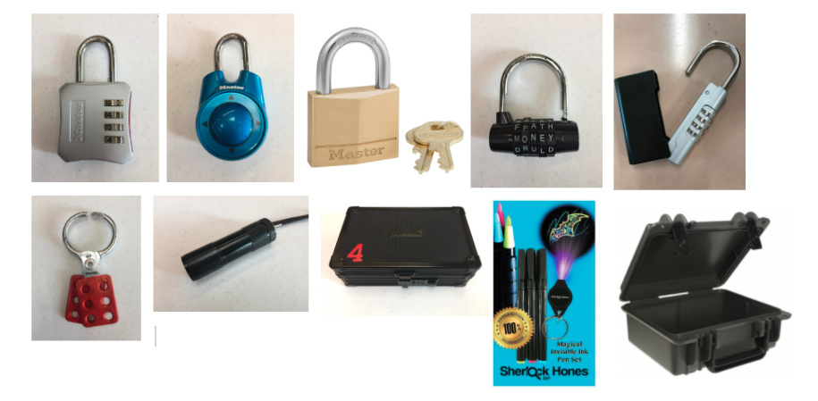

# Unit 6-2: Teaching tools (Breakout Boxes)

**What is a Breakout Box?**

In a Breakout Box activity, students work together and think critically to "break into" a box that has several locks attached to it. Students must solve challenging puzzles and follow directions carefully to succeed at unlocking all the locks on the box. Breakout Box activities allow students to demonstrate and practice the "the four C's" (Critical Thinking, Creativity, Collaboration, and Communication) Social Emotional Learning.

* https://static1.squarespace.com/static/5501c7b2e4b00bf48b5640ca/t/5d5bd4d5a3c370000110ff17/1566299351578/SEL4Cs.pdf

**Supplies List** - https://drive.google.com/file/d/1bK-hhUF7nSGrsRSx3LVyUalVKbwR9xJh/view?usp=sharing

**Resources for from BreakoutEDU** (https://breakoutedu.com)

* **Brainstorming Document** - https://docs.google.com/document/d/1zTi1lTYoiXdMq5UwWEAZjGUNrD1HPXQ8PWHaT1EkfDA/edit?usp=sharing
* **Puzzle Resources** - https://resources.breakoutedu.com/puzzleresources
* **Design Videos** - https://resources.breakoutedu.com/designvideos
* **Signup for an account to view other Breakouts Boxes created by other teachers** -
    * NOTE: Some are Free to access and some you need to upgrade to a Platform Access.
    * https://platform.breakoutedu.com/login

**Other Resources**
* **How to Make a Digital Breakout Using Google Forms** - https://engagingandeffective.com/how-to-create-a-digital-breakout-for-the-classroom/

**Breakout Box Video Demonstrations:**
* https://www.youtube.com/watch?v=uI3ZRfYrFDM&t=850s
* https://www.youtube.com/watch?v=JoXLWZMwORA
* https://www.youtube.com/watch?v=e8vH5cLNpYU

