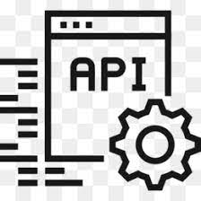
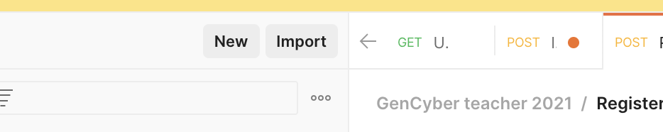
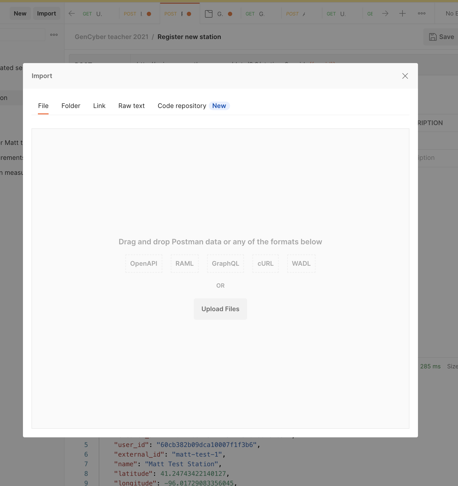
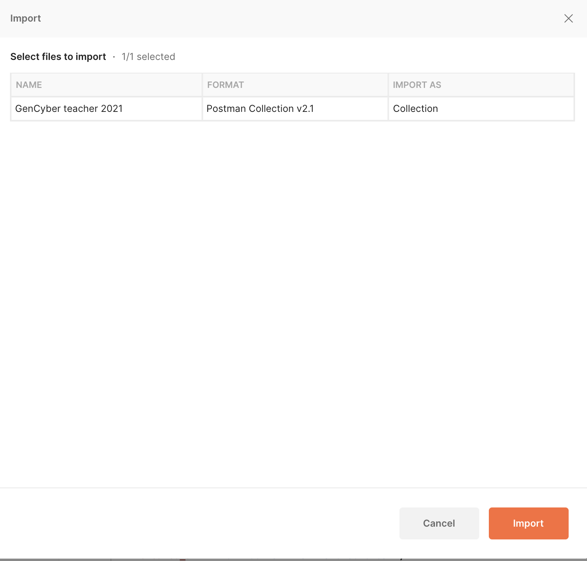
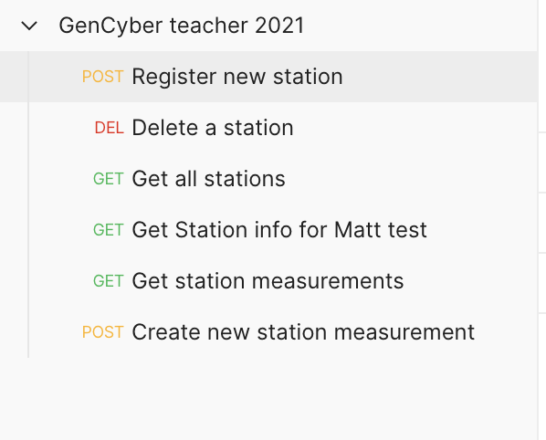
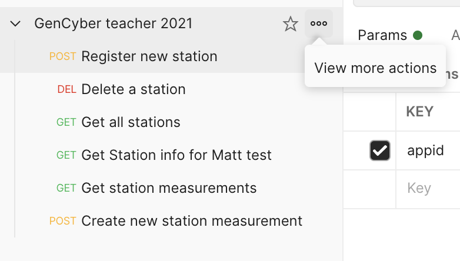
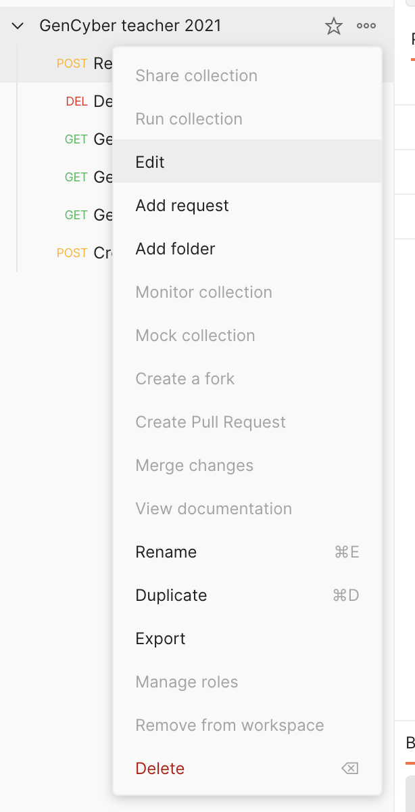
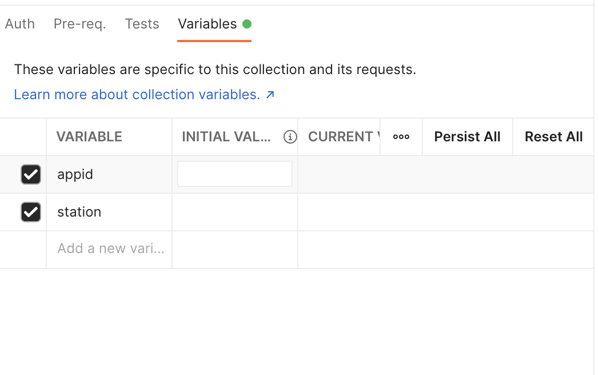
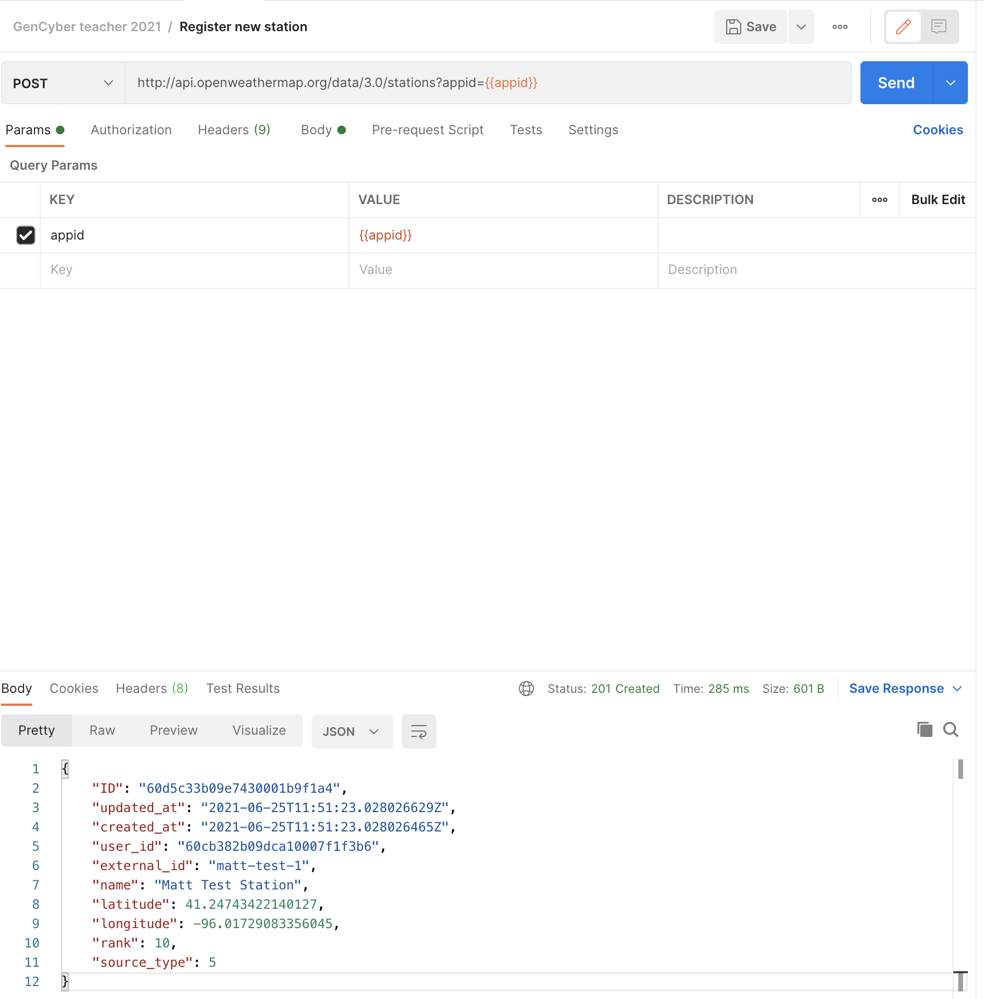

### Cybersecurity First Principles in this lesson

* __Abstraction__: An abstraction is a representation of an object or concept. It could be something such as a door, a speedometer, or a data structure in computer science. Abstraction decouples the design from the implementation. The gauges in an automobile are an abstraction of the performance of a car. A map is an abstraction of the earth.

* __Data Hiding__: Data hiding is the technique that does not allow certain aspects of an object to be observed or accessed. Data and information hiding keeps the programmer from having complete access to data structures. It allows access to only what is necessary.

* __Layering__: Cyber security uses multiple layers of defense or protecting information. If one layer is defeated the next layer should catch it.

* __Least Privilege__: One of the ways to protect information is by limiting what people can see and do with your information and resources. The principle of least privilege says to allow the minimum number of privileges necessary to accomplish the task.

* __Minimization__: Minimization refers to having the least functionality necessary in a program or device. The goal of minimization is to simplify and decrease the number of ways that software can be exploited. This can include **turning off ports that are not needed**, reducing the amount of code running on a machine, and/or turning off unneeded features in an application.

* __Modularization__: The concept of modularity is like building blocks. Each block (or module) can be put in or taken out from a bigger project. Each module has its own separate function that is interchangeable with other modules.

* __Resource Encapsulation__: Encapsulation is an object oriented concept where all data and functions required to use the resource are packaged into a single self-contained component. The goal is to only allow access or manipulation of the resource in the way the designer intended. An example, assume a flag pole is the object. There are fixed methods on how the flag pole is to be used. Put the flag on, take the flag off, raise or lower the flag. Nothing else can be done to the flag pole.

* __Simplicity__: Simplicity allows a person to better understand hardware and software. Without the clutter of unnecessarily complicated code and interfaces, the software will be more understandable by people that will update the code when requirements change. It will be easier to understand by the testers and they will be able to spot problems sooner. By keeping software as simple and as focused as possible, the reliability and security is greatly increased.

### Introduction
In this module, you will learn what a RESTful API is and how to use them.

### Goals
By the end of this tutorial, you will be able to:
* Define `REST`, `an endpoint`, `API Integration`, and `API Invocation`
* Use a REST Client to make `POST` and `GET` requests to an `API`
* Using manual requests to `mashup` web services

### Materials Required
For this lesson, you will need:

* PC
* Internet connection
* POSTMAN
* Raspberry PI

### Prerequisite lessons
You should complete the [Intro to components](./intro_to_components/README.md), [Computational thinking](introduction_to_computational_thinking_and_design_process), [Web services and IFTTT](./web_services_and_ifttt/README.md), and [Building and Iot Device](./building_an_iot_device/README.md) lessons before attempting this lesson.

### Table of Contents
<!-- TOC START min:1 max:3 link:true asterisk:false update:false -->
- [Background](#background)
- [Ok, lets take a look at a real API](#ok-lets-take-a-look-at-a-real-api)
- [Activities](#activities)
  - [REST Role Play](#rest-role-play)
  - [Working with a real API and Raspberry PI](#working-with-a-real-api-and-raspberry-pi)
    - [Step 1: Setup an Openweather API account and get your key](#step-1-setup-an-openweather-api-account-and-get-your-key)
    - [Step 2: READ THE DOCUMENTATION!](#step-2-read-the-documentation)
    - [Step 3: Working with POSTMAN or Python](#step-3-working-with-postman-or-python)
  - [Extension: Working with Python](#extension-working-with-python)
- [Lead Author](#lead-author)
    - [Acknowledgements](#acknowledgements)
    - [License](#license)
<!-- TOC END -->

### Background
Before we get started, lets talk about what an `API` is.

> This background text and its associated images are modified for this setting by Matt Hale. Modifications are licensed under creative commons share-alike. The original material it is based upon was created by the Mozilla foundation and its contributors. Credit: [https://developer.mozilla.org/en-US/docs/Web/HTTP/Overview](https://developer.mozilla.org/en-US/docs/Web/HTTP/Overview#)
[https://developer.mozilla.org/en-US/docs/Web/HTTP/Messages](https://developer.mozilla.org/en-US/docs/Web/HTTP/Messages)

**HTTP** is a `protocol` which allows the fetching of resources, such as HTML documents. It is the foundation of any data exchange on the Web and a client-server protocol, which means requests are initiated by the recipient, usually the Web browser. A complete document is reconstructed from the different sub-documents fetched, for instance text, layout description, images, videos, scripts, and more.

Clients and servers communicate by exchanging individual messages (as opposed to a stream of data). The messages sent by the client, usually a Web browser, are called `requests` and the messages sent by the server as an answer are called `responses`.

Designed in the early 1990s, HTTP is an extensible protocol which has evolved over time. It is an application layer protocol that is sent over `TCP`, or over a `TLS`-encrypted TCP connection, though any reliable transport protocol could theoretically be used. Due to its extensibility, it is used to not only fetch hypertext documents, but also images and videos or to post content to servers, like with HTML form results. HTTP can also be used to fetch parts of documents to update Web pages on demand.

#### HTTP Messages

HTTP messages are composed of textual information encoded in ASCII, and span over multiple lines. In HTTP/1.1, and earlier versions of the protocol, these messages were openly sent across the connection. In HTTP/2, the once human-readable message is now divided up into HTTP frames, providing optimization and performance improvements.

Web developers, or webmasters, rarely craft these textual HTTP messages themselves: software, a Web browser, proxy, or Web server, perform this action. They provide HTTP messages through config files (for proxies or servers), APIs (for browsers), or other interfaces.

The HTTP/2 binary framing mechanism has been designed to not require any alteration of the APIs or config files applied: it is broadly transparent to the user.

HTTP requests, and responses, share similar structure and are composed of:

1.  A `start-line` describing the requests to be implemented, or its status of whether successful or a failure. This start-line is always a single line.
2.  An optional set of `HTTP headers` specifying the request, or describing the body included in the message.
3.  A blank line indicating all meta-information for the request have been sent.
4.  An optional `body` containing data associated with the request (like content of an HTML form), or the document associated with a response. The presence of the body and its size is specified by the start-line and HTTP headers.

The start-line and HTTP headers of the HTTP message are collectively known as the `head` of the requests, whereas its payload is known as the `body`.

#### HTTP Requests

##### Start line

`HTTP requests` are messages sent by the client to initiate an action on the server. Their `start-line` contain three elements:

1.  An **HTTP Method**, a verb (like `GET`, `PUT`, `POST`, or `DELETE`) or a noun (like `HEAD` or `OPTIONS`), that describes the action to be performed. For example, `GET` indicates that a resource should be fetched or `POST` means that data is pushed to the server (creating or modifying a resource, or generating a temporary document to send back). `PUT` modifies an existing resource, while `DELETE` removes one.
2.  The **request target**, usually a `URL`, or the absolute path of the protocol, port, and domain are usually characterized by the request context. The format of this request target varies between different HTTP methods. It can be
    *   An absolute path, ultimately followed by a `'?'` and query string. This is the most common form, known as the _origin form_, and is used with `GET`, `POST`, `HEAD`, and `OPTIONS` methods.  
        `POST / HTTP 1.1  
        GET /background.png HTTP/1.0  
        HEAD /test.html?query=alibaba HTTP/1.1  
        OPTIONS /anypage.html HTTP/1.0`
    *   A complete URL, known as the _absolute form_, is mostly used with `GET` when connected to a proxy.  
        `GET http://developer.mozilla.org/en-US/docs/Web/HTTP/Messages HTTP/1.1`
    *   The authority component of a URL, consisting of the domain name and optionally the port (prefixed by a `':'`), is called the _authority form_. It is only used with `CONNECT` when setting up an HTTP tunnel.  
        `CONNECT developer.mozilla.org:80 HTTP/1.1`
    *   The _asterisk form_, a simple asterisk (`'*'`) is used with `OPTIONS`, representing the server as a whole.  
        `OPTIONS * HTTP/1.1`
3.  The **HTTP version** which defines the structure of the remaining message, acting as an indicator of the expected version to use for the response.

#### Headers

`HTTP headers` from a request follow the same basic structure of an HTTP header: a case-insensitive string followed by a colon (`':'`) and a value whose structure depends upon the header. The whole header, including the value, consist of one single line, which can be quite long.

There are numerous request headers available. They can be divided in several groups:

*   **General headers**, like `Via`,  apply to the message as a whole.
*   **Request headers**, like `User-Agent`, `Accept-Type`, modify the request by specifying it further (like `Accept-Language`), by giving context (like `Referer`), or by conditionally restricting it (like `If-None`).
*   **Entity headers**, like `Content-Length` which apply to the body of the request. Obviously there is no such header transmitted if there is no body in the request.

#### Body

The final part of the request is its body. Not all requests have one: requests fetching resources, like `GET`, `HEAD`, DELETE, or OPTIONS, usually don't need one. Some requests send data to the server in order to update it: as often the case with `POST` requests (containing HTML form data).

Bodies can be broadly divided into two categories:

*   **Single-resource bodies**, consisting of one single file, defined by the two headers: `Content-Type` and `Content-Length`.
*   **[Multiple-resource bodies](https://developer.mozilla.org/en-US/docs/Web/HTTP/Basics_of_HTTP/MIME_types#multipartform-data)**, consisting of a `multipart body`, each containing a different bit of information. This is typically associated with `HTML Forms`.

#### HTTP Responses

##### Status line

The start line of an HTTP response, called the `status line`, contains the following information:

1.  The `protocol version`, usually `HTTP/1.1`.
2.  A `status code`, indicating success or failure of the request. Common status codes are `200` (ok), `404` (Not found), or `500` (Server error)
3.  A `status text`. A brief, purely informational, textual description of the status code to help a human understand the HTTP message.

A typical status line looks like: `HTTP/1.1 404 Not Found.`

#### Headers

`HTTP headers` for responses follow the same structure as any other header: a case-insensitive string followed by a colon (`':'`) and a value whose structure depends upon the type of the header. The whole header, including its value, presents as a single line.

#### Body

The last part of a response is the `body`. Not all responses have one: responses with a status code, like `201` or `204`, usually don't.

Bodies can be broadly divided into three categories:

*   **Single-resource bodies**, consisting of a single file of known length, defined by the two headers: `Content-Type` and `Content-Length`.
*   **Single-resource bodies**, consisting of a single file of unknown length, encoded by chunks with `Transfer-Encoding` set to `chunked`.
*   **[Multiple-resource bodies](https://developer.mozilla.org/en-US/docs/Web/HTTP/Basics_of_HTTP/MIME_types#multipartform-data)**, consisting of a multipart body, each containing a different section of information. These are relatively rare.

### Ok, lets take a look at a real API
Phew, enough background. In the previous [lesson](./building_an_iot_device/README.md), we wired our `Raspberry PI` up to the web and explored how we could send it signals using [IFTTT](https://ifttt.com). We saw that if we collected the weather information, we could craft a `request` to the have `IFTTT webhook maker service` and have it do something using another service. Web APIs in general can use  _requests_ and _responses_ to process all kinds of web information. These are central to the concept of `RESTful APIs`. REST, or REpresentational State Transfer, APIs, or Application Programming Interfaces, are tools that developers use to provide __abstraction__ and __resource encapsulation__ to people who want to interact with their data.

APIs allow you to get and save data back to the application, without needing to tightly integrate with that application. This improves __simplicity__ and helps your code to be more __modular__. APIs include `endpoints`, such as `/api/events`, that allow you to access certain specific data (e.g. events in this example). API endpoints help provide __minimization__ since users can only interact with the application through those interfaces provided by the developer.

...Enough talk! Lets look at an API!

To work with weather data, like the data we acquired from sensors on our Raspberry PI in the previous lesson, it might make sense to work with a `weather data API`. We can imagine that a weather data API might have abilities like the following:
- create a new weather station site 
- update a weather station site's information (e.g. its name or location)
- delete a weather station site (e.g. it goes down permanently)
- create a new weather reading at a site 
- view weather readings at a site 
- view the most recent weather reading at a site 

Now... We could build this ourselves by creating a web server, writing code to handle each one of these `endpoints`, and deploying it on the internt.

OR... We can use existing, FREE, resources like the `openweather api` which is a freemium api on the internet for hobbist weather station operators. 

Openweather API does all of these things for us. Read more about it at [https://openweathermap.org/stations](https://openweathermap.org/stations)

## Activities

### REST Role Play
For the REST Role Play activity, you only need some paper, post-it notes, and a few pencils. Access to a white board is also helpful. In this `unplugged activity` students role play various parts of the `invocation chain` involved in the operation of the internet.

The primary roles are:

- `web server endpoint handler` - The web server endpoint handler role is responsible for checking that incoming `http requests` correctly match their input parameters. If a request does not match the parameters, they must generate an `http response` with an `error code` (like `404 not found` or `500 error`) to tell the requestor that their request was erroneous. If you are running the weather example from the prior [Building and Iot Device](./building_an_iot_device/README.md) lesson, consider using the following fields:
  - `/api/temperature?temperature=____&location=____&time=____`
  - `/api/pressure?pressure=____&location=____&time=____`
  - `/api/humidity?humidity=____&location=____&time=____`
- `web server database` - The web server database role is responsible for updating the current values the database holds with the values passed in through one of the endpoints. You might also have this person generate the appropriate `http response` to notify requestors that the request to update the database succeeded (e.g. a `200 ok http response`). If you are running the weather example from the prior [Building and Iot Device](./building_an_iot_device/README.md) lesson, consider using the following fields:
  - `temperature`
  - `air pressure`
  - `humidity`
- `Phone` - The phone role is to simulate an end user. If you are using a weather example like the one from the prior [Building and Iot Device](./building_an_iot_device/README.md), then the phone might be running a weather app.
- `Weather Station` - The Weather station (or another input device if you are using a different example) role is responsible for collecting the weather data (or other data) and reporting it periodically to the `web server` using `http requests`
- `HTTP Request` - This role is responsible for sending data from a phone or weather station, waiting at the webserver, and then picking up the http response.
- `HTTP Response` - This role goes back from two parties after a http request was communicated.

We recommend you walk through a full example with students first, then let your students run through it while pausing to address first principles and misconceptions as they go.

You might consider using the following free resources:

### Working with a real API and Raspberry PI
This activity is much more technical than the role play activity. It works as a great follow-on activity with students with a firm technology foundation (e.g. from other prior lessons).

#### Step 1: Setup an Openweather API account and get your key
To use the openweather API, we need to get an `api key`. An API Key is like the secret key we used with `IFTTT`. It is essentially a password that `authenticates` you 
(or code you write) to the API and allows you the `privileges` you need to use the functions of the API.

To signup at openweather, visit:

[https://openweathermap.org/register](https://openweathermap.org/register)

Once you setup an account at openweather, you can get your `APIKEY` by visiting:

[https://home.openweathermap.org/api_keys](https://home.openweathermap.org/api_keys)

Here you can also generate new keys. For classrooms, you might consider setting up a few different teacher accounts and then generating a few keys per account to give to students, so that they don't have to setup accounts themselves. 

#### Step 2: READ THE DOCUMENTATION!
Most APIs worth their salt will provide detailed `API Documentation` that describes all of the capabilities they have (just like we saw in the REST Role Play exercise if you ran that activity).

Capabilities should be defined as a set of `endpoints` with details about what `request parameters` (or input data values that must or can be present in the request) they accept along with the kinds of `response output` values the endpoint generates as a response. These descriptions are really speaking to the kind of structure used in `HTTP Requests` and `HTTP Responses` involved on the server. 

You can find the documentation for the Openweather API at [https://openweathermap.org/stations](https://openweathermap.org/stations)

#### Step 3: Working with POSTMAN or Python 
Once students have an understanding of the documentation, they could work in [POSTMAN](https://chrome.google.com/webstore/detail/postman/fhbjgbiflinjbdggehcddcbncdddomop?hl=en), a web request testing framework, or even write code in python to work with the API directly. 

For scaffolding, we suggest starting in POSTMAN and moving to code.

Following the documentation, we have packaged requests for postman to invoke each of the `endpoints` the open weather api supports. You can download those [here](../weather-station-activity.postman_collection.json)

You can have your students download this collection, change the environment variables in the collection to their `appid` (their api key), create their first weather station, and then save their weather station id in the collection. 

> Please note, it is best to download postman onto mac, windows, or linux. If students are using raspberry pi as their only device to run POSTMAN, the interface might look slightly different and may have slightly different functionality than shown. 

Importing the collection is as simple as:

Once you have imported the collection, you should see:

Now, just have the students first add their `API Key` (called `appid`):

Have them insert their key in the appid section.

Now have them make their first `POST` request to create a new station. 

Use the `Register Station` item from the collection:

Have the students copy the `ID` value returned from the response and paste that into the `station` environment variable, by editing the collection as shown above. This will save the variable so students dont have to repeatedly type the same thing over and over. 

You can now have the students explore the collection to create new data values manually. 

### Extension: Working with Python 
After students have a foundation with requests and responses, you could have them use a python library to write additional code to their raspberry pi to automatically send data to the weather station api. 

Students can use libraries like [py requests](https://docs.python-requests.org/en/master/) to create, format, and send `HTTP Requests` to web servers. 

This activity is left as homework, but if you have questions, free free to reach out. 

## Lead Author

- Matt Hale

### Acknowledgements
Special thanks to [Dr. Robin Gandhi](http://faculty.ist.unomaha.edu/rgandhi/) for reviewing and editing this module.

### License
[Nebraska GenCyber](https://github.com/MLHale/nebraska-gencyber)   is licensed under a <a rel="license" href="http://creativecommons.org/licenses/by-nc-sa/4.0/">Creative Commons Attribution-NonCommercial-ShareAlike 4.0 International License</a>.

Overall content: Copyright (C) 2017-2021  [Dr. Matthew L. Hale](http://faculty.ist.unomaha.edu/mhale/), [Dr. Robin Gandhi](http://faculty.ist.unomaha.edu/rgandhi/), [Dr. Briana B. Morrison](http://www.brianamorrison.net), and Brian Dorn.

Lesson content: Copyright (C) [Dr. Matthew Hale](http://faculty.ist.unomaha.edu/mhale/) 2017-2021.  
 This lesson is licensed by the author under a <a rel="license" href="http://creativecommons.org/licenses/by-nc-sa/4.0/">Creative Commons Attribution-NonCommercial-ShareAlike 4.0 International License</a>.
