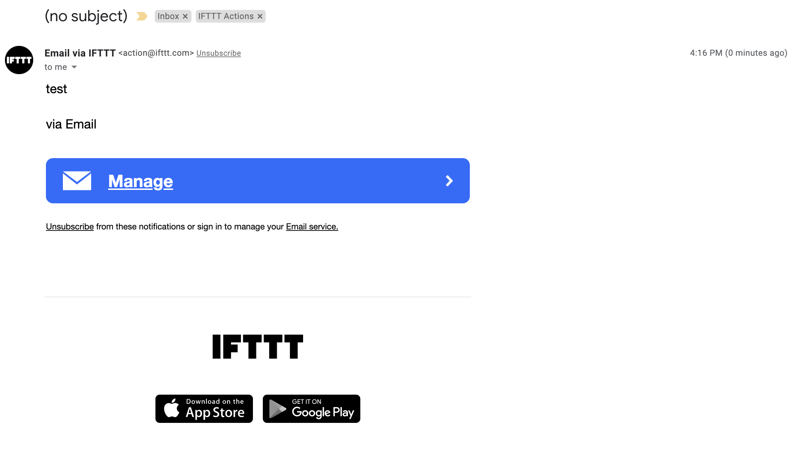

### Cybersecurity First Principles in this lesson

* __Abstraction__: An abstraction is a representation of an object or concept. It could be something such as a door, a speedometer, or a data structure in computer science. Abstraction decouples the design from the implementation. The gauges in an automobile are an abstraction of the performance of a car. A map is an abstraction of the earth.

* __Data Hiding__: Data hiding is the technique that does not allow certain aspects of an object to be observed or accessed. Data and information hiding keeps the programmer from having complete access to data structures. It allows access to only what is necessary.

* __Minimization__: Minimization refers to having the least functionality necessary in a program or device. The goal of minimization is to simplify and decrease the number of ways that software can be exploited. This can include **turning off ports that are not needed**, reducing the amount of code running on a machine, and/or turning off unneeded features in an application.

* __Modularization__: The concept of modularity is like building blocks. Each block (or module) can be put in or taken out from a bigger project. Each module has its own separate function that is interchangeable with other modules.

* __Resource Encapsulation__: Encapsulation is an object oriented concept where all data and functions required to use the resource are packaged into a single self-contained component. The goal is to only allow access or manipulation of the resource in the way the designer intended. An example, assume a flag pole is the object. There are fixed methods on how the flag pole is to be used. Put the flag on, take the flag off, raise or lower the flag. Nothing else can be done to the flag pole.

### Introduction and goals
In this lesson, we will learn how to plug and play different web services together to make some simple inventions that can automate tasks and send alerts, alarms, and messages based on various triggers.

### Goals
By the end of this tutorial, you will be able to:
* Interact with `web services`
* `Mashup` web services to make some apps that automate tasks

### Materials Required

* A free IFTTT Account (instructions to create one in this lesson)

### Prerequisite lessons
* [Computational Thinking](../introduction_to_computational_thinking_and_design_process/README.md)

### Table of Contents
<!-- TOC START min:1 max:3 link:true asterisk:false update:true -->
        - [Cybersecurity First Principles in this lesson](#cybersecurity-first-principles-in-this-lesson)
        - [Introduction and goals](#introduction-and-goals)
        - [Goals](#goals)
        - [Materials Required](#materials-required)
        - [Prerequisite lessons](#prerequisite-lessons)
        - [Table of Contents](#table-of-contents)
        - [Before We Start](#before-we-start)
        - [Using web services](#using-web-services)
        - [Create an IFTTT Account](#create-an-ifttt-account)
        - [Everything is an applet](#everything-is-an-applet)
        - [Web Service Wizardry - your first applet](#web-service-wizardry---your-first-applet)
        - [Email a tweet](#email-a-tweet)
        - [Maker service to a Tweet](#maker-service-to-a-tweet)
        - [Self Exploration](#self-exploration)
        - [Cybersecurity First Principle Reflections](#cybersecurity-first-principle-reflections)
    - [Lead Author](#lead-author)
        - [Acknowledgements](#acknowledgements)
        - [License](#license)
<!-- TOC END -->


### Before We Start
<!--Last lesson link leads to a page with no content-->
In the [computational thinking lesson](../introduction_to_computational_thinking_and_design_process/README.md), you learned how to think systematically about a problem, discover the needs of problem stakeholders, design a solution, and test it. You will put those skills to work here.

### Using web services
`Web services` are, as the name implies, services that live on the web. You use these all the time - mostly without knowing it. The internet is built on top of them. Google, Dropbox, Youtube, Twitter, and Facebook are just a few juggernauts that provide and use many different web services. In this lesson, we are going to use a `mashup service` called [IFTTT](https://ifttt.com) (which stands for **I**f **T**his, **T**hen **T**hat ). **IFTTT** is a great platform that _talks to_ all kinds of other web services. This is a great example of the __modularity__ `cybersecurity first principle`, because `IFTTT` can swap out components for others easily.


### Create an IFTTT Account
To start we need to create an account:

* Visit https://ifttt.com
* You will need to create an account with `IFTTT` if you don't already have one. Click `get started` to make an account
* Walk through the online instructions to create your account

### Everything is an applet
Once you sign in, you will see might see some `recipes` that have already been made for you by the IFTTT team. A `recipe` is a `design pattern` that combines input and output behavior to do something cool. `IFTTT` refers to recipes as `applets`.

In IFTTT, everything you might want to do involves making an `applet`. An applet in IFTTT is a very `simple` app that involves two services. The basic premise is that `if` something happens in an input service (we will call it **service A**), `then` an output service (aka **service B**) should do something using its capabilities in response. Applets allow you to mix and match services as `inputs` and `outputs` in a similar way to how `GPIO` pins allow for different components to work together on the same interface. This is an example of `modularity`. The applet concept also `encapsulates` the service resource. This is a nice example of `resource encapsulation` because you don't need to know how the service works or why, just that it accepts certain inputs/outputs and performs a certain kind of task.

### Web Service Wizardry - your first applet
Let's create a new `applet` that sends an email whenever an IFTTT trigger receives an email. This applet only uses one service - an `email service`, but uses two different features of the service.

* In your browser, visit https://ifttt.com/create or go to https://ifttt.com/home and click `create +`.
* Click the `add` button to specify the **IF** condition our applet will fire up on.
* You will see all of the service options available to be used as _IF_ conditions. Find `email` by typing it in the search/filter bar.
* Select the first option `Send IFTTT` any email.

 

* Now click the `add` icon to specify the **THAT** condition.
* You will again see all of the service options, select `email` again and then **send me an email**. You will be asked to link your email to your `IFTTT` account (if you haven't already). Go ahead and confirm your email.
* Once selected, you will see an email template available. Click `add ingredient` to see available information coming from the input. You should have, `from`, `body` and other options that come from the input service. You can customize the email message here if you want. 
* When satisfied, select **create action** to set the email service as the **THAT**.
* Click **continue** and then **finish** to turn the applet on.
* You should see the applet as a box explaining what it does.


* Try it out by emailing `trigger@applet.ifttt.com`

Check your email!


> It worked!

This is a simple, but powerful tool. It also shows off __resource encapsulation__ and __abstraction__. In terms of resource encapsulation, each of the services connected to `IFTTT` have many functions. These functions are encapsulated in a service (e.g. `email` in this example). The functions are also __abstract__ because `IFTTT` doesn't need to know _how_ they work, just that they achieve a certain purpose (e.g. send an email). This helps _model_ or _abstract_ the implementation away from the design.

### Email a tweet
Let's make an app that accepts an email and then sends a tweet. This requires a `Twitter` account. If you don't have and don't want to create a Twitter account, feel free to skip this, but it's fun!

* Go to https://ifttt.com/home, click **Create+**.
* As the **IF** condition, select `email` once again.
* This time, select the `Send IFTTT an email tagged` option
* Give it the hashtag `nebraskagencyber`
* For the **THAT** service, select the `Twitter` service. You will be asked to link your Twitter account first.
* Select the `Post a Tweet` option.
* Make your tweet text as follows:


* Press **create action** and then **finish**

Now let's try it out. Send an email to `trigger@applet.ifttt.com`
Make sure to include the `#nebraskagencyber` in the subject line. Then for the message put whatever you want to appear in your tweet. For mine, I went with the following:


This posted to twitter for me:


Pretty neat!

### Maker service to a Tweet
In IFTTT there is a special service called a `webhook` that allows makers (like you!) to trigger events programmatically and pass them data. Lets experiment create an applet that sends a tweet using a webhook.

* Go to https://ifttt.com/home, click **Create+**.
* As the **IF** condition, select `webhooks` as the service A.
* A webhook requires an event name. Let's call ours `tweet`.


* For the **THAT** service, select `twitter` once again.
* Configure your `post a tweet` option to look like this:


* Press **create action** and then **finish**

Now, triggering our maker webhook requires us to know a little bit about how this service works. Since it is not fully specified, it allows us to develop our own behaviors. For our tweet applet, we need to send the `tweet` event to maker service. 

To figure out how we do that, visit this page: https://ifttt.com/maker_webhooks/settings

Here you will see the name of your account and the url that you can use to learn more about how the maker (webhook) service works. 


Note the area outlined in red. This is something called your `secret key`. It is a unique secret just for you. Don't share it! A secret key is kind of a like a password that programs uses to interface with other programs (like the service-to-service interactions we've been making with IFTTT).

If you want to visit the link shown there, you will get some detailed information about how this service works. This kind of information is called `Service Documentation` and can be used to execute the service.

In our tweet applet, we need to trigger an event called `tweet`. The service documentation tells us that the correct way to do so is to send a `url request` to the `endpoint` below:

```
https://maker.ifttt.com/trigger/tweet/with/key/your_key_goes_here
```

The documentation also tells us we can send `parameters` labeled Value1 to Value3. For our applet, we won't need these right now, but keep this in mind - because later lessons will use these.

For now, visit the link above in a browser after you've inserted your own secret key into the url.

You have just connected one component (a browser) to a programmatic interface service and finally onward to twitter. Let's check the result. You should see this in your browser:


And this on twitter:


Well done!

### Self Exploration
Try some different designs yourself. You can combine any services with any other services. You could also change out some of the ingredients in the patterns we used to try some other ones.


### Cybersecurity First Principle Reflections
In this lesson, we saw web services, such as `IFTTT`, can __abstract__ away details about devices and instead focus on recipes or `design patterns` to describe how things work. We also saw that by keeping functionality __modular__, `IFTTT` can combine many services together. We only need to know about input and output parameters to link them together.

Web services use __resource encapsulation__ to ensure that all functions related to the execution of an app or service are neatly within the scope of the service itself. `IFTTT` relies on services to be encapsulated so that they can provide external services a simple interface to use their abilities.

__Data hiding__ is also important to prevent internal data in the service from being released outside of the `service invocation`. Local data remains hidden, while `interfaces` expose only what the service wants to release (for instance to `IFTTT`). This also relates to __minimization__ because services can turn ports and other access off except for the specific interfaces it wants to leave open for other services to use.


<!-- ### Additional Resources
For more information, investigate the following.

 -->

## Lead Author

- Matt Hale

### Acknowledgements
Special thanks to [Dr. Robin Gandhi](http://faculty.ist.unomaha.edu/rgandhi/) for reviewing and editing this lesson.

### License
[Nebraska GenCyber](https://github.com/MLHale/nebraska-gencyber) <a rel="license" href="http://creativecommons.org/licenses/by-nc-sa/4.0/"></a><br /> is licensed under a <a rel="license" href="http://creativecommons.org/licenses/by-nc-sa/4.0/">Creative Commons Attribution-NonCommercial-ShareAlike 4.0 International License</a>.

Overall content: Copyright (C) 2017-2021  [Dr. Matthew L. Hale](http://faculty.ist.unomaha.edu/mhale/), [Dr. Robin Gandhi](http://faculty.ist.unomaha.edu/rgandhi/), and [Dr. Briana B. Morrison](http://www.brianamorrison.net).

Lesson content: Copyright (C) [Dr. Matthew L. Hale](http://faculty.ist.unomaha.edu/mhale/) 2021.  
<a rel="license" href="http://creativecommons.org/licenses/by-nc-sa/4.0/"></a><br /><span xmlns:dct="http://purl.org/dc/terms/" property="dct:title">This lesson</span> is licensed by the author under a <a rel="license" href="http://creativecommons.org/licenses/by-nc-sa/4.0/">Creative Commons Attribution-NonCommercial-ShareAlike 4.0 International License</a>.
