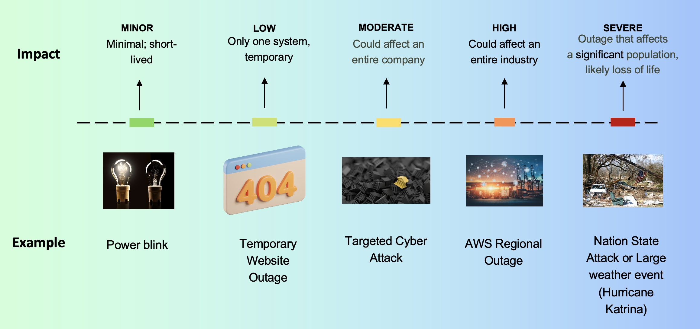
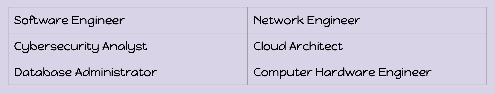
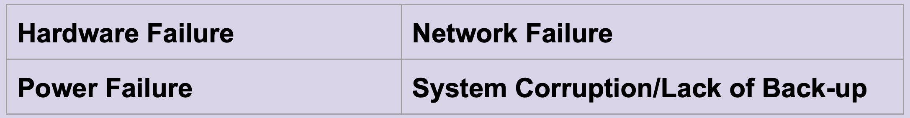
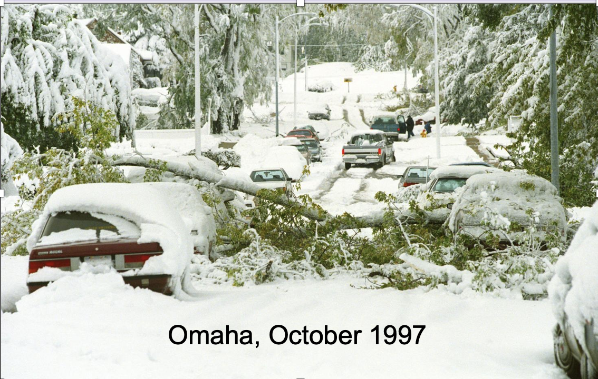
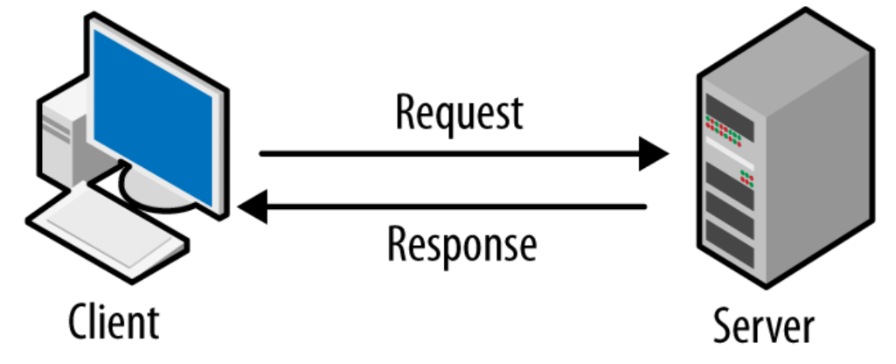
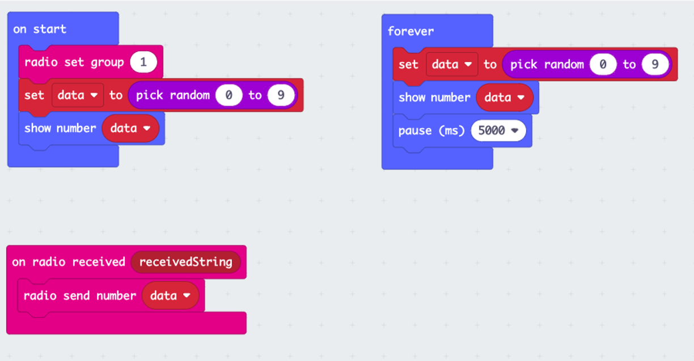
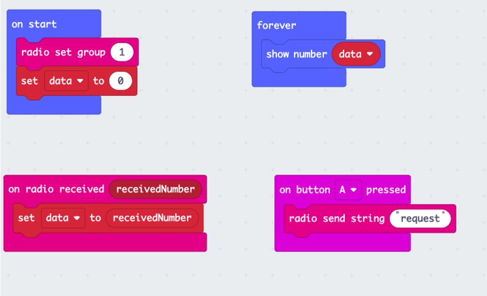
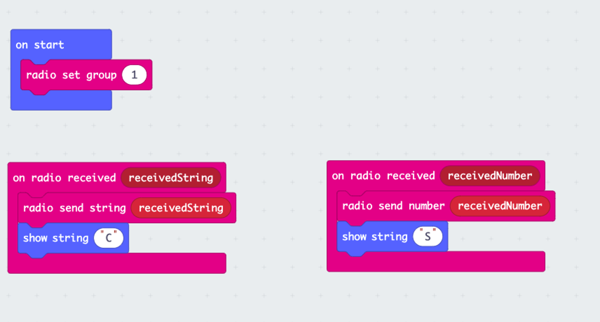

### Cybersecurity First Principles in this lesson

* __Defense in Depth__: Using multiple layers of protection to secure something.

### Introduction
Availability in cybersecurity ensures that systems, services, and data are accessible and operational when needed by authorized users. It is a crucial aspect of security that focuses on minimizing downtime and preventing disruptions from attacks or failures.

### Goals
By the end of this tutorial, you will be able to:
* understand and explain the importance of availability in cybersecurity and how it ensures continuous access to systems and data.
* apply the concept of availability by designing and implementing a system using microbits.

### Materials Required
* Microbit

### Prerequisite lessons
- Cyber Security Concepts

### Table of Contents

- [Availability](#availability)
- [Availability Spectrum](#availability-spectrum)
- [Jobs with Availability Duties](#jobs-with-availability-duties)
- [Some Attacks that Affect Availability](#some-attacks-that-affect-availability)
- [Other Factors that Affect Availability](#other-factors-that-affect-availability)
- [Activity](#activity)
- [Additional Resources](#additional-resources)
- [Lead Author](#lead-author)
- [Acknowledgements](#acknowledgements)
- [License](#license)

### Availability
- Systems are able to be accessed as expected when needed. Data/information can be included.
- Can you think of a time when the availability principle has been broken for you?

### Availability Spectrum

### Jobs with Availability Duties
- There are many career-areas/jobs that provide support to ensure that availability is maintained. 
- Risk managers will typically understand all of the systems in a company to understand which ones are the most important and make sure those are the ones that stay available during an incident.

### Some Attacks that Affect Availability
- **DoS (Denial of Service)** - occurs when legitimate users are unable to access information systems, devices, or other network resources due to the actions of a malicious cyber threat actor.

- **DDoS (Distributed Denial of Service)** - A DDoS attack occurs when a threat actor uses resources from remote locations to attack an organization’s online operations.  

- **Ransomware** - A form of malware designed to encrypt files on a device, rendering any files and the systems that rely on them unusable.

### Other Factors that Affect Availability

- In October 1997, Omaha had a huge ice/snow storm. A lot of the trees still had leaves, so the storm caused a lot of fallen trees/limbs which cut out power. The Internet was becoming popular (dot-com bubble!!) but many companies (particularly those in Omaha) had web servers running locally (meaning IN OMAHA) without uninterruptible power supplies (UPSs) and they didn’t have generators. UPSs sometimes only last 30 minutes! For a webpage to work, it needs to have a web server with power, so this affected **availability** all over Omaha. People were desperately scrambling for generators so that their business did not lose money. People in Florida did not care that a company in Nebraska lost power, they just wanted their website to work!

### Activity

1. We will create a Micro:bit network connecting a Client to the Server. 
2. Data is stored on the server and needs to be sent to the client when requested.
3. In groups of 3-4, select one Micro:bit to be a Server and another to be a Client.

#### Server Code

#### Client Code

#### Questions
1. Is there any level of security?
2. How can you ensure the server you requested is the one sending the data?
3. What happens if two groups pick the same radio group?
4. What is the range of the Micro:bit network?

#### Range Extender - Repeater

### Lead Author

- Derek Babb

### Acknowledgements

Special thanks to Gul e Fatima Kiani for reviewing and editing this lesson.

### License
[Nebraska GenCyber](https://www.nebraskagencyber.com)   is licensed under a <a rel="license" href="http://creativecommons.org/licenses/by-nc-sa/4.0/">Creative Commons Attribution-NonCommercial-ShareAlike 4.0 International License</a>.

Overall content: Copyright (C) 2024  [Dr. Matthew L. Hale](http://faculty.ist.unomaha.edu/mhale/), [Dr. Robin Gandhi](http://faculty.ist.unomaha.edu/rgandhi/), [Dr. Deanna House](#),[Derek Babb](https://derekbabb.com/), [Kristeen Shabram](#), [Dr. Lynn Spady](#), and [Gul e Fatima Kiani](#)

Lesson content: Copyright (C) [Dr. Matthew L. Hale](http://faculty.ist.unomaha.edu/mhale/) 2024.  
 This lesson is licensed by the author under a <a rel="license" href="http://creativecommons.org/licenses/by-nc-sa/4.0/">Creative Commons Attribution-NonCommercial-ShareAlike 4.0 International License</a>.
