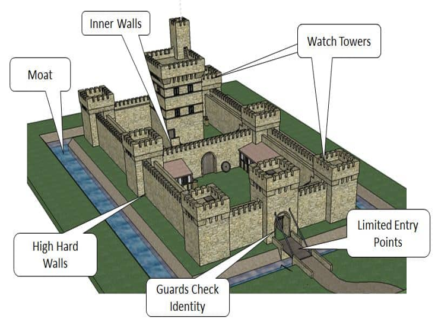
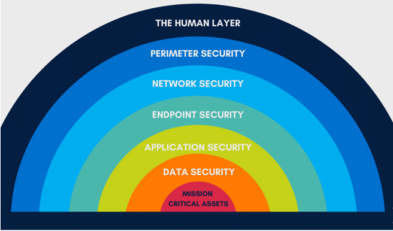
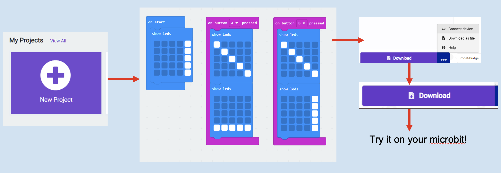
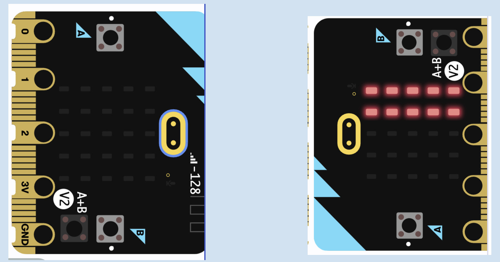
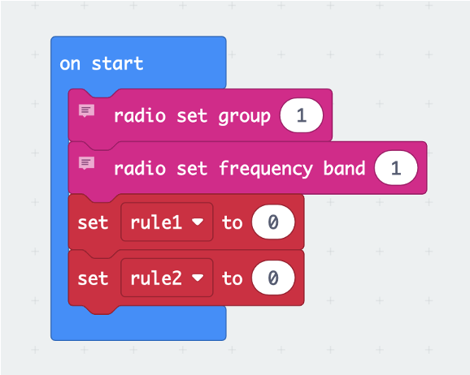

### Cybersecurity First Principles in this lesson

* __Defense in Depth__: Using multiple layers of protection to secure something.

### Introduction
Defense in depth is a multi-layered security strategy that incorporates multiple defensive mechanisms to protect information and resources. This approach ensures that if one security layer is breached, additional layers continue to provide protection. In this lesson, we will explore how to build a mini defense system using a Microbit!

### Goals

By the end of this tutorial, you will be able to:
* understand and explain the principles of defense in depth and its importance in cybersecurity.
* apply the concepts of defense in depth by designing and implementing a multi-layered security system using microbits

### Materials Required
* Microbit

### Prerequisite lessons
- Cybersecurity concepts

### Table of Contents
- [Defense in Depth](#defense-in-depth)
- [Castle Defenses ⇔ Computer Systems](#castle-defenses-⇔-computer-systems]
- [Activities](#activities)
- [Lead Author](#lead-author)
- [Acknowledgements](#acknowledgements)
- [License](#license)

### Defense in Depth
#### Definition
Using multiple layers of protection to secure something.

#### Key Ideas
Layering, failure handling, redundancy

### Take the example of Castles

- Castle comes from a latin term meaning “fortified place

#### Castle Defenses ⇔ Computer Systems

**The Human Layer:** Awareness and Training (Guards)

**Perimeter Security:** Firewalls, spam filters etc. (outer walls and draw bridges)

**Network Security:** Segmentation (inner walls)

**Application Security:** Anti-virus (watch towers)

**Data Security:** Passwords (inner locks)

**Mission Criticial Assets:** Encryption (king's/queen's guard)

 
> Img Credit: [https://www.questionmark.com/app/uploads/2022/11/castle2-1.jpg]

> Img Credit: [https://www.diamondit.pro/7-layers-of-cybersecurity/]

#### Takeaway
Secure your systems like castles

### Activities
#### Activity 1: Secure a Castle
- Challenge 1 - build your physical defenses
- Draw your castle, it should have:
    - a moat 
    - an outer wall
    - a courtyard
    - and a keep
- Discuss your defenses with the peers on your table
- What attacks might your castle defense be resilient against?
- What attacks might it still be vulnerable too?

#### Activity 1: Secure a Castle - With Tech
- Challenge 2 - Guard the entrance with a drawbridge
- Build an LED drawbridge over your moat

#### Activity 2: Radio-controlled attack/defend game
**Goal:** prevent all attacks with defense in depth
Download complete code from [here](https://github.com/MLHale/did)

- Two player game (Take turns)
    - one player is the ‘defender’, second player is the ‘attacker’
    - PRESS A+B at the same time to reset screen / be the defender
- Attacker options
    - Press A, B, Logo for ‘regular attack’
    - Long Press logo for ‘special attack’
- Defend options
    - Tilt left to toggle firewall 1
    - Tilt right to toggle firewall 2
 
#### Activity 3: Add a Password
- Guard the entrance with a passworded drawbridge
- Use a more advanced version that actually raises a bridge
- Open a new browser tab
- Go to [https://tinyurl.com/ngc23-moat](https://tinyurl.com/ngc23-moat)
- Click ‘Simulator’
- Download the code
- Try it with a motor!

### Lead Author

- Dr. Matthew L. Hale

### Acknowledgements

Special thanks to Gul e Fatima Kiani for reviewing and editing this lesson.

### License
[Nebraska GenCyber](https://www.nebraskagencyber.com)   is licensed under a <a rel="license" href="http://creativecommons.org/licenses/by-nc-sa/4.0/">Creative Commons Attribution-NonCommercial-ShareAlike 4.0 International License</a>.

Overall content: Copyright (C) 2024  [Dr. Matthew L. Hale](http://faculty.ist.unomaha.edu/mhale/), [Dr. Robin Gandhi](http://faculty.ist.unomaha.edu/rgandhi/), [Dr. Deanna House](#),[Derek Babb](https://derekbabb.com/), [Kristeen Shabram](#), [Dr. Lynn Spady](#), and [Gul e Fatima Kiani](#)

Lesson content: Copyright (C) [Dr. Matthew L. Hale](http://faculty.ist.unomaha.edu/mhale/) 2024.  
 This lesson is licensed by the author under a <a rel="license" href="http://creativecommons.org/licenses/by-nc-sa/4.0/">Creative Commons Attribution-NonCommercial-ShareAlike 4.0 International License</a>.

