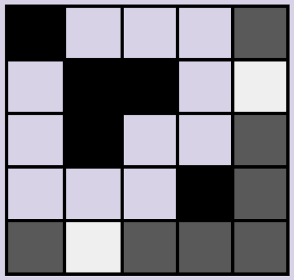

### Introduction
Data integrity ensures information remains unaltered (unchanged) and complete (no missing parts) throughout its lifecycle. In this lesson we'll see how data, must stay unchanged and complete from creation to storage and use, to ensure it's reliability and trustworthiness. We'll even explore how to build a system that checks data integrity using a Microbit!

### Goals

By the end of this tutorial, you will be able to:
* know what data integrity means and why it's important.
* identify techniques used to check if images haven't been tampered with.
* crack the code behind ISBNs, a special system used to identify books accurately.

### Materials Required

* Instructor's slides
* Microbit

### Prerequisite lessons
None

### Table of Contents
- [Integrity](#integrity)
- [Integrity of Images](#integrity-of-images)
- [Integrity of ISBN](#integrity-of-isbn)
  - [ISBN-10](#isbn-10)
  - [ISBN-13](#isbn-13)
- [Error Detction](#error-detection)
- [Error Correction](#error-correction)
- [Image Protocol](#image-protocol)
- [Activity with Microbits](#activity-with-microbits)
- [Additional Resources](#additional-resources)
- [Lead Author](#lead-author)
- [Acknowledgements](#acknowledgements)
- [License](#license)

### Integrity
- How do we know that data has not been changed?
- Data could be changed on accident.
- Data could be changed on purpose.
- Integrity is the assurance that the data we have is the same as the data that was sent.

### Integrity of Images
- Imagine we have a 4x4 Black & White Image
  
  
  
- How can we verify this image is displayed as intended?
- We can add a bit in a 5th row/column.
- The 5th row/column should make the number of black bits even.
  
  

  
  
- Images are not sent as pictures.
- Images are sent as a series of zeros and ones
  - Everything is sent as zeros and ones.

### Integrity of ISBN
- Before 2007, ISBNs were 10-digit long.
- After that year ISBNs extended to 13 digits. 
- In both ISBN-10 and ISBN-13 standards, the last digit is the check digit, for error detection.
- ISBN-10 check digit is calculated by Modulus 11 with decreasing weights on the first 9 digits.

#### ISBN-10 
**1. Example:** 0-38549-422-X
- 0×10 + 3×9 + 8×8 + 5×7 + 4×6 + 9×5 + 4×4 + 2×3 + 2×2 + 10×1 = 231
- 231 / 11 = 21 remainder 0.
- This is a valid ISBN

**2. Example:** 0-060-53348-X
- 0×10 + 0×9 + 6×8 + 0×7 + 5×6 + 3×5 + 3×4 + 4×3 + 8×2 + 10×1 = 48 + 35 + 15 + 12 + 12 + 16 + 10 = 148
- 148 / 11 = 13 remainder 5.
- This is a invalid ISBN

#### ISBN-13
ISBN-13 check digit is calculated by Modulus 10 with alternate weights of 1 and 3 on the first 12 digits.

1. Example: 978-1549304002
- 9×1 + 7×3 + 8×1 + 1×3 + 5×1 + 4×3 + 9×1 + 3×3 + 0×1 + 4×3 + 0×1 + 0×3 + 2×1 =90
- 90 / 10 = 9 remainder 0.
- This is a valid ISB

2. Example: 978-0-80-374107-2
- 9×1 + 7×3 + 8×1 + 0×3 + 8×1 + 0×3 + 3×1 + 7×3 + 4×1 + 1×3 + 0×1 + 7×3 + 2×1 = 9 + 21 + 8 + 0 + 8 + 0 + 3 + 21 + 4 + 3 + 0 + 21 + 2 
- 100 / 10 = 10 remainder 0.
- This is a valid ISBN

### Error Detection
- Some techniques can tell there was a mistake.
- They cannot identify the specific problem.
- An example of error detection we saw earlier?

### Error Correction
- Some techniques can tell there was a mistake AND find the mistake.
- If possible, an algorithm can correct the mistake to re-create the data.

### Binary Numbers
To send information (like images, text, numbers, videos, etc.) we must store all data as Binary numbers

### Image Protocol
- How would you convert an image to binary for the purpose of saving or transmitting?
- A Protocol is a set of rules to define how to expect information.
- What is all the information you would need for a black & white image?
- Would you include error detection/correction?

#### Example Protocol
4-bits for width
4-bits for height
Image data (1 = White, 0 = Black)
Column Parity Bits for Error Checking
0101 (5)
0101 (5)
1010111011111111101110001 (Image Data)
00100 (Column Parity Bits)

### Activity
#### Micro:bit Images
- Create two images for your micro:bit to display. 
- Randomly choose which image displays when A or B are clicked.
- Quiz a neighbor to see if they can determine which image has an error.
- Can they identify which pixel is wrong?

- x, y coordinates for LEDs in the 5x5 grid

- Plot (0,0)

- Similarly plot (4,4), (4,0)
- **Microbit Whackamole!**
 

### Additional Resources
- [Binary Game](https://tinyurl.com/CyberBinary)
- [Microbit image integrity](https://github.com/robinagandhi/imageintegrity/)

### Lead Author

- Derek Babb

### Acknowledgements

Special thanks to Gul e Fatima Kiani for reviewing and editing this lesson.

### License
[Nebraska GenCyber](https://www.nebraskagencyber.com)   is licensed under a <a rel="license" href="http://creativecommons.org/licenses/by-nc-sa/4.0/">Creative Commons Attribution-NonCommercial-ShareAlike 4.0 International License</a>.

Overall content: Copyright (C) 2024  [Dr. Matthew L. Hale](http://faculty.ist.unomaha.edu/mhale/), [Dr. Robin Gandhi](http://faculty.ist.unomaha.edu/rgandhi/), [Dr. Deanna House](#),[Derek Babb](https://derekbabb.com/), [Kristeen Shabram](#), [Dr. Lynn Spady](#), and [Gul e Fatima Kiani](#)
