### Introduction
In cybersecurity, "keep it simple" means prioritizing clear, manageable security practices. In this lesson, we will explore the concept of 'keep it simple' In this lesson with several unplugged activities.

### Goals

By the end of these fun activities, you will be able to:
* understand how simplifying things can actually make them stronger.

### Materials Required
- Paper
- Tape
- Scissors (Optional)

### Prerequisite lessons
Introduction to Cybersecurity Concepts

### Table of Contents
- [Important Vocabulary](#important-vocabulary)
- [Activity 1: Logic Unplugged](#activity-1-logic-unplugged)
  - [Logic Unplugged Activity](#logic-unplugged-activity-rules)
  - [Logic Unplugged Activity-Materials](#logic-unplugged-activity-materials)
  - [Logic Unplugged - Your Turn!](#logic-unplugged-your-turn!)
- [Activity 2: Write It Do It](#activity-2-write-it-do-it)
- [Activity 3: Paper Tower Challenge](#activity-3-paper-tower-challenge)
- [Lead Author](#lead-author)
- [Acknowledgements](#acknowledgements)
- [License](#license)

### Important Vocabulary
- **Algorithm** - a step-by-step set of instructions to accomplish a task or solve a problem. Written in human instructions.
- **Program** - A list of steps that tell a computer how to complete a task.
- **Bug** - An error in a line of code that causes the program to not run.
- **Debugging** - The process of identifying bugs (errors) in a program.

### Activity 1: Logic Unplugged 
- Understanding logic is an important step in programming
- Our goal during this lesson is to instruct a “robot” to stack cups in a certain design.
  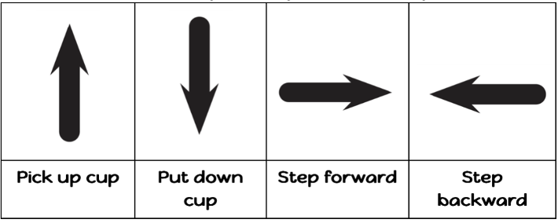
- Robots in Action 
- How do you think these robots know how to dance?

Let’s try an activity! 
#### Logic Unplugged Activity-Rules
- **Pick up** cup means that the cup automatically goes up as high as it needs to.
- **Put down** cup means that it automatically goes down until it lands on something.
  - The hand automatically returns to cup stack after setting down a cup.
- **Step forward** means the robot moves one step (1/2 cup width) forward.
- **Step backward** means the robot moves one step (1/2 cup width) backward.

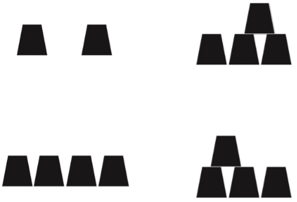

- Programmers are **not** allowed to talk when the robot is working. 
    - This includes blurting out answers or pointing out when the robot has done something wrong.
- Programmers should raise their hand if they see a bug.

#### Logic Unplugged Activity-Materials
You will need:
- A partner - One person is the **Programmer** and the other person is the **Robot**.
- You can use a cup spacing mat if you need to
- Depending on the design, you will need 2-5 cups per “pair”

#### Logic Unplugged - Your Turn!
- Now try it on your own! 
- Get into your groups and pick one of these designs.
  
  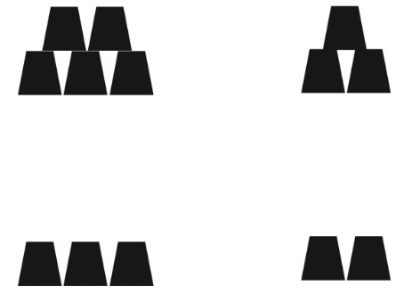

   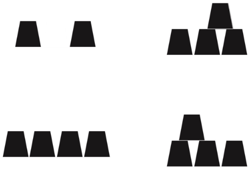
- Make sure you also write down your “program” using the symbols in your workbook

### Activity 2: Write It Do It 
- Keep the paper turned upside down until you’re told to turn it over
- When you’re finished following the directions, turn your paper over
  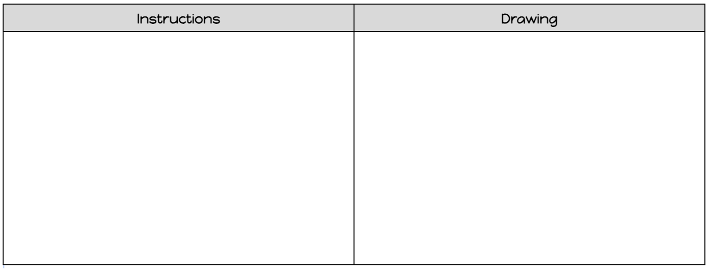

- Does yours look like the one shown below?  Why or why not?
- Could there be more specific instructions given?  If so, which step?

- Keep your paper folded until you’re told to open it
- Write the instructions for your drawing (try to keep it hidden)
- Tear on the dotted line and crumple up the “Drawing Side”
- Hand the “Instructions Side” to the instructor
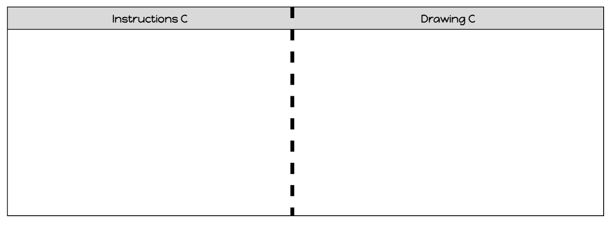

- Follow the instructions written and create the drawing
- Here are some different drawings:
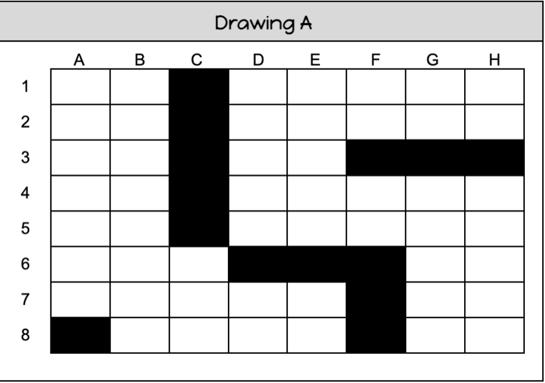 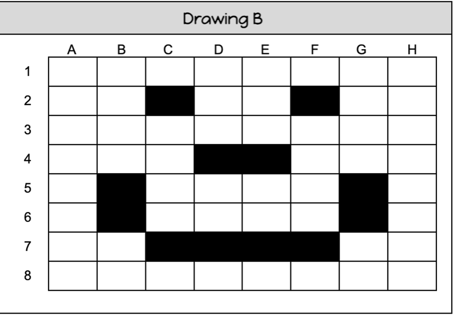

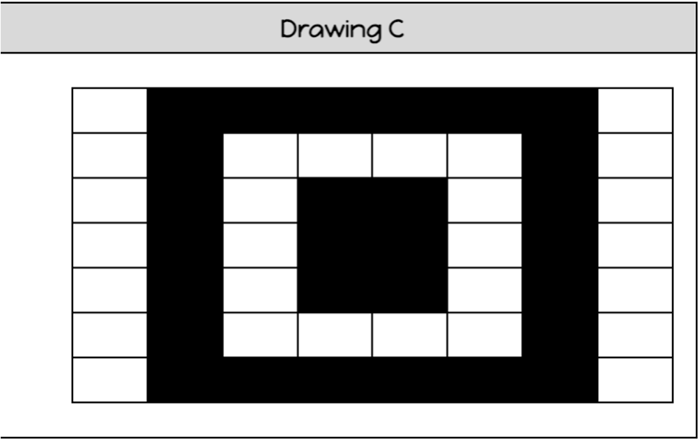 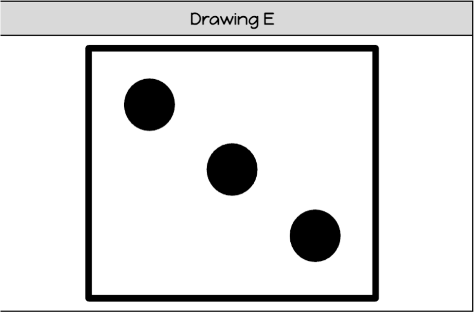

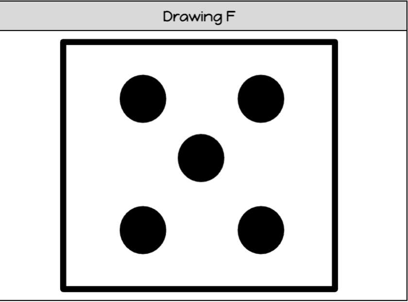 

### Activity 3: Paper Tower Challenege
**Objective:** Create the tallest structure that using only 6 pieces of paper and tape.

**Constraints/Limits:**
- The structure must be able to stand alone for at least 5 seconds.
- The structure cannot be taped down to a surface nor have any additional material supporting it up.

### Lead Author

- Dr. Deanna House, Dr. Lynn Spady, Kristeen Shabram

### Acknowledgements

Special thanks to Gul e Fatima Kiani for reviewing and editing this lesson.

### License
[Nebraska GenCyber](https://www.nebraskagencyber.com)   is licensed under a <a rel="license" href="http://creativecommons.org/licenses/by-nc-sa/4.0/">Creative Commons Attribution-NonCommercial-ShareAlike 4.0 International License</a>.

Overall content: Copyright (C) 2024  [Dr. Matthew L. Hale](http://faculty.ist.unomaha.edu/mhale/), [Dr. Robin Gandhi](http://faculty.ist.unomaha.edu/rgandhi/), [Dr. Deanna House](#),[Derek Babb](https://derekbabb.com/), [Kristeen Shabram](#), [Dr. Lynn Spady](#), and [Gul e Fatima Kiani](#)

Lesson content: Copyright (C) [Dr. Matthew L. Hale](http://faculty.ist.unomaha.edu/mhale/) 2024.  
 This lesson is licensed by the author under a <a rel="license" href="http://creativecommons.org/licenses/by-nc-sa/4.0/">Creative Commons Attribution-NonCommercial-ShareAlike 4.0 International License</a>.
