### Introduction
Confidentiality is a security principle that ensures information is accessible only to those authorized to view it. It protects sensitive data from unauthorized access and disclosure. In this lesson, we will get hands-on with 'Confidentiality Unplugged' and explore Caesar cipher encryption on a Microbit.

### Goals

By the end of this tutorial, you will be able to:
* understand the importance of confidentiality and its role in protecting sensitive information.
* implement strategies and best practices to maintain confidentiality in various scenarios through hands-on activities and real-world examples.

### Materials Required

* Microbits

### Prerequisite lessons
- Cyber Security Concepts

### Table of Contents
- [Confidentiality](#confidentiality)
- [Confidentiality: Unplugged](#confidentiality-unplugged)
- [Threats to Confidentiality](#threats-to-confidentiality)
- [Activity](#activity)
- [Additional Resources](#additional-resources)
- [Lead Author](#lead-author)
- [Acknowledgements](#acknowledgements)
- [License](#license)

### Confidentiality
- The property that information is not disclosed to individuals, devices, or processes unless they have been authorized to access the information

  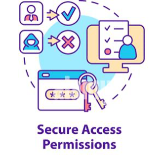
  > Img Credit: [https://www.alamy.com/secure-access-permissions-concept-icon-image466495847.html]
  
- **Definition:** Define _permissions_ for interactions with _protected_ objects.
- Everyday Life Example: 
  - Setting permissions on a website - who can access your contacts, camera, microphone, etc.
- Computing Example:
  - Certain User accounts only have  permissions to do things. Giving only necessary privileges creates accountability and prevents misuse.

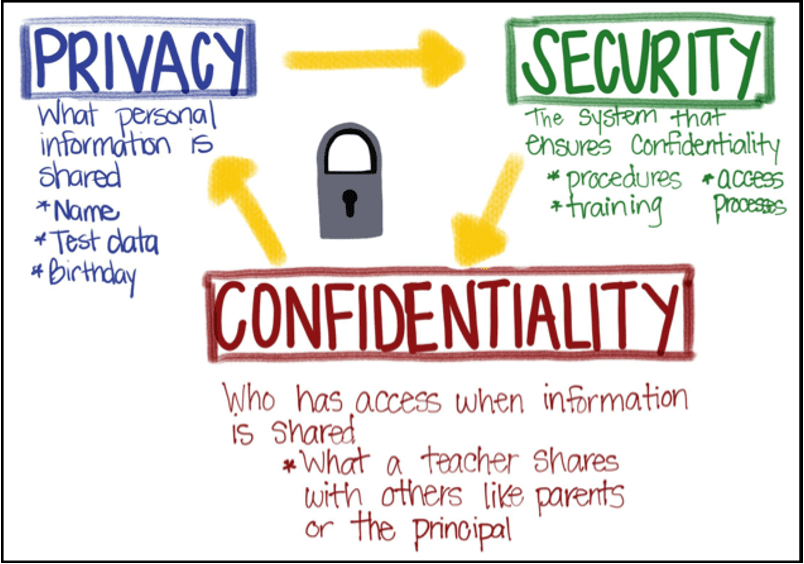

> Img Credit:[https://studentprivacycompass.org](https://studentprivacycompass.org)

### What are some protected, sensitive data in a classroom?

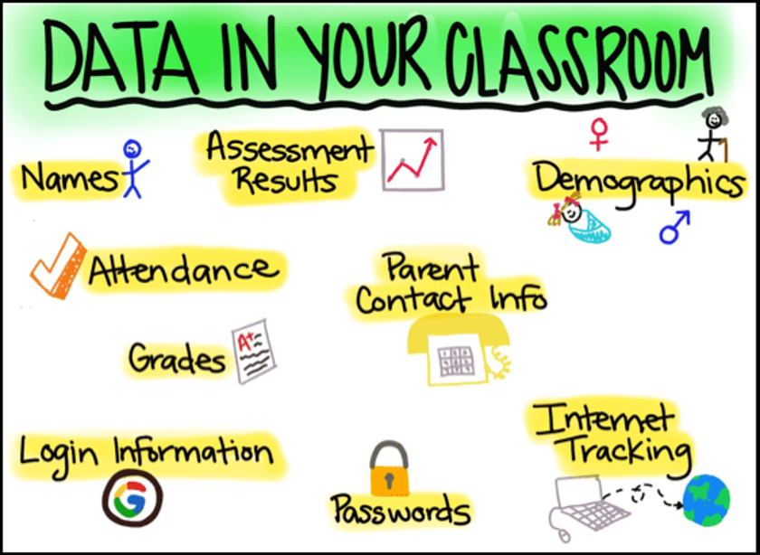
> Img Credit: [https://www.linkedin.com/pulse/use-students-data-khaled-salem-ph-d]

### Confidentiality: Unplugged
- Compute information about a group without revealing information about individuals
- Scenario:
  - Alice feels that her rating for the camp is  private!  But, she is also curious about how much is the average rating among her friends.
  - Is it possible to compute average ratingat your table without revealing anyone’s rating?
- **It is Possible!!!**
	
1. **Step 1:** In your head, rate the camp on a scale of 1 to 10. 1 is the lowest, and 10 is the highest. Do not reveal your rating to anyone.
2. **Step 2:** Locate a pen and book for your group.
3. **Step3:** Pick a group leader. 
    - Without showing others, the leader writes down a two digit random number on the first page of the book.
    - The leader tears it off, and keeps it.
4. **Step 4:** In their head, the group leader adds their rating to the starting random number 
    - Write the total in the book; close cover
    - Hand the book to the next person
5. **Step 5:** The next person remembers the number and tears off the page to keep with them
    - In their head, adds their rating to the number and writes it in the book; close cover
    - Hand the book to the next person
    - Repeat until all done.
6. **Step 6:** Return the pad to the group leader
    - Group leader does this
    - Final number minus Starting Number is equal to the Sum of all ratings
    - Sum of all ratings / # of people is equal to the average rating!

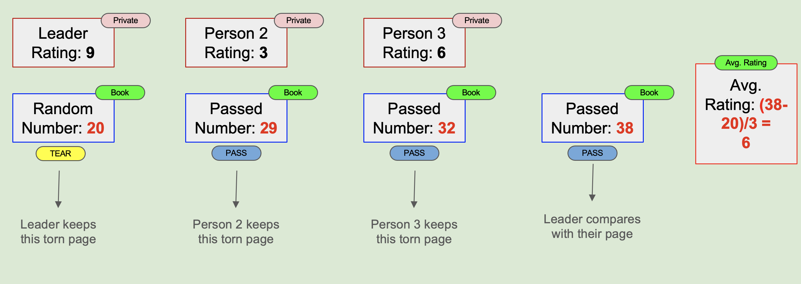

#### Summary
- It is possible to keep individual data hidden/private while computing aggregate data

#### Threats to Confidentiality
- People get fooled (Phishing)
- People bypass or turn off security for convenience 
- People may not realize their responsibilities with private data

### Activity 
#### Microbit Caesar Cipher
- Build your own Caesar Cipher Encrypter/Decrypter
  - **Challenge 1:** Use buttons A and B to scroll through letters in the alphabet one at a time
  - **Challenge 2:** Press the logo to increment the key. Long press the logo to display the key. 
  - **Challenge 3:** Tilt right to encrypt the selected letter. Tilt left to decrypt the selected letter

#### Challenge 1
- Set up the variables "on start"

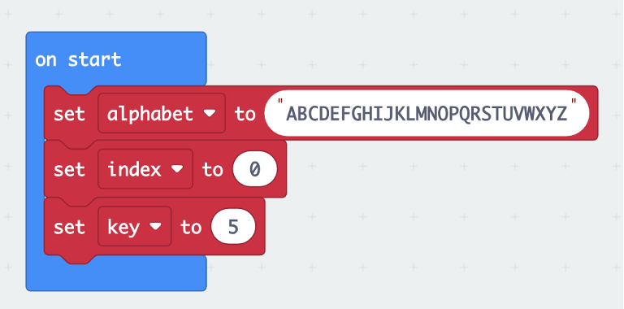

- Select character in alphabet at index position

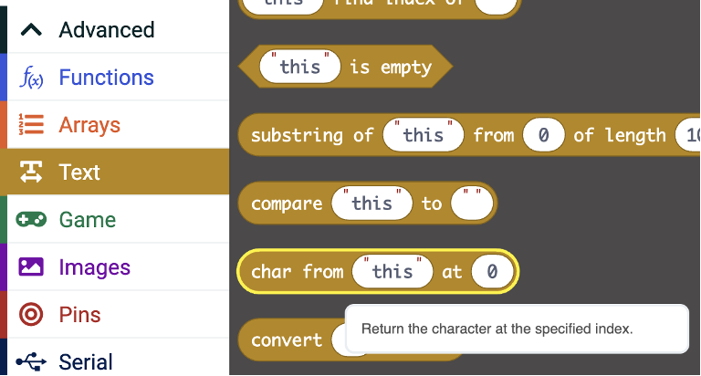

- Forever loop to show character at index in alphabet

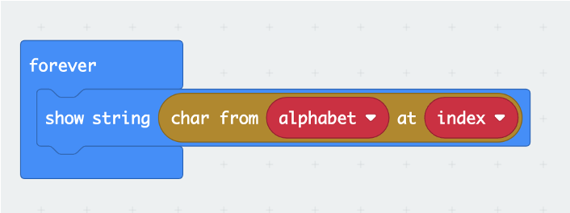

- Buttons A and B increment/decrement index

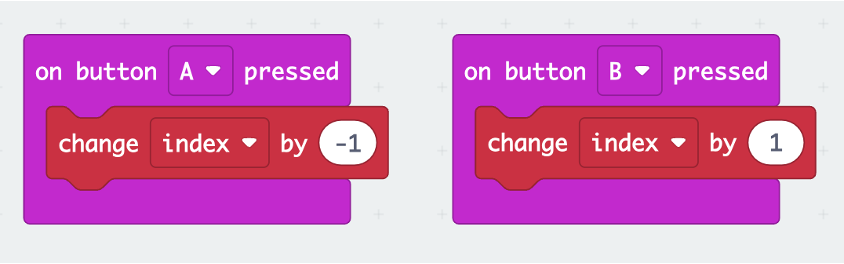

#### Challenge 2
- Logo press/long press to increment/decrement key
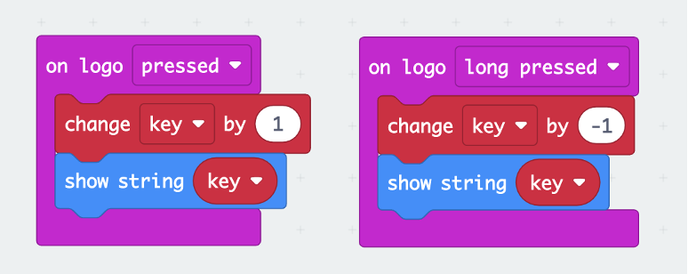

**How to make sure that index and key always stay between 0 and 25?**
**Modulo Operation**

- E.g. “5 mod 3 = 2” which means 2 is the remainder when you divide 5 by 3
    - For mod 3, answer is always 0, 1, or 2
- What is 10 mod 3?
    - what is the remainder?
- What is 14 mod 5?
    - What is the remainder?

**A modulo 10 system example**

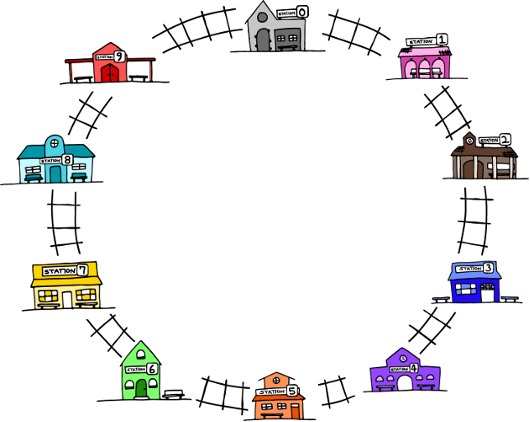

- The alphabet index is a modulo 26 system
    - index = index mod 26 (index rotates between 0 and 25)
      
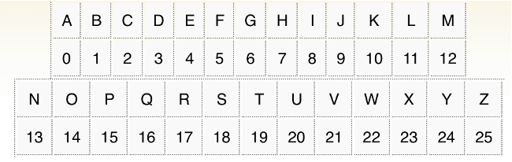

- Modulo Function

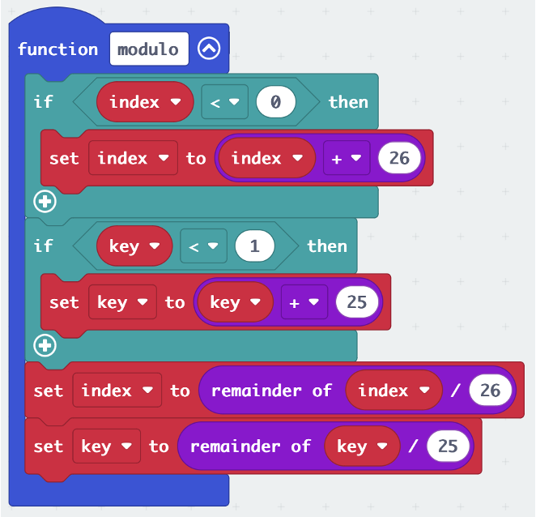

- Call modulo in our code everytime index or ket variables are updated

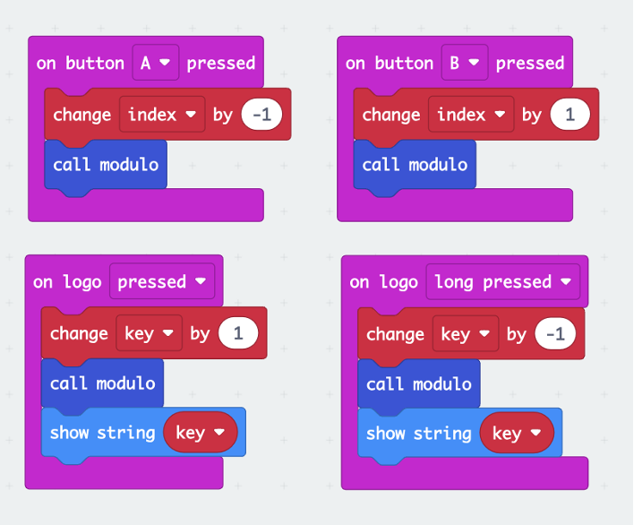

#### Challenge 3
- Encryption and Decryption with tilt

#### Extra Challenges
- Modify to the program to do a Rot13 encryption
  - A simple letter substitution cipher that replaces a letter with the 13th letter after it.
- Can you implement a way for the LEDs to signal a morse code?

### Additional Resources
- [What is Confidential Info?](https://youtu.be/i_BK3ppBW4Q)
- [Micro Caesar Full Project](https://github/robingandhi/microcaesar)

### Lead Author

- Dr. Robin Gandhi

### Acknowledgements

Special thanks to Gul e Fatima Kiani for reviewing and editing this lesson.

### License
[Nebraska GenCyber](https://www.nebraskagencyber.com)   is licensed under a <a rel="license" href="http://creativecommons.org/licenses/by-nc-sa/4.0/">Creative Commons Attribution-NonCommercial-ShareAlike 4.0 International License</a>.

Overall content: Copyright (C) 2024  [Dr. Matthew L. Hale](http://faculty.ist.unomaha.edu/mhale/), [Dr. Robin Gandhi](http://faculty.ist.unomaha.edu/rgandhi/), [Dr. Deanna House](#),[Derek Babb](https://derekbabb.com/), [Kristeen Shabram](#), [Dr. Lynn Spady](#), and [Gul e Fatima Kiani](#)

Lesson content: Copyright (C) [Dr. Matthew L. Hale](http://faculty.ist.unomaha.edu/mhale/) 2024.  
 This lesson is licensed by the author under a <a rel="license" href="http://creativecommons.org/licenses/by-nc-sa/4.0/">Creative Commons Attribution-NonCommercial-ShareAlike 4.0 International License</a>.

