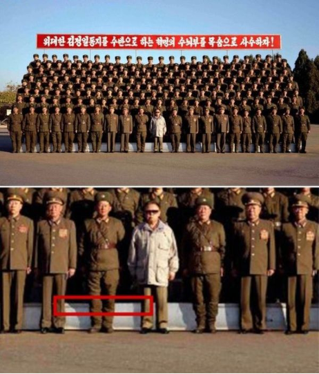
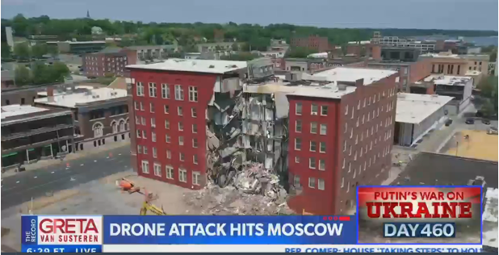
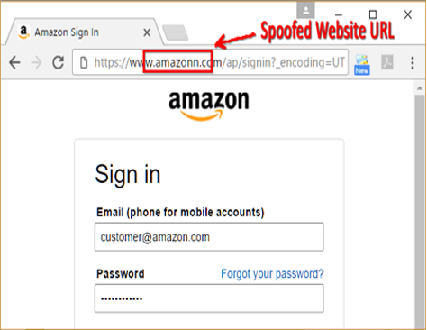
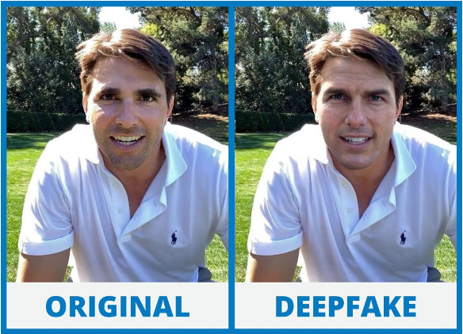
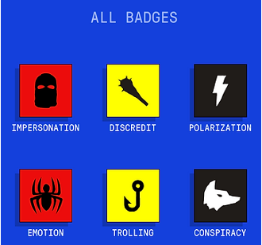

### Introduction
In this lesson,we'll expose spoofing tactics! We'll learn how tricksters disguise themselves online, like wearing a mask to impersonate someone else. Then, we'll explore deepfakes, AI-generated videos that can be shockingly real, and how they can be used to mislead.

### Goals

By the end of this tutorial, you will be able to:
* understand what spoofing and deep fakes are, including how they are created and used in various contexts.
* identify the potential risks and impacts of spoofing and deep fakes, and learn strategies to recognize and protect against them.

### Prerequisite lessons
- Cyber Security Concepts

### Table of Contents
- [What is Spoofing?](#what-is-spoofing?)
- [What is Deep Fake?](#what-is-deep-fake?)
- [Misinformation](#misinformation)
- [Activity](#activity)
- [Additional Resources](#additional-resources)
- [Lead Author](#lead-author)
- [Acknowledgements](#acknowledgements)
- [License](#license)

### What is Spoofing?
- Spoofing is when someone or something pretends to be something else in an attempt to gain our confidence, get access to our systems, steal data, steal money, or spread malware. 
- Spoofing can can come in many forms: email, text message, website, etc.

#### Spoofing Examples

> Img Credit: [https://www.buzzfeednews.com/article/kevintang/north-korean-officials-fail-at-photoshop]

> Img Credit: [https://www.france24.com/en/20080711-iran-released-photos-missile-test-were-doctored-iran-missiles]

> Img Credit: [https://www.msn.com/en-us/news/crime/davenport-qualified-immunity-claim-in-apartment-building-collapse-questioned/ar-BB1p9LzM?ocid=BingNewsVerp&apiversion=v2&noservercache=1&domshim=1&renderwebcomponents=1&wcseo=1&batchservertelemetry=1&noservertelemetry=1]

### What is a Deep Fake?
- Deep Fake - a video or image of a person in which their face or body has been digitally altered so that they appear to be someone else, typically used maliciously or to spread false information.

#### Deep Fake Example

> Img Credit: [https://medium.com/@sat00yam/deepfake-videos-a-threat-f3cc49736c24]

### Misinformation
- Misinformation refers to false or inaccurate information that is spread, regardless of an intent to deceive.
- It can include rumors, myths, and incorrect data that people may share unknowingly, leading to misconceptions and misunderstandings.

### Activity
#### Outrage Gets Clicks!

- Go to the Website
    - [getbadnews.com](getbadnews.com)
- Play the game
    - How many badges can you collect?
    - What do they mean?
      
 

### Lead Author

- Derek Babb

### Acknowledgements

Special thanks to Gul e Fatima Kiani for reviewing and editing this lesson.

### License
[Nebraska GenCyber](https://www.nebraskagencyber.com)   is licensed under a <a rel="license" href="http://creativecommons.org/licenses/by-nc-sa/4.0/">Creative Commons Attribution-NonCommercial-ShareAlike 4.0 International License</a>.

Overall content: Copyright (C) 2024  [Dr. Matthew L. Hale](http://faculty.ist.unomaha.edu/mhale/), [Dr. Robin Gandhi](http://faculty.ist.unomaha.edu/rgandhi/), [Dr. Deanna House](#),[Derek Babb](https://derekbabb.com/), [Kristeen Shabram](#), [Dr. Lynn Spady](#), and [Gul e Fatima Kiani](#)
