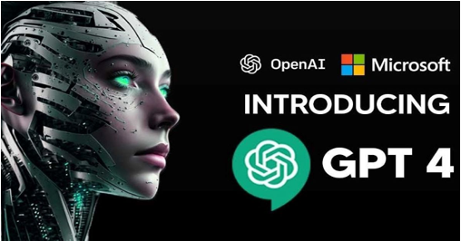

### Cybersecurity Concepts in this lesson

* __Defense in Depth__: Using multiple layers of protection to secure something.
* __Keep it Simple__: Avoid unnecessary complexity and reduce exposed areas.
* __Think Like an Adversary__: Be proactive by thinking of what an attacker can exploit (weaknesses and vulnerabilities).
* __Confidentiality__: Define permissions for interactions with protected objects.

### Introduction
In this lesson, we'll dive into Ethical AI, making sure AI is fair, transparent, and used for good, just like using a powerful tool responsibly. We'll also explore cutting-edge AI like ChatGPT and get hands-on to see AI in action.

### Goals

By the end of this tutorial, you will be able to:
* understand the fundamental concepts of AI.
* learn how to use AI technologies ethically.

### Materials Required
* Chrome Book

### Prerequisite lessons
- Cybersecurity Concepts

### Table of Contents

- [What is Artificial?](#what-is-artificial?)
- [What is Intelligence?](#what-is-intelligence?)
- [What is Artificial Intelligence?](#what-is-artificial-intelligence?)
- [Artificial Intelligence (AI) and Ethics](#artificial-intelligence-(AI)-and-ethics)
- [Current Modern Artificial Intelligence](#current-modern-artificial-intelligence)
- [Activities](#activities)
- [Additional Resources](#additional-resources)
- [Lead Author](#lead-author)
- [Acknowledgements](#acknowledgements)
- [License](#license)

### What is Artificial?
- Made by people, often as a copy of something natural:
    - clothes made of artificial fibers
    - an artificial heart
    - an artificial lake
    - artificial fur/sweeteners/flowers (my example of snow cone flavors)
> Content Credit: [https://dictionary.cambridge.org/us/dictionary/english/natural
 

> Img Credit: [https://www.iberdrola.com/talent/naturalistic-intelligence]

> Img Credit: [https://instituteofyou.org/multiple-intelligences/]

### What is Intelligence?

- The ability to solve complex problems or make decisions with outcomes benefiting the actor, and has evolved in lifeforms to adapt to diverse environments for their survival and reproduction. 

> Imd Credit: [https://www.iberdrola.com/talent/naturalistic-intelligence]

> Img Credit: [https://instituteofyou.org/multiple-intelligences/]

### What is ArtificiaL Intelligence?
- Artificial intelligence, or “AI,” is the ability for a computer to **think** and **learn**.
- With AI, computers can perform tasks that are typically done by **people**, including processing language, problem-solving, and learning.
- AI is not human and doesn't necessarily think in the same way humans do. It can be very good for doing certain tasks it is trained to.
- AI is advancing really fast and is very likely to change the world significantly over the next few years.

### Artificial Intelligence (AI) and Ethics
- Ethics refers to the concepts of right and wrong behavior. It relates to how individuals choose to interact with one another.
- You need to also think about when is it ok to use AI and when is it not.
  -  Is it ok to shortcut tasks that you need to do? 
  -  Is it ok to have an AI do your homework? 
  -  Send a card to someone on your behalf on their birthday? 
  -  Answer your emails, phone calls or texts?

### Current Modern Artificial Intelligence
- AI is not just robots like you see in the movies. 
- AI is usually just software running on machines called servers.
- A server is just a computer program or a device that provides functionality for other programs or devices, called “clients.”

 

### Activities

#### Activity 1
- Work with your assigned partner
- Step 1: visit [https://chat.openai.com/](https://chat.openai.com/) 
- Step 2: create a prompt to make a fake news story - this is the one we used together “write a fake news story about how dangerous downtown omaha is during the college world series. It should be a news bulletin for those traveling to Omaha”.

#### Activity 2
- Work with your table partner
- Step 1: visit https://chat.openai.com/ 
- Step 2: type “write a game with python. Then give it some rules for your game”
- Step 3: Think about some different scenarios where having AI code for you is ok to use and some where it might not be.
- The one we used together was: “write a cool game for microbits that I can paste into microsoft makecode”

### Lead Author

- Dr. Matthew L. Hale

### Acknowledgements

Special thanks to Gul e Fatima Kiani for reviewing and editing this lesson.

### License
[Nebraska GenCyber](https://www.nebraskagencyber.com)   is licensed under a <a rel="license" href="http://creativecommons.org/licenses/by-nc-sa/4.0/">Creative Commons Attribution-NonCommercial-ShareAlike 4.0 International License</a>.

Overall content: Copyright (C) 2024  [Dr. Matthew L. Hale](http://faculty.ist.unomaha.edu/mhale/), [Dr. Robin Gandhi](http://faculty.ist.unomaha.edu/rgandhi/), [Dr. Deanna House](#),[Derek Babb](https://derekbabb.com/), [Kristeen Shabram](#), [Dr. Lynn Spady](#), and [Gul e Fatima Kiani](#)

Lesson content: Copyright (C) [Dr. Matthew L. Hale](http://faculty.ist.unomaha.edu/mhale/) 2024.  
 This lesson is licensed by the author under a <a rel="license" href="http://creativecommons.org/licenses/by-nc-sa/4.0/">Creative Commons Attribution-NonCommercial-ShareAlike 4.0 International License</a>.
