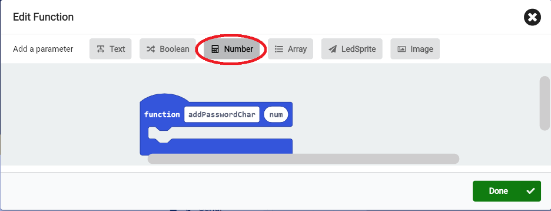

### Cybersecurity First Principles in this lesson

* __Defense in Depth__: Using multiple layers of protection to secure something.
* __Keep it Simple__: Avoid unnecessary complexity and reduce exposed areas.
* __Think Like an Adversary__: Be proactive by thinking of what an attacker can exploit (weaknesses and vulnerabilities).
* __Confidentiality__: Define permissions for interactions with protected objects.

### Introduction
In today's digital world, our passwords act as the gatekeepers to our personal information. Strong password security is essential to prevent unauthorized access and safeguard our online accounts.

### Goals

By the end of this tutorial, you will be able to:
* identify different ways to prove you're the rightful owner of your online accounts (authentication).
* crack the codes for creating strong passwords and learn to avoid common pitfalls that make them weak.
* know how sneaky hackers might try to steal your password, so you can stay a step ahead!

### Materials Required

* Instructor's slides
* Microbit

### Prerequisite lessons
None

### Table of Contents

- [Authentication](#authentication)
- [Single, Two, Multi-factor Authentication](#single,-two,-multi-factor-authentication)
- [Strong Passwords may contain](#strong-passwords-may-contain)
- [Weak Passwords may contain](#weak-passwords-may-contain)
- [How can someone figure out your password?](#how-can-someone-figure-out-your-password?)
- [Activity](#activity)
- [Additional Resources](#additional-resources)
- [Lead Author](#lead-author)
- [Acknowledgements](#acknowledgements)
- [License](#license)

### Authentication
- Authentication is the process of verifying that you are who you say you are. 
- Example: username, password, email.

  
### Single, Two, Multi-factor Authentication
- Something you know: includes your username and password.
- Something you have: ID badge, cell phone text message with a code/pin
- Something you are: your fingerprint, retina (eye) scan
- Multi-factor is the process of choosing two or more of these factors

Passwords are the most common form of authentication used by websites.

What makes a good password?

### Strong Passwords may contain
- At least eight characters—the more characters, the better.
- A mixture of both uppercase and lowercase letters.
- A mixture of letters and numbers.
- Inclusion of at least one special character, e.g., ! @ # ? ]

### Weak Passwords may contain
- Fewer than eight characters. 
- Includes words found in the dictionary.
- Includes personal identifiable information, such as name, pets names, birthday, etc.

### How can someone figure out your password?
Based on how many characters a password includes, if the characters are letters, numbers, or special characters, someone can figure out how many possible passwords there could be.

## Activity
### Creating Your Own Password Generator
You will be create a password generator using your Microbits. 
A couple of things first:
We will be using variables and functions. 

**Functions:** are used to make a portion of code do a similar task multiple times. 
 

**Variables:** a variable is something that can be changed. We use variables in coding to store information that may change or may need to be used later.

### Creating Your Own Password Generator - Button Actions

### Creating Your Own Password Generator - Function

### Your Turn!!!
The password generator code is [here](https://tinyurl.com/UNOGenCyber2024)

Check your password [here](https://www.security.org/how-secure-is-my-password). How many years will it take to crack your password?

### Additional Resources

### Lead Author

- Dr. Matthew L. Hale, Dr. Deanna House

### Acknowledgements

Special thanks to Gul e Fatima Kiani for reviewing and editing this lesson.

### License
[Nebraska GenCyber](https://www.nebraskagencyber.com)   is licensed under a <a rel="license" href="http://creativecommons.org/licenses/by-nc-sa/4.0/">Creative Commons Attribution-NonCommercial-ShareAlike 4.0 International License</a>.

Overall content: Copyright (C) 2024  [Dr. Matthew L. Hale](http://faculty.ist.unomaha.edu/mhale/), [Dr. Robin Gandhi](http://faculty.ist.unomaha.edu/rgandhi/), [Dr. Deanna House](#),[Derek Babb](https://derekbabb.com/), [Kristeen Shabram](#), [Dr. Lynn Spady](#), and [Gul e Fatima Kiani](#)
