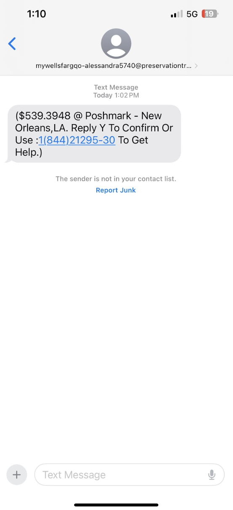

### Cybersecurity First Principles in this lesson

* __Defense in Depth__: Using multiple layers of protection to secure something.
* __Keep it Simple__: Avoid unnecessary complexity and reduce exposed areas.
* __Think Like an Adversary__: Be proactive by thinking of what an attacker can exploit (weaknesses and vulnerabilities).
* __Confidentiality__: Define permissions for interactions with protected objects.

### Introduction
Phishing is a cybercrime where scammers pretend to be a trusted source to trick you into giving away your personal information, like passwords or credit card details. Be cautious of any unexpected messages or requests for information online.

### Goals

By the end of this tutorial, you will be able to:
* know what phishing is.
* identify some of the tricks scammers use in phishing attempts and understand the dangers they pose.

### Materials Required
* None

### Prerequisite lessons
None

### Table of Contents
- [What is Phishing?](#what-is-phishing?)
- [Activity](#activity)
- [Additional Resources](#additional-resources)
- [Lead Author](#lead-author)
- [Acknowledgements](#acknowledgements)
- [License](#license)

### What is Phishing?
- Phishing pretends to be someone you trust.
  - Deceptive emails, texts, or even fake websites will appear to come from a legitimate source like your bank, social media platform, or a friend.
- Phishing lures you in with a trick.
  - These messages will often create a sense of urgency or offer something tempting to get you to click on a link or download an attachment.
- Phishing steals your information.
  - The goal is to trick you into revealing sensitive details like passwords, credit card numbers, or personal data.

### Activity

- Students will be presented with the screenshots of different SMS, emails and social media posts/comments and they would have to answer the following questions:
  - Write a "reason" you think it is/is not a scam.
  - How do you think the recepient responded? How would you response?
- Screenhots are given below

 

 

 

### Additional Resources
[What is Phishing?](#https://www.youtube.com/watch?v=Xle27xh_N0A) 

### Lead Author

- Dr. Lynn Spady

### Acknowledgements

Special thanks to Gul e Fatima Kiani for reviewing and editing this lesson.

### License
[Nebraska GenCyber](https://www.nebraskagencyber.com)   is licensed under a <a rel="license" href="http://creativecommons.org/licenses/by-nc-sa/4.0/">Creative Commons Attribution-NonCommercial-ShareAlike 4.0 International License</a>.

Overall content: Copyright (C) 2024  [Dr. Matthew L. Hale](http://faculty.ist.unomaha.edu/mhale/), [Dr. Robin Gandhi](http://faculty.ist.unomaha.edu/rgandhi/), [Dr. Deanna House](#),[Derek Babb](https://derekbabb.com/), [Kristeen Shabram](#), [Dr. Lynn Spady](#), and [Gul e Fatima Kiani](#)

Lesson content: Copyright (C) [Dr. Matthew L. Hale](http://faculty.ist.unomaha.edu/mhale/) 2024.  
 This lesson is licensed by the author under a <a rel="license" href="http://creativecommons.org/licenses/by-nc-sa/4.0/">Creative Commons Attribution-NonCommercial-ShareAlike 4.0 International License</a>.

