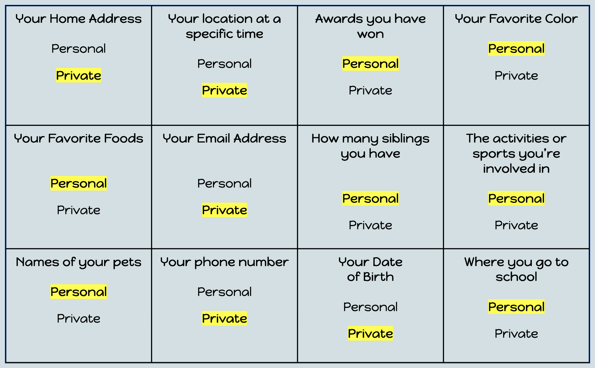

### Cybersecurity First Principles in this lesson

* __Think Like an Adversary__: Be proactive by thinking of what an attacker can exploit (weaknesses and vulnerabilities).
* __Confidentiality__: Define permissions for interactions with protected objects.

### Introduction

### Goals

By the end of this tutorial, you will be able to:
* 
* 
* 

### Materials Required

* 
* 

### Prerequisite lessons
None

### Table of Contents

- [Let's Brainstorm First!](#let's-brainstorm-first!)
- [Personal Information VS Private Information](#personal-information-vs-private-information)
- [Personal or Private?](#personal-or-private?)
- [How Could Sharing Private Information Online be Unsafe?](#how-could-sharing-private-information-online-be-unsafe?)
- [Oversharing Personal Information Online](#oversharing-personal-information-online)
- [Tips for Preventing Oversharing](#tips-for-preventing-oversharing)
- [Additional Resources](#additional-resources)
- [Lead Author](#lead-author)
- [Acknowledgements](#acknowledgements)
- [License](#license)

### Let's Brainstorm First!

- List 1-2 things that are okay to share online?
- List 1-2 things you should not share online?

### Personal Information VS Private Information
- Personal Information
  - Information about you that cannot be used to identify you because it is also true for many other people (e.g., your hair color or the city you live in).
- Private Information
  - Information about you that can be used to identify you because it's unique to you (e.g., your full name or your address).

### Personal or Private?

- In your notes, there is a list of Personal and Private Examples.
- Circle if you think the examples are personal or private information. 
  - To help you decide, ask, "Would this information also be true for many other people?" If so, it's personal. If not, it's private.

### How Could Sharing Private Information Online be Unsafe?

- Sharing private information can affect your online privacy and could make you the target of cyber crimes.
- Posting private information about you could make it easier for cyber criminals to learn information about you to commit cyber crimes.

### “Oversharing” Personal Information Online 

- It’s okay to share some personal information online, but be careful of “Oversharing.”
- “Oversharing” is sharing an excessive amount of personal and private information online, especially in a way which might be considered inappropriate or dangerous to you and those around you.

### Tips for Preventing Oversharing

#### What you post is a reflection of who you are.
- Imagine that the mirror is attached to your computer/device. It you look in it and saw someone in the reflection (parents, employer, coach), would they approve of what they’re doing or saying online?

#### Remember to “Keep it Clean & True” and only post appropriate things.
- Too many times people are posting information that is NOT appropriate or information that is not true (rumors).

#### Lock down your privacy settings.
- Remember to set privacy settings on all your accounts so that your information is secure.

#### Everything that you put online is permanent.
- Even if you hit the delete button after posting. Remember to THINK before you post.

#### You wouldn’t share your toothbrush with anyone. 
- Don’t share your private information online.

### Additional Resources

### Lead Author

- Kristeen Shabram

### Acknowledgements

Special thanks to Gul e Fatima Kiani for reviewing and editing this lesson.

### License
[Nebraska GenCyber](https://www.nebraskagencyber.com)   is licensed under a <a rel="license" href="http://creativecommons.org/licenses/by-nc-sa/4.0/">Creative Commons Attribution-NonCommercial-ShareAlike 4.0 International License</a>.

Overall content: Copyright (C) 2024  [Dr. Matthew L. Hale](http://faculty.ist.unomaha.edu/mhale/), [Dr. Robin Gandhi](http://faculty.ist.unomaha.edu/rgandhi/), and [Dr. Briana B. Morrison](http://www.brianamorrison.net).

Lesson content: Copyright (C) [Dr. Matthew L. Hale](http://faculty.ist.unomaha.edu/mhale/) 2024.  
 This lesson is licensed by the author under a <a rel="license" href="http://creativecommons.org/licenses/by-nc-sa/4.0/">Creative Commons Attribution-NonCommercial-ShareAlike 4.0 International License</a>.

