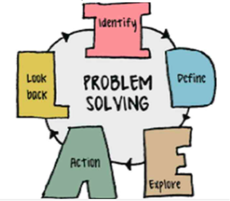
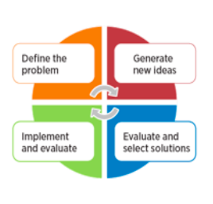
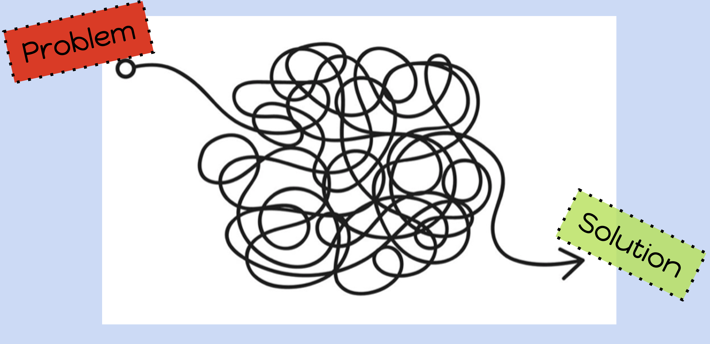
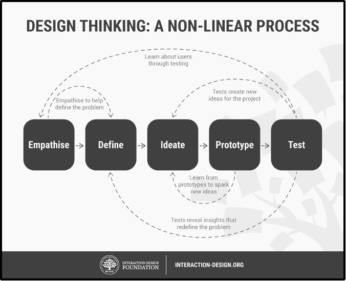
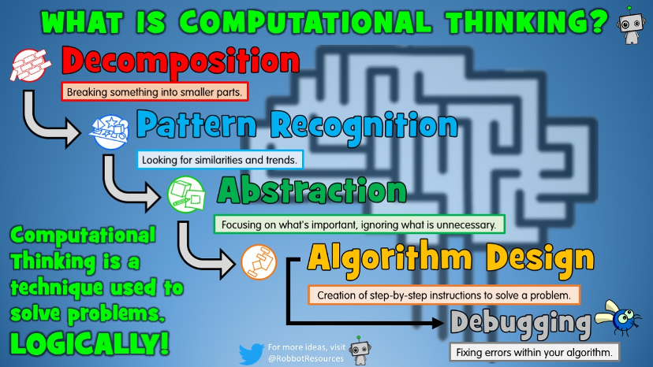

### Ways to Approach Problems
- Scientific Method
- Computational Thinking
- Design Process & Engineering Design Process
- Polya’s 4-Step to Solving Problems
& Many More
  
  

 

### Design Process

#### Stage 1: Empathize — Research Your Users' Needs

Here, you should gain an empathetic understanding of the problem you’re trying to solve, typically through user research. Empathy is crucial to a human-centered design process such as design thinking because it allows you to set aside your own assumptions about the world and gain real insight into users and their needs.

#### Stage 2: Define — State Your Users' Needs and Problems

It’s time to accumulate the information gathered during the Empathize stage. You then analyze your observations and synthesize them to define the core problems you and your team have identified. These definitions are called problem statements. You can create personas to help keep your efforts human-centered before proceeding to ideation.

#### Stage 3: Ideate — Challenge Assumptions and Create Ideas

Now, you’re ready to generate ideas. The solid background of knowledge from the first two phases means you can start to “think outside the box”, look for alternative ways to view the problem and identify innovative solutions to the problem statement you’ve created. Brainstorming is particularly useful here.

#### Stage 4:

#### Stage 5:

[Source](https://www.interaction-design.org/literature/article/5-stages-in-the-design-thinking-process)

### Computational Thinking

	

Computational Thinking is the process of breaking down a problem into simple enough steps that even a computer would understand.

Image [Source](https://robbotresources.com/blog/2018/11/3/what-is-computational-thinking)

