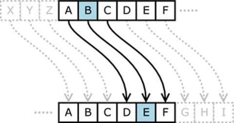
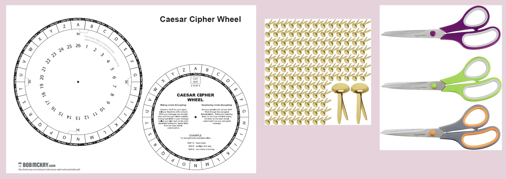
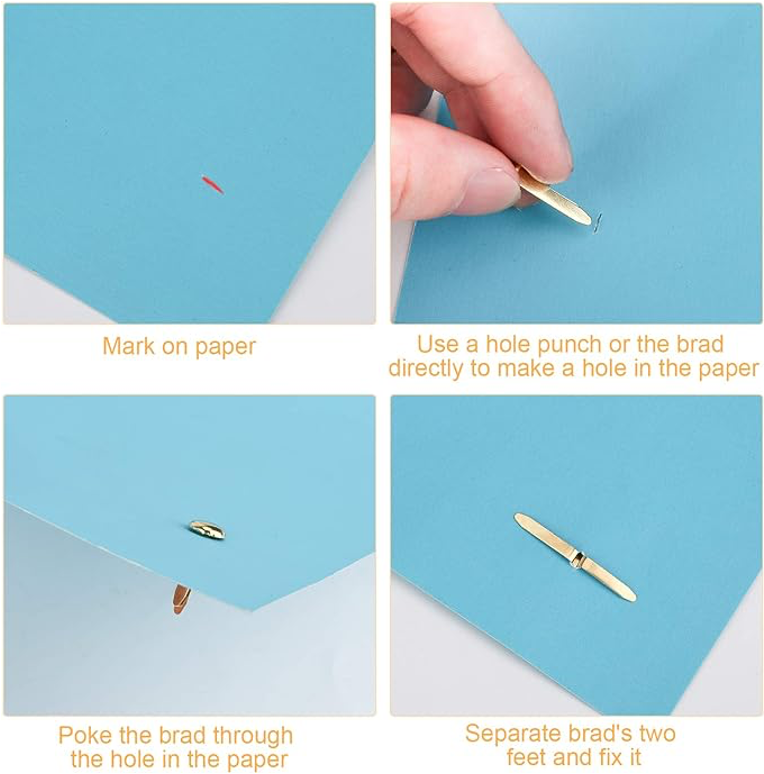
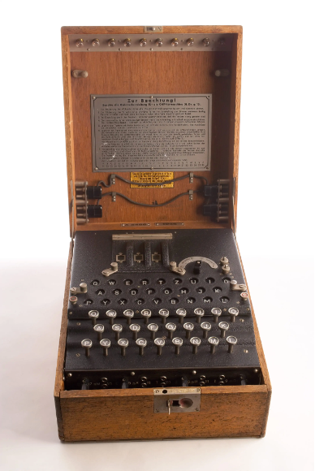
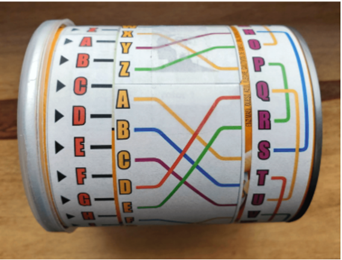
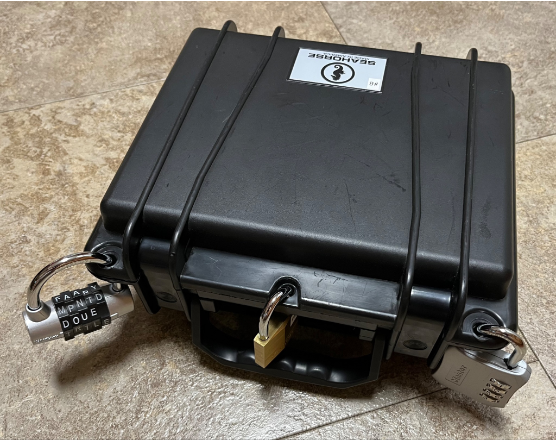

### Cybersecurity First Principles in this lesson

* __Defense in Depth__: Using multiple layers of protection to secure something.
* __Keep it Simple__: Avoid unnecessary complexity and reduce exposed areas.
* __Think Like an Adversary__: Be proactive by thinking of what an attacker can exploit (weaknesses and vulnerabilities).
* __Confidentiality__: Define permissions for interactions with protected objects.

### Introduction
Cryptography is the practice and study of techniques for securing communication and data from unauthorized access or tampering. It involves transforming readable information into coded text using algorithms, ensuring that only intended recipients can decode and understand the information.

### Goals

By the end of this tutorial, you will be able to:
* understand the fundamental principles and concepts of cryptography, including encryption and decryption.
* apply basic cryptographic techniques to encode and decode messages which will enhance your problem-solving and analytical skills through hands-on activities.

### Materials Required

- Caesar Cipher Wheel
- Brad
- Scissors
- Breakout box

### Prerequisite lessons
- Cyber Security Concepts

### Table of Contents

- [Additional Resources](#additional-resources)
- [Lead Author](#lead-author)
- [Acknowledgements](#acknowledgements)
- [License](#license)

### What is Cryptogrpahy?
- Cryptography is the art of writing and solving codes.
- With Cryptography, information is hidden so that only the person a message was intended for can read it

### Cryptography Unplugged - Caesar Cipher
#### Ciphers
- Meant to always hide the true meaning of a message. 
- They use a variety of techniques to alter and/or rearrange the characters or bits of a message to achieve confidentiality.
- Typically work on individual characters or bits

#### Caesar Cipher

- A substitution cipher that involves shifting a number of positions down the alphabet
-  Shift 5:
  _Plaintext:_ abcdefghijklmnopqrstuvwxyz
  _Ciphertext:_ fghijklmnopqrstuvwxyzabcde

[Image Source:https://academickids.com/encyclopedia/index.php/Caesar_cipher](https://academickids.com/encyclopedia/index.php/Caesar_cipher)

#### What You Will Need
- Caesar Cipher Wheel
- Brad
- Scissors

#### Your Turn!! Decode the messages
- Use your wheel and work on the the handout to decipher the messages and also create some cipher text of your own!

### Cryptography Pringle Rotors Creation

#### Enigma
- Used by Germany in World War II
- 3 Rotors selected from 5 possible options
- Each Rotor has a starting position
- Once one rotor fully rotates, it moves the next rotor one spot 
  -  (Think of an analog clock)

**Construction**
1. Cut each strip of paper along the thin gray outline of each strip. 
2. Wrap each strip of paper around the Pringles can in the same order they were printed on the sheet. 
3. Overlap the tab at the end of each strip and secure with a piece of tape. 
4. Ensure each of the paper rings (rotors) can freely rotate

#### Decoding Challenges
**Challenge 1 - Rotor 1**
Rotor Settings: AAA
Message: GJGMJ

**Challenge 2 - Rotor 1**
Rotor Settings: AHA
Message:LMQANI

**Challenge 3 - Rotor 2**
Rotor Settings: AIA
Message: FHZPIUIMKA

### Cryptography Breakout Box
- A Cryptography Breakout Box is a box with 3 locks on it.
- Each lock has a cryptography activity that when decoded, it will reveal the combination or key to open the lock.
- Your task is to work together in groups to open the Cryptography Breakout Box in 15 minutes or less.

### Lead Author

- Dr. Deanna House, Dr. Matthew L. Hale, Derek Babb, Kristeen Shabram

### Acknowledgements

Special thanks to Gul e Fatima Kiani for reviewing and editing this lesson.

### License
[Nebraska GenCyber](https://www.nebraskagencyber.com)   is licensed under a <a rel="license" href="http://creativecommons.org/licenses/by-nc-sa/4.0/">Creative Commons Attribution-NonCommercial-ShareAlike 4.0 International License</a>.

Overall content: Copyright (C) 2024  [Dr. Matthew L. Hale](http://faculty.ist.unomaha.edu/mhale/), [Dr. Robin Gandhi](http://faculty.ist.unomaha.edu/rgandhi/), [Dr. Deanna House](#),[Derek Babb](https://derekbabb.com/), [Kristeen Shabram](#), [Dr. Lynn Spady](#), and [Gul e Fatima Kiani](#)

Lesson content: Copyright (C) [Dr. Matthew L. Hale](http://faculty.ist.unomaha.edu/mhale/) 2024.  
