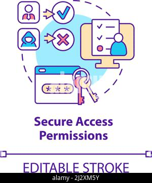
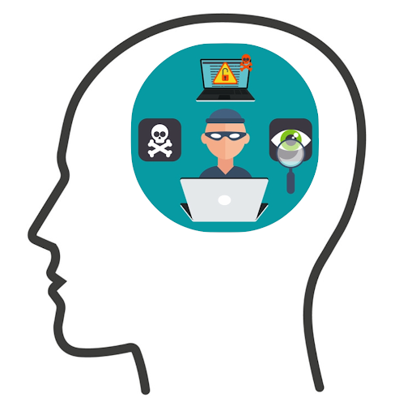

### Introduction
Cybersecurity is the practice of protecting systems, networks, data from digital attacks. It is essential for safeguarding digital information and systems from unauthorized access, attacks and damage. This lesson introduces the importance of cybersecurity in our increasingly connected world and sets the foundation for understanding how to protect our digital assets effectively.

### Goals

By the end of this tutorial, you will be able to:
* understand the fundamental concept of cybersecurity.
* gain insights into key cybersecurity principles.

### Materials Required

* Teacher presentation
* Student handout

### Prerequisite lessons
None

### Table of Contents

- [What is Cybersecurity?](#what-is-cybersecurity?)
- [What are Cybersecurity Concepts?](#what-are-cybersecurity-concepts?)
    - [Cybersecurity Concepts](#cybersecurity-concepts)
- [Defense in Depth](#defense-in-depth)
- [Confidentiality](#confidentiality)
- [Integrity](#integrity)
- [Availability](#availability)
- [Think Like an Adversary](#think-Like-an-adversary)
- [Keep it Simple!](#keep-it-simple)
- [Additional Resources](#additional-resources)
- [Lead Author](#lead-author)
- [Acknowledgements](#acknowledgements)
- [License](#license)

### What is Cybersecurity?
Draw a picture or write in your own words what you think “cybersecurity” means or what you think it looks like?

### What are Cybersecurity Concepts?
The fundamental building blocks of protecting systems, networks, and programs from digital attacks.

#### Cybersecurity Concepts
1. Defense in Depth
2. Confidentiality
3. Integrity
4. Availability
5. Think Like an Adversary
6. Keep it Simple

###  Defense in Depth
A comprehensive strategy of including multiple layers of security within a system so that if one layer fails, another layer of security is already in place to stop the attack/unauthorized access.

**Definition:** Using multiple layers of protection to secure something.
- Everyday Life Example: 
  - Guard to protect the entrance to the castle
  - Lock on a door
  - Putting up a fence around your home
- Computing Example:
  - Anti-virus, firewall and website blocker are examples of multiple defenses
  - Utilizing multi-factor authentication

###  Confidentiality
The property that information is not disclosed to individuals, devices, or processes unless they have been authorized to access the information.

**Definition:** Define permissions for interactions with protected objects.
- Everyday Life Example: 
  - Setting permissions on a website - who can access your contacts, camera, microphone, etc.
- Computing Example:
  - Certain User accounts only have  permissions to do things. Giving only necessary privileges creates accountability and prevents misuse.
  - 

### Integrity
The property that information, an information system, or a component of a system has not been modified or destroyed in an unauthorized manner.

**Definition:** Prevent data from being modified or misused by an unauthorized party.
- Everyday Life Example: 
  - Sending a letter and stamping/sealing the back so that no one can  tamper or modify it.
- Computing Example:
  - Backup up your files to an external drive so that they can be restored if tampered with.

### Availability
The property that information or information systems are accessible and usable upon demand.

**Definition:**  Information is available under any circumstance.
- Everyday Life Example: 
  - In a power outage, using a generator to provide power to necessary appliances.
- Computing Example:
  - In the event of a  DDoS (Distributed Denial of Service) attacks, creating a DDoS response plan, create redundancy in systems, load balancing and fault tolerance.

### Think Like an Adversary
The strategy of putting yourself inside the mindset of a potential attacker that allows you to anticipate attack strategies and defend your systems accordingly.

**Definition:** Be proactive by thinking of what an attacker can exploit (weaknesses and vulnerabilities).
- Everyday Life Example: 
  - Putting on sunscreen to protect yourself from the sun
  - Watching film before a game to analyze your opponent and their moves
- Computing Example:
  - Running software updates to patch potential software weaknesses/vulnerabilities. Staying up-to-date on the latest attacks and putting in place strategies to avoid potential attacks.

### Keep it Simple
The strategy of designing information and security systems to be configured and operated as simply as possible; all systems perform best when they have simple designs rather than complex ones.

**Definition:** Avoid unnecessary complexity and reduce exposed areas.
- Everyday Life Example: 
  - A lock and key is easy to use.
  - Only having one entrance and one exit for students to enter and exit the school.
- Computing Example:
  - Simple programming languages, such as blocks, are easier to understand when first learning to program.

### Additional Resources

### Lead Author

- Kristeen Shabram

### Acknowledgements

Special thanks to Gul e Fatima Kiani for reviewing and editing this lesson.

### License
[Nebraska GenCyber](https://www.nebraskagencyber.com)   is licensed under a <a rel="license" href="http://creativecommons.org/licenses/by-nc-sa/4.0/">Creative Commons Attribution-NonCommercial-ShareAlike 4.0 International License</a>.

Overall content: Copyright (C) 2024  [Dr. Matthew L. Hale](http://faculty.ist.unomaha.edu/mhale/), [Dr. Robin Gandhi](http://faculty.ist.unomaha.edu/rgandhi/), and [Dr. Briana B. Morrison](http://www.brianamorrison.net).

Lesson content: Copyright (C) [Dr. Matthew L. Hale](http://faculty.ist.unomaha.edu/mhale/) 2024.  
 This lesson is licensed by the author under a <a rel="license" href="http://creativecommons.org/licenses/by-nc-sa/4.0/">Creative Commons Attribution-NonCommercial-ShareAlike 4.0 International License</a>.
