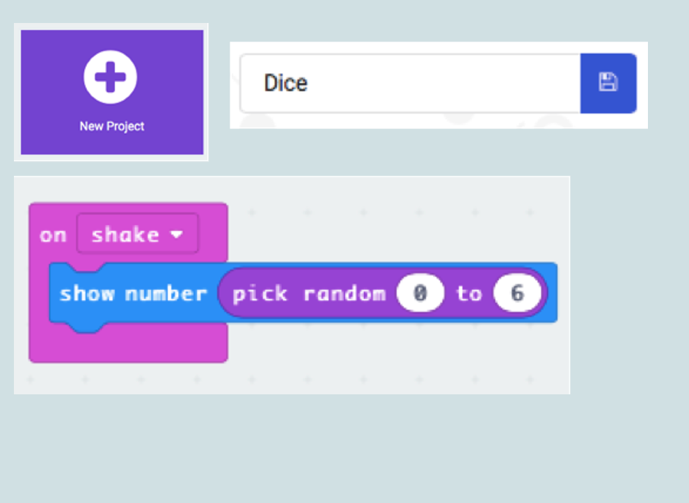

### Introduction
Microbits are pocket-sized computers designed to make learning and teaching easy and fun. They are equipped with various sensors and inputs, allowing users to create and program a wide range of interactive projects.

### Goals

By the end of this tutorial, you will be able to:
* understand the basic components and features of the Microbit including its LED display, buttons, and sensors.
* create simple programs using block-based coding to control the Microbit and interact with its various components through hands-on activities and challenges.

### Materials Required

* Microbit
* USB cord
* Battery Holder
* 2 AAA batteries for the battery holder
* Microbit Smart Watch Kit

### Prerequisite lessons
None

### Table of Contents

- [Additional Resources](#additional-resources)
- [Lead Author](#lead-author)
- [Acknowledgements](#acknowledgements)
- [License](#license)

### What is a Microbit?

- A pocket-sized computer that can be programmed.
- Has all these things that can be programmed:
  - 25 red LED lights
  - 3 programmable buttons
  - An accelerometer so it can detect motion
  - A built-in compass
  - A microphone
  - A speaker
  - Connector for accessories

### Microbit Features

[Image Source: https://microbit.org/get-started/user-guide/overview/](https://microbit.org/get-started/user-guide/overview/)

### Task 1: Attaching the Battery Pack to the Microbit
- Unpackage your batteries and put them in your battery holder.
- Plug the battery pack into the Microbit. Check for the RED light on the back of the Microbit.
- The Microbit might start making noise.
- Wiggle the white part of the battery pack to detach it from the Microbit.
  

### Task 2: Attaching the USB Cord to the Microbit
- Untie the twist tie on the cord. 
- Plug the cord into the Microbit.
- Plug the USB end into the Chromebook. Check for the RED light on the back of the Microbit.
- Make sure the Microbit Icon appears on the computer screen.
  
  

### USB Cord or Battery Pack?

#### USB Cord
- When coding your Microbit on the MakeCode website, you only need to attach the USB cord to the Microbit. 
- The Chromebook will supply power to the Microbit.
  
#### Battery Pack
- Only use when you want your Microbit to be mobile and not connected to the Chrombook. 
- After the code has been downloaded to the Microbit from the MakeCode website, BEFORE unplugging the USB cord, plug the battery pack into the Microbit.

### Task 3: What is Pair Programming?
- Pair programming is where two programmers work together at one workstation/computer. 
- One person is the driver, types the code while the other, the navigator, reviews each line of code as it is typed in. 
- The two programmers **switch roles frequently**. 

### Task 4: Using the MakeCode Website
- Open the Chrome web browser and go to [https://makecode.microbit.org](https://makecode.microbit.org)
- Click the purple plus sign to create a new project.

### Practice Programs

#### Practice Program#1
- Save the project as “Scrolling Name”
- Create the program
- Type your first name in the show string block.
- Download the file
- Drag the downloaded file to the Microbit icon on your Desktop

#### Practice Program#2
- Save the project as “Flashing Heart”
- Create the program
- Download the file
- Drag the downloaded file to the Microbit icon on your Desktop

#### Practice Program#3
- Save the project as “Smiley Buttons”
- Create the program
- Download the file
- Drag the downloaded file to the Microbit icon on your Desktop

#### Practice Program#4
- Save the project as “Dice”
- Create the program
- Download the file
- Drag the downloaded file to the Microbit icon on your Desktop

### Microbit Smart Wtach Kit
#### What you will receive

#### Setting Up Your Microbit Smart Watch
**Step 1:** 
Insert the two 3V coin cell batteries in the battery holders.

**Step 2:** 
Use the mini screwdriver and the screws to attach the microbit to the battery holder.

**Step 3:** 
With the Microbit face down, pass the longer watch strap through the hole in the button panel Pro to install the watch strap.

### Activity: Microbit Competitions

#### Small Task Game
- Create a simple challenge game.
- Use the Micro:bit as part of the challenge
- Code your Micro:bit
- Create an instructions slide

#### Game Ideas
- Rock, Paper, Scissors
- Shake Counter
- Dice / Random Number 
- Button Presses
- Toss Time
- Hot potato

#### Pair & Play
- Partner with another group.
- Take turns playing each game.
- In ~1 minute we will find new partners

### Additional Resources

- [Microbit User Guide](#https://microbit.org/get-started/user-guide/overview/)
- [Microbit Games Examples](#https://makecode.microbit.org/projects/games)

### Lead Author

- 

### Acknowledgements

Special thanks to Gul e Fatima Kiani for reviewing and editing this lesson.

### License
[Nebraska GenCyber](https://www.nebraskagencyber.com)   is licensed under a <a rel="license" href="http://creativecommons.org/licenses/by-nc-sa/4.0/">Creative Commons Attribution-NonCommercial-ShareAlike 4.0 International License</a>.

Overall content: Copyright (C) 2024  [Dr. Matthew L. Hale](http://faculty.ist.unomaha.edu/mhale/), [Dr. Robin Gandhi](http://faculty.ist.unomaha.edu/rgandhi/), [Dr. Deanna House](#),[Derek Babb](https://derekbabb.com/), [Kristeen Shabram](#), [Dr. Lynn Spady](#), and [Gul e Fatima Kiani](#)
