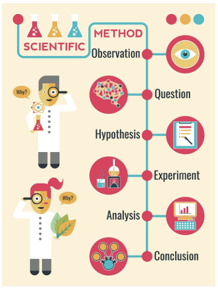
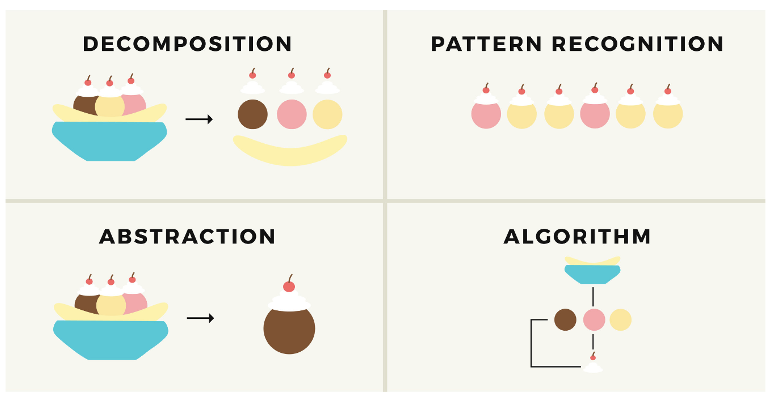
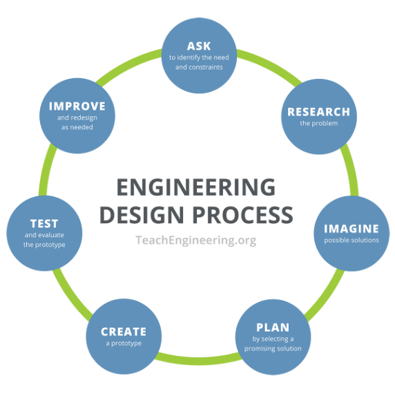
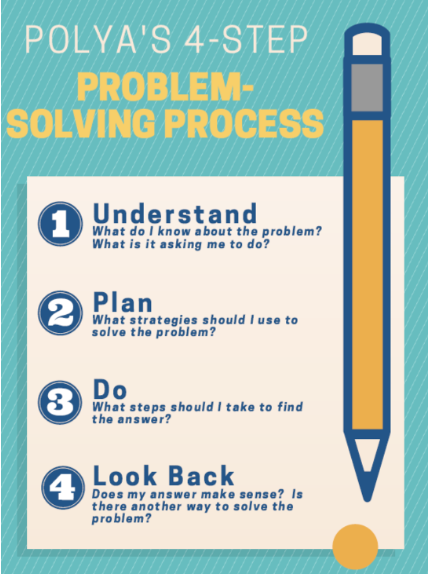

### Introduction
Problem-solving is the process of finding solutions to overcome obstacles and achieve a desired outcome.

### Goals

By the end of this tutorial, you will be able to:
* understand different approaches to tackling challenges, from the scientific method to engineering design.
 

### Materials Required

* Intructor's slides

### Prerequisite lessons
None

### Table of Contents

- [Sample Problems](#sample-problems)
- [Ways to Approach Problems](#ways-to-approach-problems)
    - [Scientific Method](#scientific-method)
    - [Computational Thinking](#computational-thinking)
    - [Engineering Design Process](#engineering-design-process)
    - [Polya's 4-Step Problem Solving Process](#ploya's-4-step-problem-solving-process)
- [Lead Author](#lead-author)
- [Acknowledgements](#acknowledgements)
- [License](#license)

### Sample Problems
- You hear a hissing noise from underneath your sink and find out the water tank has a crack in it.
- You noticed something posted on your SnapChat account that you didn’t post.
- You bend over and your pants split open.
- You’re in the middle of a game and the internet goes out.

### Ways to Approach Problems
We are face with problems each and every day. Some problems are smaller than others. Some problems can be solved quickly and others require multiple attempts. There are many different approaches to solving problems. 

#### 1. Scientific Method
   
   
#### 2. Computational Thinking
   
   
#### 3. Engineering Design Process

#### 4. Polya's 4-Step Problem Solving Process
   
   

### Lead Author

- Dr. Lynn Spady

### Acknowledgements

Special thanks to Gul e Fatima Kiani for reviewing and editing this lesson.

### License
[Nebraska GenCyber](https://www.nebraskagencyber.com)   is licensed under a <a rel="license" href="http://creativecommons.org/licenses/by-nc-sa/4.0/">Creative Commons Attribution-NonCommercial-ShareAlike 4.0 International License</a>.

Overall content: Copyright (C) 2024  [Dr. Matthew L. Hale](http://faculty.ist.unomaha.edu/mhale/), [Dr. Robin Gandhi](http://faculty.ist.unomaha.edu/rgandhi/), [Dr. Deanna House](#),[Derek Babb](https://derekbabb.com/), [Kristeen Shabram](#), [Dr. Lynn Spady](#), and [Gul e Fatima Kiani](#)

Lesson content: Copyright (C) [Dr. Matthew L. Hale](http://faculty.ist.unomaha.edu/mhale/) 2024.  
 This lesson is licensed by the author under a <a rel="license" href="http://creativecommons.org/licenses/by-nc-sa/4.0/">Creative Commons Attribution-NonCommercial-ShareAlike 4.0 International License</a>.

