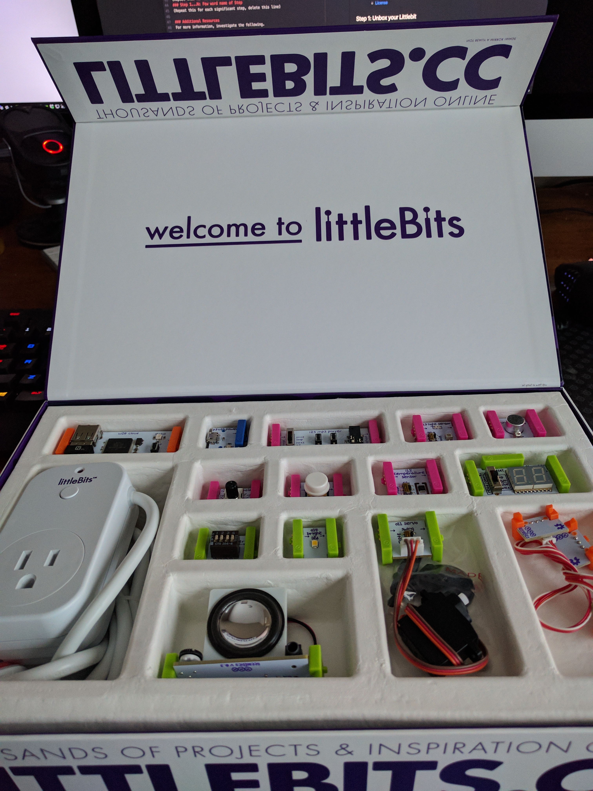

# Hands-on IoT with - Littlebits Intro

### Cybersecurity First Principles in this lesson

* __Abstraction__: An abstraction is a representation of an object or concept. It could be something such as a door, a speedometer, or a data structure in computer science. Abstraction decouples the design from the implementation. The gauges in an automobile are an abstraction of the performance of a car. A map is an abstraction of the earth.

* __Modularization__: The concept of modularity is like building blocks. Each block (or module) can be put in or taken out from a bigger project. Each module has its own separate function that is interchangeable with other modules.

* __Simplicity__: Simplicity allows a person to better understand hardware and software. Without the clutter of unnecessarily complicated code and interfaces, the software will be more understandable by people that will update the code when requirements change. It will be easier to understand by the testers and they will be able to spot problems sooner. By keeping software as simple and as focused as possible, the reliability and security is greatly increased.

### Introduction
In this lesson, we will explore a cool hands-on technology called [Littlebits](http://littlebits.cc/). Littlebits follows a _component-based design_ paradigm using _GPIO_ (or general purpose input/output) to let you easily make apps. We will learn how to plug and play bits together to make some simple inventions. Littlebits will be the central platform for the rest of camp and you will be using them in other lessons.

### Goals
By the end of this tutorial, you will be able to:
* Use Littlebits and GPIO to make your first (or another) IoT app
* Understand IoT `modularity`
* Come up with some of your own app ideas

### Materials Required

* Littlebits kit
* Power outlet nearby

### Prerequisite lessons
None

### Table of Contents
<!-- TOC START min:1 max:3 link:true update:true -->
- [Hands-on IoT with - Littlebits Intro](#hands-on-iot-with---littlebits-intro)
    - [Cybersecurity First Principles in this lesson](#cybersecurity-first-principles-in-this-lesson)
    - [Introduction](#introduction)
    - [Goals](#goals)
    - [Materials Required](#materials-required)
    - [Prerequisite lessons](#prerequisite-lessons)
    - [Table of Contents](#table-of-contents)
    - [Step 1: Unbox it!](#step-1-unbox-it)
    - [Step 2: Gotta start somewhere](#step-2-gotta-start-somewhere)
    - [Step 3: Count all the things!](#step-3-count-all-the-things)
    - [Step 4: The world is more than True or False - Variable Inputs](#step-4-the-world-is-more-than-true-or-false---variable-inputs)
    - [Step 5: Hey, Listen - Audio](#step-5-hey-listen---audio)
    - [Step 6: Turning on an outlet with the IR transmitter](#step-6-turning-on-an-outlet-with-the-ir-transmitter)
    - [Step 7: Motoring onward](#step-7-motoring-onward)
    - [Self Exploration](#self-exploration)
    - [Test Your Bits, err... Wits!](#test-your-bits-err-wits)
    - [Additional Resources](#additional-resources)
    - [Acknowledgements](#acknowledgements)
    - [License](#license)

<!-- TOC END -->

### Step 1: Unbox it!
First, open your Littlebits box. Take a second to look at the different components you have. Littlebits is organized around three colors:

* **<span style="color: pink">Pink</span>** modules are _inputs_, like an On/Off button.
* **<span style="color: green">Green</span>** modules are _outputs_, like LEDs and Fans.
* **<span style="color: orange">Orange</span>** modules are special and usually are _supportive_ - think spliters and logic handlers.
* **<span style="color: blue">Blue</span>** modules are power related.

Look over each module. Your box should include a helpful component diagram fold-out poster that shows off each of your modules. Read about some of them.



### Step 2: Gotta start somewhere
No time like the present. Lets make a simple invention:

* find the blue ```power``` module.
* find the pink ```button``` input module
* find the green ```bright led``` output module

Lets make a simple circuit:

* Connect the power to the wall
* Connect micro USB end to the ```power``` module
* Connect the ```button``` to the ```power``` module
* Connect the ```bright led``` to the ```button```.


Press the button and the light turns on. That was easy!

This is `GPIO` in a nutshell. Each module has a general purpose input and output, with a standard interface, and **doesn't need to understand or know anything about what they are connected to**. These modules also need to protect themselves from invalid input. This is a great example of the `modularity` cybersecurity first principle.

### Step 3: Count all the things!
Ok, we've made our first circuit - but it's pretty simple. Let's add some more modules:

* Find the green ```o21 number``` output module

Time to extend your previous circuit to 

* Connect the ```o21 number``` to the ```bright led```
* Set the switch to the up position on the ```o21 number``` module. This puts it into **count** mode instead of **voltage** mode.

Press the button!

Pretty simple. Notice we can **chain the output modules together** (bright led and a counter in this case). Any number of output modules can be chained together.

Now, lets switch up our circuit a bit.

* Find the pink ```sound trigger``` input module
* Find the pink ```light sensor``` input module

Lets swap some components around.

* Remove the ```bright led``` module (it is really bright!)

Press the button. Everything still works!

* Connect the ```light sensor``` to the ```power``` and then to the ```button```

Press the button. Does it work? How about if you cover up the light sensor?

This shows you that you can also **chain multiple input modules together** and their **total behavior is a combination of their input designs**. In this case, our counter only worked if the light was detected `AND` the button was pressed.

Lets try one more combo:

* Remove the ```button``` module.
* Remove the ```light sensor``` module.
* Connect the ```sound trigger``` between the ```power``` and the ```o21 number``` module.

Snap your fingers or tap the table near your device.


### Step 4: The world is more than True or False - Variable Inputs
So far, we have outputs and inputs that result in an **on** (True) or **off** (False) behavior.

The world is not always **on** or **off** .

* Find the pink ```temperature sensor``` input module.
* Find the pink ```i23 threshold``` input module.
* Get the ```light sensor``` and ```bright led``` out again

We are going to make a circuit that shows off variable voltage.

* Remove all components.
* Connect the ```temperature sensor``` to the ```o21 number``` module.
* Set the ```o21 number``` switch to **value** (middle position)
* Set the ```temperature sensor``` switch to **f** (for Fahrenheit)

You should see the current temperature in the room near the device.


* Replace the ```temperature sensor``` with the ```light sensor```
* Put the ```o21 number``` module back into **voltage** mode by moving the switch to the bottom position.
* Move your finger closer to and further away from the light sensor

You should see that the more light it gets, the more voltage it outputs.

* Now connect the ```bright led``` to the right-hand side of the ```o21 number``` module
* Move your finger closer to and further away from the light sensor

You should notice the light dimming and brightening depending on the voltage it receives.

Ok, last part!

* Connect the ```i23 threshold``` module between the ```o21 number``` and ```bright led``` modules
* Set the threshold on the ```i23 threshold``` by turning the nob.
* Keep turning until a voltage of roughly 3 or greater turns on the ```bright led```
* You can put your finger over the light sensor to change the voltage

So, what did we learn? The thresholder can **set a voltage tolerance and output a 1 (True) if its input is greater than the threshold***. This can be helpful if you want to do **sound**, **light**, or **temperature** detection, but you only want to output True if the value is greater than some value.

### Step 5: Hey, Listen - Audio

> Photo Credit: CmOrigins@deviantart http://cmorigins.deviantart.com/art/Navi-Hey-Listen-322389835

Sometimes you want your inventions to have some sound. The next design we will explore involves using audio.

* Find the pink ```mp3 player``` input module
* Find the green ```synth speaker``` output module
* Get the pink ```button``` module again

Lets play a sound when a button is pressed:

* Remove all components
* Connect the ```button``` to the ```power```
* Connect the ```mp3 player``` to the ```button```
* Connect the ```synth speaker``` to the ```mp3 player```

Press the button. This plays **all** of the tracks. If you move the ```mp3 player``` switch to **next**, it will allow you to press the ```button``` to switch tracks. You can also use the buttons on the ```mp3 player``` board.


By default, the ```mp3 player``` comes loaded with stock Littlebits tutorial audio. You can replace it using the ```sdcard``` in the board to load it with your own audio.

### Step 6: Turning on an outlet with the IR transmitter
The next module to explore is the ```ir transmitter``` and ```power outlet``` combo.

* Find the green ```ir transmitter``` output module
* Find the outlet with IR sensor (hard to miss)
* Get your pink ```button``` module

Lets wire this up so that when you press the button the outlet comes on.

* Remove all components
* Connect the ```button``` up to the ```power```
* Plug the outlet into a nearby power outlet
* Plug something up to the outlet (optional)
* Connect the ```ir transmitter``` to the ```button```

Pressing the button should turn on the device. The first time you press it, you will see the outlet light blink. It is pairing up. Once its paired, press the button a few times. You can see the red light turn on and off as you do.

> Note: Since it is IR, the IR transmitter needs line-of-sight to the IR sensor on the outlet.

### Step 7: Motoring onward
The last module we will explore is the ```servo``` which can bring actual movement into your inventions!

* Remove all components
* Connect the ```button``` to the ```power```.
* Connect the ```servo``` to the ```button```.
* Open the packet of black attachments and pick one of the arms.
* Attach the arm by pushing it down onto the ```white plastic gear``` on the ```servo```
* Set the switch on the ```servo``` board to ```turn```.

> Note you don't need to use the screw, but hand onto it for later - it should be used in production to secure the turner down

When you press the button, it should rotate the arm 90 degrees.

This can be used for all kinds of purposes!

### Self Exploration
Try some different designs yourself.

### Test Your Bits, err... Wits!
[Quiz](https://www.qzzr.com/c/quiz/430545/all-about-littlebits-introduction)

<div class="quizz-container" data-width="100%" data-iframe-title="QUIZ: All About Littlebits - Introduction" data-height="auto" data-quiz="430545"></div>

### Additional Resources
For more information, investigate the following:

* [Littlebits](http://littlebits.cc/how-it-works) - Overview of concepts and available bits
* [https://shop.littlebits.cc/products/smart-home-kit](https://shop.littlebits.cc/products/smart-home-kit) - Information about the Smart Home Kit

### Acknowledgements
Special thanks to [Dr. Robin Gandhi](http://faculty.ist.unomaha.edu/rgandhi/) for reviewing and editing this lesson.

### License
[Nebraska GenCyber](https://github.com/MLHale/nebraska-gencyber) <a rel="license" href="http://creativecommons.org/licenses/by-nc-sa/4.0/"></a><br /> is licensed under a <a rel="license" href="http://creativecommons.org/licenses/by-nc-sa/4.0/">Creative Commons Attribution-NonCommercial-ShareAlike 4.0 International License</a>.

Overall content: Copyright (C) 2017  [Dr. Matthew L. Hale](http://faculty.ist.unomaha.edu/mhale/), [Dr. Robin Gandhi](http://faculty.ist.unomaha.edu/rgandhi/), and [Doug Rausch](http://www.bellevue.edu/about/leadership/faculty/rausch-douglas).

Lesson content: Copyright (C) [Dr. Matthew L. Hale](http://faculty.ist.unomaha.edu/mhale/) 2017.  
<a rel="license" href="http://creativecommons.org/licenses/by-nc-sa/4.0/"></a><br /><span xmlns:dct="http://purl.org/dc/terms/" property="dct:title">This lesson</span> is licensed by the author under a <a rel="license" href="http://creativecommons.org/licenses/by-nc-sa/4.0/">Creative Commons Attribution-NonCommercial-ShareAlike 4.0 International License</a>.
