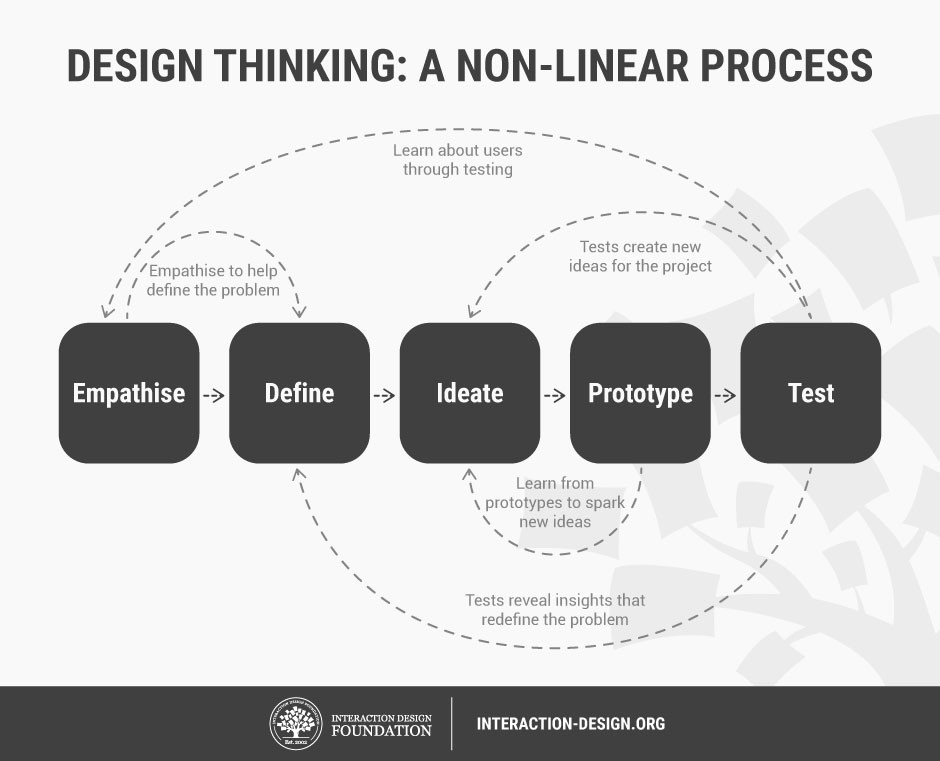
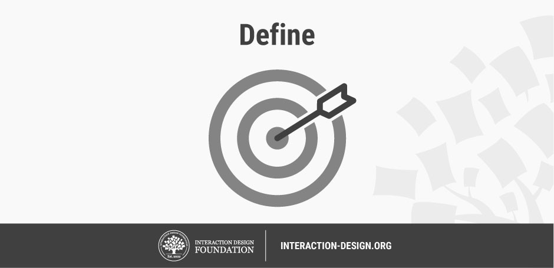
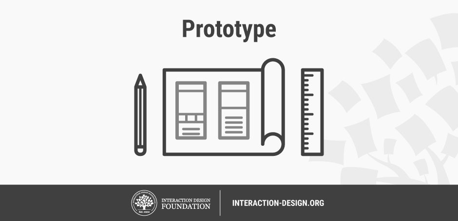

# Computational thinking and design process with Littlebits droids

### Cybersecurity First Principles in this lesson

* __Abstraction__: An abstraction is a representation of an object or concept. It could be something such as a door, a speedometer, or a data structure in computer science. Abstraction decouples the design from the implementation. The gauges in an automobile are an abstraction of the performance of a car. A map is an abstraction of the earth.

* __Modularization__: The concept of modularity is like building blocks. Each block (or module) can be put in or taken out from a bigger project. Each module has its own separate function that is interchangeable with other modules.

* __Simplicity__: Simplicity allows a person to better understand hardware and software. Without the clutter of unnecessarily complicated code and interfaces, the software will be more understandable by people that will update the code when requirements change. It will be easier to understand by the testers and they will be able to spot problems sooner. By keeping software as simple and as focused as possible, the reliability and security is greatly increased.

### Introduction
In this lesson, we will learn how components can be used to solve a problem by decomposing it into sub-problems. We will also learn about how the `design process` can be applied to imagine a problem, think about different solutions, and then iteratively make attempts to solve it - getting better solutions at each iteration. The Littlebits Scratch programming interface will be used as an organizing technology platform for these activities.

### Goals
By the end of this tutorial, you will be able to:
* express the key steps of the design process
* conceptualize and decompose a problem into smaller sub-problems using components
* program in scratch to solve a physical challenge

### Materials Required

* [Littlebits Droid Inventor Kit](https://shop.littlebits.com/products/droid-inventor-kit)
* [Number bit](https://shop.littlebits.com/products/number-bit)
* [LED bit](https://shop.littlebits.com/products/led)
* [Sound trigger bit](https://shop.littlebits.com/products/sound-trigger)
* [Temperature sensor bit](https://shop.littlebits.com/products/temp-sensor)
* [Button bit](https://shop.littlebits.com/products/button)
* [Wire bit](https://shop.littlebits.com/products/wire-bit)
* [USB power bit](https://shop.littlebits.com/products/usb-power)
* [Rechargable battery pack](https://shop.littlebits.com/products/rechargeable-battery)

### Prerequisite lessons
[Intro to components using Littlebits Droids](../intro_to_components_using_littlebits_droids/README.md)

### Table of Contents
<!-- TOC START min:1 max:3 link:true update:true -->
- [Computational thinking and design process with Littlebits droids](#computational-thinking-and-design-process-with-littlebits-droids)
    - [Cybersecurity First Principles in this lesson](#cybersecurity-first-principles-in-this-lesson)
    - [Introduction](#introduction)
    - [Goals](#goals)
    - [Materials Required](#materials-required)
    - [Prerequisite lessons](#prerequisite-lessons)
    - [Table of Contents](#table-of-contents)
    - [The Design Process](#the-design-process)
    - [Scratch 101 in Littlebits App](#scratch-101-in-littlebits-app)
    - [Exercise: Apply design thinking to solve a problem with Littlebits](#exercise-apply-design-thinking-to-solve-a-problem-with-littlebits)
    - [Additional Resources](#additional-resources)
  - [Lead Author](#lead-author)
    - [Acknowledgements](#acknowledgements)
    - [License](#license)

<!-- TOC END -->

### The Design Process
Design is more than sitting down and starting to code. In the real world when faced with a complex problem, companies, and individuals need a systematic process to think about the problem, consider all of the stakeholders and come up with a solution. In this lesson, we examine a 5-step `design thinking process` created by the [Hasso-Plattner Institute of Design at Stanford](https://dschool.stanford.edu/). Their process is iterative and non-linear.

> Author/Copyright holder: Teo Yu Siang and Interaction Design Foundation. Copyright licence: CC BY-NC-SA 3.0

#### Empathizing and Defining
I group these two stages together as they are very iterative. 

> Author/Copyright holder: Teo Yu Siang and Interaction Design Foundation. Copyright licence: CC BY-NC-SA 3.0

Before trying to solve a problem, one must understand it. Complex real-world problems involve more than one stakeholder. If you are trying to design software, for instance, you need to cognizant of _all_ of your users, not just some of them. `Implicit bias` (where problem solvers accidentally leave some users out) can be a real issue if problem solvers don't `empathize` with their users. In this sense, empathizing is the part of the design process where we observe and study our user base, build `user stories` that describe who our users are and what they want to do with our product, and then make sure we have coverage across our user population. Empathy is also important for **setting aside our assumptions** so that our product can meet the needs our users and not ourselves.

> Author/Copyright holder: Teo Yu Siang and Interaction Design Foundation. Copyright licence: CC BY-NC-SA 3.0

After we have gathered some data about our users and empathically considered their perspective, we can begin to `define` the problem. It should be noted that the `define` stage is not done once we initially define the problem. We will keep returning to the problem statement as we test our potential solutions. With definition, we want to make problem assumptions clear and define the requirements for any potential solution. 

##### Some processes for empathizing and defining the problem
A good technique for empathizing and defining the problem is `affinity diagramming`. This technique helps development teams consider multiple perspectives and is a great process to use with groups of users from the target population.

For affinity diagramming, you need some sticky note cards, a few ink pens or markers, and a few questions. The questions get posed the group. Individuals in the group think up their answers and write them on the note cards, and then the facilitator goes note by note and the group decides how to categorize the notes. No note is bad.

This can produce some interesting categories that help define and contextualize the problem. 

`User stories` are another useful technique for contextualizing a problem. User stories are used pretty extensively in software design and development - particularly in teams using a process called `Agile`.

A user story is generally written as:

As a `type of user`, I want to `some action`, so that I can `rationale`.

an example would be:

As a `instagram user in highschool`, I want to `post pictures of myself and my friends`, so that I can `build my social status at school`.

This may create very different requirements that a different kind of instagram user with different actions and rationales, e.g.

As a `company on instagram`, I want to `post pictures of my products`, so that I can `build brand recognition`.

Both statements help define requirements for any potential solution.

##### Exercise:
* Read [https://www.mountaingoatsoftware.com/blog/advantages-of-the-as-a-user-i-want-user-story-template](https://www.mountaingoatsoftware.com/blog/advantages-of-the-as-a-user-i-want-user-story-template)
* Read [https://uxdict.io/design-thinking-methods-affinity-diagrams-357bd8671ad4](https://uxdict.io/design-thinking-methods-affinity-diagrams-357bd8671ad4)
* try it

#### Ideating
Once we can begin to stabilize the problem definition, we can start zoning in on solutions. The `ideation` phase is very important to help us find as many possible solutions to the problem as possible - so that we can pick the best one. Often times, computer scientists and developers **don't ideate enough** before jumping into development. This can lead to some myopic focus on one particular design - that might be _bad_. 

When ideating, there are several techniques you can use to come up with good ideas.

One is obviously `brainstorming` - where the team sits around a table and thinks up different ideas to address the problem. Brainstorming is great, but it is better applied as a second step. 

First, a technique called `worst possible idea` is a good starting place. Worst possible idea runs counter to out notions of solving a problem, but its a helpful exercise. Here, participants come up with the absolute worst solutions to a problem that they can think of. Bad solutions are considered for _why_ and _how_ they are bad - to list out all the reasons. 

Going through this process, the group begins to get a notion of the **solutions to avoid**. This is a great time to introduce brainstorming. The group can start to frame new ideas in terms of how they avoid the mistake and pitfalls of the bad ideas. This can help break town team-dynamics barriers that often emerge whenever a particular team member becomes _attached_ to their particular idea.

##### Exercise:
* Read [https://www.interaction-design.org/literature/article/learn-how-to-use-the-best-ideation-methods-worst-possible-idea](https://www.interaction-design.org/literature/article/learn-how-to-use-the-best-ideation-methods-worst-possible-idea) (~5 min read)
* try it

> Author/Copyright holder: Teo Yu Siang and Interaction Design Foundation. Copyright licence: CC BY-NC-SA 3.0

#### Prototyping and Testing

Prototyping is the stage where you start making. `Prototypes` should not be full-fledged at the beginning. Since we aren't always sure if an idea coming out of the ideation stage is really going to work, we don't want to spend too much time on it at first. Prototypes can help to identify whether or not an idea will pan out. Often prototypes lead to new ideas - because different members of a team begin to bounce ideas off one another to create better ones.

As you progress, prototypes need to be `tested.` 

> Author/Copyright holder: Teo Yu Siang and Interaction Design Foundation. Copyright licence: CC BY-NC-SA 3.0

Testing a prototype helps us to learn whether or not it succeeds (i.e. does it meet the requirements of the problem) and can help to refine the definition of the problem - if we learn something about the problem that we hadn't thought of before. 

### Scratch 101 in Littlebits App
Try coding your droid.

* Go to the `mission interface` in the inventor kit app
* Try missions 11 (with secret handshake) and 18
* How could you combine the scratch interface with various inputs and outputs to solve a problem?

### Exercise: Apply design thinking to solve a problem with Littlebits
The problem: Navigate a course, drop and object on the dropzone, drive out.  
The twist: You may only use materials present on the table and any of your Littlebits parts.  
The second twist: You must drive and deliver the object using a scratch program written on your R2-D2.  

> Make sure to use the design process, in this case since the problem is defined, focus on the ideating, prototyping, and testing phases

### Additional Resources
For more information, investigate the following:

* [Littlebits](http://littlebits.cc/how-it-works) - Overview of concepts and available bits

## Lead Author

- Matt Hale

### Acknowledgements
This lesson was inspired and informed by a [blog post](https://www.interaction-design.org/literature/article/5-stages-in-the-design-thinking-process) written by Rikke Dam and Teo Siang. Materials in this lesson are used consistent with their CC-v3 license.

### License
[Nebraska GenCyber](https://github.com/MLHale/nebraska-gencyber)   is licensed under a <a rel="license" href="http://creativecommons.org/licenses/by-nc-sa/4.0/">Creative Commons Attribution-NonCommercial-ShareAlike 4.0 International License</a>.

Overall content: Copyright (C) 2017-2018  [Dr. Matthew L. Hale](http://faculty.ist.unomaha.edu/mhale/), [Dr. Robin Gandhi](http://faculty.ist.unomaha.edu/rgandhi/), [Dr. Briana B. Morrison](http://www.brianamorrison.net), and [Doug Rausch](http://www.bellevue.edu/about/leadership/faculty/rausch-douglas).

Lesson content: Copyright (C) [Dr. Matthew L. Hale](http://faculty.ist.unomaha.edu/mhale/) 2018.  
 This lesson is licensed by the author under a <a rel="license" href="http://creativecommons.org/licenses/by-nc-sa/4.0/">Creative Commons Attribution-NonCommercial-ShareAlike 4.0 International License</a>.
