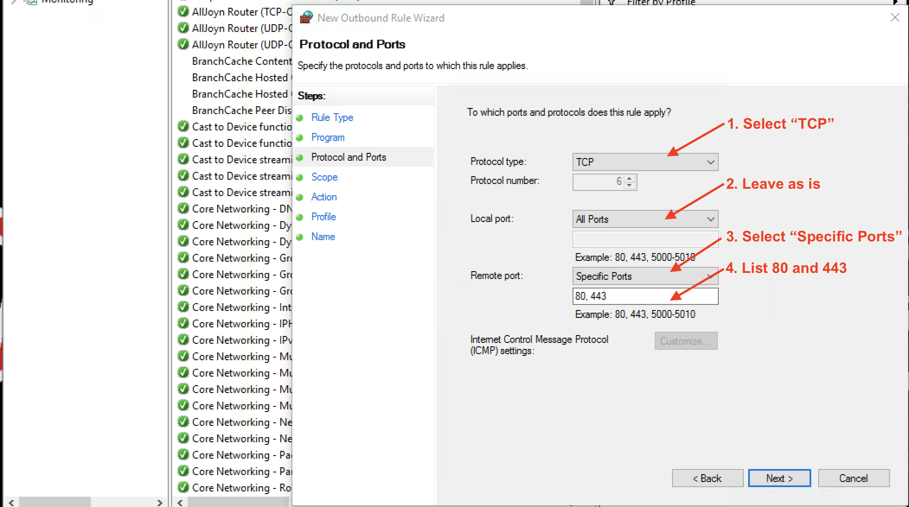
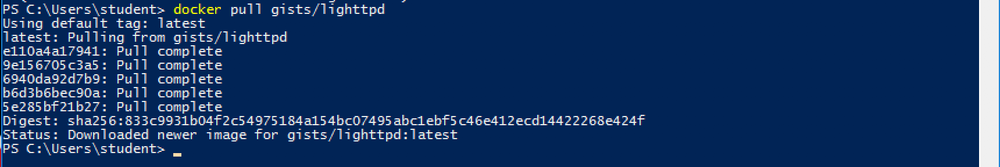

# Firewalls

Firewalls are often the first line of defense for an enterprise or home network. In this unit, we will understand the fundamentals of firewalls, write firewall rules that configure its behavior and then test if the firewall performs as expected.

### Cybersecurity First Principles
* __Minimization__: Minimization refers to having the least functionality necessary in a program or device. The goal of minimization is to simplify and decrease the number of ways that software can be exploited. This can include **turning off ports that are not needed**, reducing the amount of code running on a machine, and/or turning off unneeded features in an application. This lesson focuses specifically on turning off ports and limiting network connections that aren't required for correct operation.

* __Layering__: Cyber security uses multiple layers of defense or protecting information. If one layer is defeated the next layer should catch it. Firewalls are a key aspect of any layered defense.

* __Least Privilege__: One of the ways to protect information is by limiting what people can see and do with your information and resources. The principle of least privilege says to allow the minimum number of privileges necessary to accomplish the task.

### Table of Contents  
[Overview](#overview)  
[Firewalls as a Collection of Valves](#firewall-as-a-collection-of-valves)  
[Firewall Rules](#firewall-rules)  
[Windows Firewall](#windows-firewall)   
[Additional Readings](#additional-readings)  
[Teacher Developed Modules](#teacher-developed-modules)  
[Acknowledgements](#special-thanks)  


## Overview

The name `firewall` is inspired from its physical manifestation in construction which refers to walls that are designed to stop a fire from spreading.

> 

While these firewalls are "cool", we are interested in a different kind of firewall. Namely, the ones that protect internal networks from external networks. These kinds of firewalls allow us to control the flow of information between networks. Firewalls __minimize__ the number of ways that internal networks and computers on them can be exploited. They also encourage __least functionality__ by turning off ports that are not needed. Firewalls can also drop network traffic that does not conform to expected patterns (such as malicious requests to an application server).

> 


Firewalls aren't just for networks. Each computer in a network can have its own `personal firewall`. All popular operating systems now come with a firewall installed. For Windows Server and Desktop installations we will focus on the built-in `Windows Firewall with Advanced Security` application. This application can be configured with a graphical user interface or the command line interface using `netsh` or Powershell `NetSecurity` modules. These options provide a lot of flexibility and control over the configuration of the firewall for personal and enterprise use.

> 

When two machines communicate (such as a client talking to a server), communication spans many different __layers__. Each of these layers is progressively lower level as you move downward. In general there are 7 layers:

- `Application` - The highest level layer where application data is handled (HTTP/FTP/DHCP/SSH/SSL, etc)
- `Presentation` - often the same as the application level, sometimes acts as a translation between application and session
- `Session` - The layer that is used to form sessions between applications (often issues remote procedure calls (RPCs))
- `Transport` - One of the two layers that are foundational to the modern internet (TCP / UDP), this layer serves to transport packets from one host to another.
- `Network` - The second of the foundation layers for the modern internet (IP, IPv4, IPv6, IPSec, etc). This layer serves to transport packets between routers (often referred to as __packet forwarding__).
- `Data Link` - The biggest example of the data link layer is `ethernet`. It provides a protocol for exchanging data over a local network.
- and `Physical` - This layer is nothing but raw bits that underly the interpretation of those bits at higher levels.

> 

### Question

At what [network layer](https://support.microsoft.com/en-us/kb/103884) does it make the most sense to operate a firewall, considering that it is connecting two different networks?

- [ ] Physical layer  
- [ ] Data link layer  
- [ ] Network layer and above  

Discussion:  
The headers on ethernet frames at the `Data link` layer and below are not useful for routing across networks. Packet filtering Firewalls rules are authored using routing information starting at the `Network` (also called the IP layer in the TCP/IP implementation) layer and above, all the way to the `Application` layer. As a result IP layer firewalls are the simplest and most widely used.


[Top](#table-of-contents)

### Firewall as a Collection of Valves

A packet filtering Firewall can be understood as a collection of valves  

* Each valve/port corresponds to single service at the application level (e.g. HTTP, SSH, HTTPS, SMTP)
* Each valve can  
  - Permit traffic in one or both directions  
  - Deny traffic  

  

Here are three basic scenarios to keep in mind.  

First, lets consider **Ports 1 and 4**. These ports are open. Which means they permit packets from internal and external sources. So in the case of the TCP protocol, which forms explicit connections or circuits before transmitting data via a handshake mechanism, such connections can be externally or internally initiated.

In the case of **Port 2**, it allows unrestricted flow of information if the connection is initiated internally. However, it blocks all external requests to initiate an information flow. That is, it permits packets from external sources only if they correspond to a `connection` initiated by an internal source. The firewall will not permit connection requests from external sources. This restriction is useful when an internal web client initiates a web browsing request, then the firewall will allow the corresponding incoming response from an external webserver to pass through the firewall. Any connection initiated externally will not be allowed.

Finally, **Port 3** is closed. Which means that it denies all traffic. A closed port may just drop the packets or send back an RST or "Reset" packet. From a security and resource consumption standpoint, it is always better to just drop the packet. Upon denial of access, no additional or useful information should be communicated back.

[Top](#table-of-contents)

## Firewall Rules

Firewalls are configured using simple `if then` rules. In a packet filtering firewall, a rule says: `IF source IP, destination IP, protocol, and local ports and remote ports match a pattern THEN take this action`. Since there are many rules involved, the order of the rules matters. **A LOT!**

Rules are evaluated **in order**, starting with the first one at the top until a first match is discovered. If your top rule is very generic, i.e. matches almost every packet, then **none of the later specific rules will ever be evaluated**. So it is best to start with rules that are the `most restrictive` (i.e rules that focus on to specific services and have a very small chance of interfering with other rules). After ordering by restrictiveness it is then best to order rules according to `how well they match the majority of your network traffic`. This minimizes the number of checks required to find a matching rule. If `block` and `allow` rules do not match, the default policy of the firewall is applied.

Always start firewall configuration with a `whitelisting` philosophy, where you **Deny by default** and allow only specific information flows. This means, start the firewall configuration by dropping all packets by default. Then add rules to `allow` specific traffic patterns (incoming, outbound, or forwarding) as required by application needs.

Let's look at an example for exposing a web service over HTTP.

| Rule#  | Direction     | Source        | Destination   | Local Port   | Remote Port   | Action   |
| ------ |:-------------:|:-------------:| :------------:|:------------:|:-------------:|:--------:|
| 1      | inbound       | any           | web server    | http (80)    | any           | ```accept```   |
| 2      | outbound      | web server    |   any         | http (80)    | any           | ```accept```   |
| 3      | any           | any           |   any         | any          | any           | ```reject```   |

**Rule 1** permits externally initiated requests (Direction: inbound) to a webserver behind the firewall. So the source is ```any```, since we cannot anticipate a specific IP address at the time of writing the rule. The destination is the IP address of the webserver and the Local Port specifies the port number where the service is typically hosted. That would be port ```80``` for a web server. The request may originate from any Remote Port. If these conditions match an incoming packet then the action is ```accept```(allow packet to come in).

**Rule 2** permits internal requests (Direction: outbound) out to the Internet. So the source is any IP address of the ```web server``` and the Destination is  ```any```. The Local Port is ```80``` (originating port) and Remote Port is ```any```. If a packet matches these conditions then the action is ```accept``` (allow packet to go out).

**Rule 3** denies all traffic (in ```any``` direction). So all match conditions are specified as ```any``` and the action is ```reject```. This is ```Default Deny``` behavior.

### Question

What would happen if we re-ordered these rules? Specifically, if Rule 3 was exchanged with Rule 1.

Discussion:
* Inbound and outbound rules are typically maintained in separate lists. We will see this shortly. Rule 3 is typically implemented as a ```Default Policy``` in Inbound and Outbound rule lists. It applies if none of the specified rules match.

[Top](#table-of-contents)

## Windows Firewall

As mentioned before, Windows has a built-in firewall. Depending on the profile (type) of Network your computer is connected to, the firewall can be configured to have a different behavior. Your home network should be assigned the ```Private``` profile, while coffee-shop and airport networks are best assigned to the ```Public``` profile. Enterprise computers are typically part of a ```Domain``` in an enterprise network. For this option, the ```Domain``` profile is used. When you bring up the firewall, you will see these profiles listed. You will also see the default policy for inbound and outbound network connections associated with each profile.

> 

### Observations:  

* The firewall is ON
* Inbound connections are being blocked by default. Allowed connections have to be whitelisted.
* Outbound connections are being allowed by default!!!    
Which means that unless you block a connection, it is allowed. This is not a secure setting. Once malware is installed on your machine (quite plausible with phishing), it can easily call out to a remote server and exfiltrate data. This poor [design choice](https://docs.microsoft.com/en-us/windows/access-protection/windows-firewall/create-an-outbound-port-rule) is perhaps motivated by a trade-off between usability and security.

The defaults for Outbound connections go against the fundamental security principle of ```Default Deny``` and ```Whitelisting``` allowed connections. Let's go ahead and make it right.

> Be ready for many internet connected programs to stop working after this change!

Click on Firewall Properties to view the defaults for all profiles

> 


Let's change the default behavior for Outbound connections to ```Block```.

> 

Repeat the same for Private and Public profiles (tabs). Then hit ```Apply``` to save these settings.

By default, all rules apply to all network interfaces for both IPv4 and IPv6 protocols. The network interfaces protected by Windows Firewall can be changed clicking on the ```Customize``` button next to ```Protected network connections```

> 

We see that all network interfaces are selected. Observe that DockerNAT is also covered.  
Hit ```OK``` to exit.  
Hit ```OK``` again to exit the Properties dialog box.  

Now the firewall status page should look like this:

> 

Let's test with docker. Open a Powershell terminal:

```bash
# Try to pull this docker image
# If you already have a local copy
# this command will attempt to update it
docker pull gists/lighttpd
```
> 

The pull fails. Why?

> The request can not pass through the firewall (outgoing direction) to reach docker servers

Docker for Windows uses ```vpnkit``` module to provide virtual networking. So we need to allow this program through our firewall in the Outbound direction.
We want to be very specific to the Program, Ports, and Protocol in our Rule (Cybersecurity First principle: Minimization).

Let's start to author a new Outbound rule. Select ```Custom``` rule to provide the most flexibility:

> 

Next, we locate the program that we want to allow through the firewall in the outbound direction.

> 

Click ```Next```. That brings us to ```Protocols and Ports```.   
We want docker to be able to contact docker hub webservers (```Remote```) to access HTTP (Port ```80```) and HTTPS (Port ```443```) services using the ```TCP``` protocol.    
So adjust the settings as shown:

> 

Click ```Next```. We will not limit the connection to specific IP addresses, so we will leave ```Scope``` as is.   
Click ```Next``` again.

Now for ```Action```. Select ```Allow the connection``` since we are whitelisting this application.

> 

Next, for ```Profile``` select all profiles so that the rule applies to all network types.  
Finally, provide the rule a Name and Description as shown below:

> 

Click ```Finish```. The rule is now active and should be listed in the Outbound rules listing.

Now use similar steps as above to add a rule for the same program (vpnkit), but allowing protocol ```UDP``` for remote port ```53```. This allows DNS requests to go through. DNS helps with domain name discovery.

Once the UDP rule is added, we are ready to try the `pull` command again.

```bash
# Try to pull this docker image
docker pull gists/lighttpd
```

It should work this time. Call the instructor to troubleshoot if the command fails.

> 

## Exercise

Write two new outbound rules to enable Google Chrome to connect to websites. To carry out this task you will need the following information:

> 1. Program: `%ProgramFiles%\Google\Chrome\Application\chrome.exe`
> 2. Protocol: TCP
> 3. Remote Ports: 80, 443

and

> 1. Program: `%ProgramFiles%\Google\Chrome\Application\chrome.exe`
> 2. Protocol: UDP
> 3. Remote Port: 53

### Inbound Connection Filtering

The default policy for Inbound connections is ```Block```. So at installation time, programs insert very broad ranging rules to avoid later connection issues. Docker does the same. Locate inbound rules named ```vpnkit```. You should see two of them.

> 

Examine the properties of both. Properties for the TCP rule are shown below.

> 

Here is a summary of properties from both rules:

> 1. Program: `%ProgramFiles%\Docker\Docker\resources\vpnkit.exe`
> 2. Protocol: ```TCP```
> 3. Local Port: ```any```
> 4. Remote Ports: ```any```

and

> 1. Program: `%ProgramFiles%\Docker\Docker\resources\vpnkit.exe`
> 2. Protocol: ```UDP```
> 3. Local Port: ```any```
> 4. Remote Port: ```any```

If you only wanted to host a webserver container or a DNS server container, this rule allows unnecessary exposure to all other ports. By applying the minimization principle we can reduce the attack surface. What we need is the following configuration, if all we want to do is expose web services and perhaps allow incoming DNS requests:

> 1. Program: `%ProgramFiles%\Docker\Docker\resources\vpnkit.exe`
> 2. Protocol: ```TCP```
> 3. Local Port: ```80, 443```
> 4. Remote Ports: ```any```

and (2nd rule is optional for the `cloudbit` container app, rule may be just disabled)

> 1. Program: `%ProgramFiles%\Docker\Docker\resources\vpnkit.exe`
> 2. Protocol: ```UDP```
> 3. Local Port: ```53```
> 4. Remote Port: ```any```

Here is the change illustrated for the TCP rule.
> 

This change minimizes the attack surface and enforces least privilege.

Now check if your `Cloudbit` application still works after making these changes.

Check other programs in the Inbound rules list that you think might be allowing more exposure (Protocol and Ports) than necessary for operation.

## Test your blockage, err ... knowledge!

[Firewall Quiz](https://www.qzzr.com/c/quiz/435576/firewalls)

That's it for Firewalls in this Unit. Happy Surfing.

> Firewalls are an essential component of "Defense-in-Depth" strategy. It can certainly slow down an attacker. However, firewalls cannot keep a determined adversary out. There are many ways in which firewalls can be abused and easily bypassed. Such attacks need to be constantly monitored using Intrusion Detection Systems (IDS) and Network Monitoring solutions. The final line of defense is applications built using secure coding practices and proper encryption implementations.  

[Top](#table-of-contents)

## Additional Readings

* [Order of Windows Firewall Rule Evaluation](https://technet.microsoft.com/en-us/library/cc755191%28v=ws.10%29.aspx)
* [Microsoft Windows Firewall in Enterprise Environment Resources](https://docs.microsoft.com/en-us/windows/access-protection/windows-firewall/windows-firewall-with-advanced-security-design-guide)
* [Microsoft The OSI Model's Seven Layers Defined and Functions Explained](https://support.microsoft.com/en-us/kb/103884)  
* Linux firewalls
  * [Ubuntu iptables Wiki](https://help.ubuntu.com/community/IptablesHowTo)  
  * [CentOS iptables Wiki](https://wiki.centos.org/HowTos/Network/IPTables)
  * 25 Most Used iptables commands, [The Geek Stuff](http://www.thegeekstuff.com/2011/06/iptables-rules-examples/)

[Top](#table-of-contents)

## Teacher Developed Modules

* [Firewall discussion: Part 1 @ GenCyber Camp 2016](https://dl.dropboxusercontent.com/u/4594444/Gencyber-teacher-modules/FirewallPresentation2016.pptx)

[Top](#table-of-contents)

## Special Thanks

* A special thanks to Matt Hale for reviews of this module and thoughtful discussions.

[Top](#table-of-contents)

# License
[Nebraska GenCyber](https://github.com/MLHale/nebraska-gencyber) <a rel="license" href="http://creativecommons.org/licenses/by-nc-sa/4.0/"></a><br /> is licensed under a <a rel="license" href="http://creativecommons.org/licenses/by-nc-sa/4.0/">Creative Commons Attribution-NonCommercial-ShareAlike 4.0 International License</a>.

Overall content: Copyright (C) 2017  [Dr. Matthew L. Hale](http://faculty.ist.unomaha.edu/mhale/), [Dr. Robin Gandhi](http://faculty.ist.unomaha.edu/rgandhi/), and [Doug Rausch](http://www.bellevue.edu/about/leadership/faculty/rausch-douglas).

Lesson content: Copyright (C) [Robin Gandhi](http://faculty.ist.unomaha.edu/rgandhi/) 2017.  
<a rel="license" href="http://creativecommons.org/licenses/by-nc-sa/4.0/"></a><br /><span xmlns:dct="http://purl.org/dc/terms/" property="dct:title">This lesson</span> is licensed by the author under a <a rel="license" href="http://creativecommons.org/licenses/by-nc-sa/4.0/">Creative Commons Attribution-NonCommercial-ShareAlike 4.0 International License</a>.
