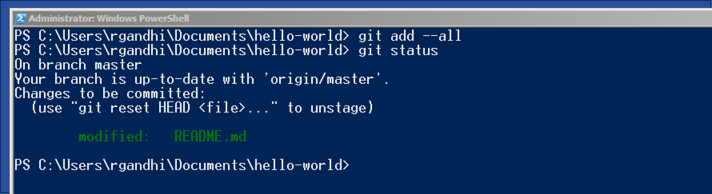

# Github Primer

### Cybersecurity First Principles in this lesson

#### Domain Separation
Good fences make good neighbors.  
- It is good to separate source code from build and runtime environments
- Version control for source code prevents accidental or unauthorized changes
- Eliminate dead code

#### Modularization
The concept of modularity is like building blocks. Each block (or module) can be put in or taken out from a bigger project. Each module has its own separate function that is interchangeable with other modules.
- Different code repositories can be maintained for project modules

### Introduction: Git and Github
* [Git](https://git-scm.com/) is a popular software development tool.
* Used by developers to collaborate and version control code.   
* A collaborative environment to develop written works including code!
* [Github](www.github.com) is popular for online git repository hosting
  - Free for open source  
  - [BitBucket](https://bitbucket.org/), is another such a service.

### Lesson goals
- Create, clone and manage online repositories
- Create and manage local repositories
- Synchronize repositories

### Materials required
- [git](https://git-scm.com/download/) (Windows Version)

### Prerequisite lessons
- Lots of curiosity
- [Linux Commands](https://www.cheatography.com/davechild/cheat-sheets/linux-command-line/pdf/). These directory operations will be very useful:
```bash
# Directory Operations
pwd # Show current directory
mkdir dir # Make directory dir
cd dir # Change directory to dir
cd .. # Move up a directory
ls  # list files and directories in current directory
```

- Windows PowerShell and MacOS terminal also understand above commands.

### Table of Contents    
<!-- TOC START min:1 max:3 link:true update:true -->
- [Github Primer](#github-primer)
    - [Step 1: Create an Account](#step-1-create-an-account)
    - [Step 2: Hello World](#step-2-hello-world)
    - [Step 3: Clone a Repository](#step-3-clone-a-repository)
    - [Step 4: Push Changes](#step-4-push-changes)
    - [Step 5: Pull Remote Changes](#step-5-pull-remote-changes)
    - [Initialize a new repository](#initialize-a-new-repository)
    - [Cyber security First Principles Reflections](#cyber-security-first-principles-reflections)
  - [Additional Resources](#additional-resources)
  - [Acknowledgements](#acknowledgements)
  - [License](#license)

<!-- TOC END -->

### Step 1: Create an Account
First things first, create a free account on Github. https://github.com/join
You will also need to verify your email address after registration in order to use your new GitHub account.

[Top](#table-of-contents)

### Step 2: Hello World
Complete the following Github tutorial:
https://guides.github.com/activities/hello-world/

At the end of Step 2, you will have created a `remote` repository and will have added a `branch`. It is `remote` because all your files are in the Github cloud. As a developer, you might ask, _"how do I use this to create code if it is just online?"_ It is not convenient to write and test code online, especially when many applications require locally install packages to even work. It would be great to use your own `Local` repository. We will do just that in the next step.   

Git is a distributed configuration management system. It helps to `avoid` thinking of a traditional central code repository. Instead, with Git we have multiple independent repositories that could be in different states at any given time and synchronized using specific commits.

[Top](#table-of-contents)

### Step 3: Clone a Repository
To create a `Local` repository there are two basic options.
1. `Clone` a remote repository on your computer, or
2. `Initialize` a new git repository from scratch on your computer.

[Top](#table-of-contents)

##### Clone a remote repository
Let's start by looking at option #1 and checking that Git is installed.

- Git tools do not come pre-installed with all operating systems.
- To check if they exist on your operating system, open up a command line interface (`PowerShell` for Windows) and type:

  ```bash
  git --version
  ```

- If Git is installed, this command will show the version installed. If the command is not recognized, then it means you need to install git on your OS. The information available at [https://git-scm.com/book/en/v2/Getting-Started-Installing-Git](https://git-scm.com/book/en/v2/Getting-Started-Installing-Git) can walk you through it for a variety of OSes.
- We will assume a Windows OS environment with PowerShell as shown below:

> 

To `clone` a remote repository (what we set out to do), we first need a ```reference URL``` to find it.   
* On `Github.com`, navigate to your hello-world repository and click on the button that says ```Clone or download```.   
* Copy that URL.
* Now we are ready to clone this remote repository, and create a local repository.

  ```bash
  git clone <replace this, including angled brackets with the clone URL that you copied above>
  ```

You will start to see some download messages and upon success, your local repository will be ready for use. You may be asked to authenticate with Github credentials if your repository is not public.

>

Now, in PowerShell, switch to the hello-world directory that has all the files from the repository that you just cloned.

```bash
cd hello-world/
```

To list the files in this directory, use this command

```bash
ls
```
You should see a README.md and possibly some other files.

[Top](#table-of-contents)

### Step 4: Push Changes
In this step, we will make changes to files in our `Local` repository and then `push` changes back to the `remote` repository.

Git is based on a **de-centralized** model of ownership - which means that there is no central authoritative repository. Every repository, Local or Remote, is fully autonomous and fully functional on its own. So changes made in any repository are tracked in that repository only. Two repositories do not communicate unless there is a explicit request to synchronize changes across them. This will make more sense as we work through a scenario.

Let's open the hello-world folder in windows explorer and make changes to the `README.md` file in a text editor.  

1. Navigate to the files
2. Open README.md in Notepad
3. Edit README.md to add a message. Like the one below.
>

Once you save the edited README.md, check the status of the local repository using the following command. Return to PowerShell:

```bash
git status
```
You should see something like this:

>

A few things to notice here about these status messages:  
1. `On branch master`: You are on the master branch in your `local` repository.  
2. `Your branch is up-to-date with 'origin/master'`: Your local repository master branch is in sync with your remote repository master branch on GitHub. The default name for the remote repository is **origin**. This makes sense as you cloned your local repository from it.  
3. `Changes not staged for commit`: git follows a two step process to save changes to a repository.
  1. The user indicates which modified/deleted/new files need to be `staged` for a save in the repository.
  2. The staged files are `committed` to the repository.
4. `modified:  README.md`: git knows that the README.md file has been modified  

Now we `stage` our changes for a commit using this command:
```bash
git add --all
```
The above command `adds` any edited files in a staging area, a temporary holding place before a commit. We can check the status of the repository again using the following command:

```bash
git status
```
You should see something like this:

>

This time the modified files are `staged` for a `commit` and appear in green.

Now before we `commit` these files into our local repository, the git author details need to be set. This is for accountability of commits. Using the commands below, save your information to the git configuration files and set them for all of your local repositories. Make sure to use the same name and email you used to register with Github. This is a one-time setup only. Once it is set, you don't have to do this on subsequent commits.

```bash
git config --global user.name "replace this with your name"
git config --global user.email youremail@example.com
```
You should see something like this (with your name and email):
>

Check your configuration changes by using the following command:
```bash
git config --list
```

Again, you only have to set the config parameters once. Now that they are set, git will keep reusing them when making commits or merging your changes with other repositories.

Now let's commit the changes that we staged before. Here we use the `commit` option with `-m` to provide a short commit message. This helps us remember various checkpoints in our editing process. These messages are very helpful to rollback changes to an appropriate commit.

```bash
git commit -m "added UNO description"
```

Use this command to see all your commits:

```bash
git log
```

This command shows a summary of commits in the repository, starting with the most recent. Observe the hash code, user details and commit message. These attributes provide attribution of all changes in the code repository, promoting code integrity.

> Hit the key `q` to exit the log of commit messages.

Issue this command to check your repository status once again:
```bash
git status
```

It should report **no** uncommitted changes. But it indicates that `Your branch is ahead of 'origin/master' by 1 commit`. Which means that our local repository master branch has more recent commits than the remote repository master branch.

To push our local commits to the remote repository (Github in this case), we need the git `push` command. With this command, we need to indicate the name of the remote repository followed by the name of the local repository branch that has updates to be pushed. Do you remember the name of our remote repository and the main branch?

> **Questions**  
> - What is the default name of the remote repository?  
> - What is the default name of the base branch in a repository?

To `push` local commits in the current branch to a remote repository (`origin` in our case) and its remote branch (`master` in our case), use the following command:

```bash
 git push origin master
```

> **OPTIONAL**: To rename a branch in the remote repository, you'd use the same git push command, but you would add one more argument: the name of the new branch. For example:  
> `git push  <REMOTENAME> <LOCALBRANCHNAME>:<REMOTEBRANCHNAME>`  
> This command pushes the LOCALBRANCHNAME to your REMOTENAME, but it is renamed to REMOTEBRANCHNAME.  

Now, issue the `status` command to check your repository status once again:
```bash
git status
```

Visit your remote repository on `Github.com`. Your changes should appear there. You should also see your commit message there. Clicking on the commit message will show the file differences in that commit.

> 

As mentioned before in the introduction, git version control is very efficient for text files. It does not store entire files for old versions but only the differences. So it is prudent to make frequent commits and then push these changes to the remote repository - so that you have as many checkpoints as possible should you need to roll back. To keep the master branch commits clean, it is advisable to do feature development and testing in a feature branch and then merge with master.

[Top](#table-of-contents)

### Step 5: Pull Remote Changes
What happens if we make some changes to README.md on `Github.com`? Or another collaborator makes changes to it. How do we get these changes back into our local repository? We will learn just that in this step.

So, I realized that I forgot to add a link to UNO's Cybersecurity programs in the README.md file. So I will make these changes and commit those changes on Github.com itself.

1. First, click on README.md file on Github and then click the edit option as shown below:
>

2. Make changes, add a commit message and click `Commit changes`
>

3. See changes in your README.md file
>

Now the remote repository is one `commit` ahead of the local repository. To bring the _local_ repository up to speed, we use the following command in a terminal. This single command fetches remote changes (`git fetch`) and merges them (`git merge`) into your local repository.

```bash
git pull
```

> `Sidebar`: If a repository has linked sub-modules (e.g. [nebraska-gencyber](https://github.com/MLHale/nebraska-gencyber)), add the following recursion flags to clone and pull changes from the sub-modules as well:  
> `git clone --recursive https://github.com/MLHale/nebraska-gencyber-dev-env.git`  
> `git pull --recurse-submodules`

Continuing with the lesson, if we look at our local README.MD file in windows explorer, it should have the updated link.
>

At this point, you know enough to keep both the local and remote repositories synchronized.    

As long as you always `pull` before making changes and keep `pushing` any new changes - you will avoid most merge conflicts that can occur.  

If you are interested in learning more about complex team interaction scenarios - you may want to explore a concept called `branching` that avoids most `merge conflicts`; for more information about merge conflicts see: [https://help.github.com/articles/resolving-a-merge-conflict-from-the-command-line/](https://help.github.com/articles/resolving-a-merge-conflict-from-the-command-line/).

[Top](#table-of-contents)

You are now ready to explore the wonderful world of open source on Github. Enjoy and make your own contributions!

[Top](#table-of-contents)

### Initialize a new repository

In previous steps we assumed that a repository existed on Github. What if you wanted to start a repository on your local computer?
If you need to create a new repository you would just navigate to the folder (using the `cd` command) containing the files you wish to version control and then use the `init` command.

In the commands below, I will first create a new directory and then initialize a git repository within that directory. Git will then allow you to keep track all the files in that directory with version control.

```bash
# Create a new directory
mkdir test
# Switch to that directory
cd test
# Initialize a new git repository
git init
```

That's it! This directory is now ready for version control using git. This is useful if you are **creating new files from scratch**. You can also _push_ newly tracked files such to a remote repository hosted on Github. The steps are the same as we saw for repositories cloned from Github.

### Cybersecurity First Principles Reflections

Developers often design Github repositories, to be self-contained _modules_. These modules are then put in or taken out of a bigger project. During build time these components are composed to create an integrated system. This strategy facilitates __Modularization__. Following this principle allows globally distributed teams to collaborate and locate faulty components.

Finally, Github repositories separate source code from other resources. This separation allows long term archival and maintenance of a codebase, separate from its dependencies. __Domain Separation__ enables the management of source code versions that target different products and operating environments.

[Top](#table-of-contents)

## Additional Resources

* Interactive tutorial: [tryGit](https://try.github.io/)
* [Github cheatsheet](https://education.github.com/git-cheat-sheet-education.pdf)
* Collection of [Github tutorials](https://help.github.com/articles/git-and-github-learning-resources/)
* How To: [Ignore files during a check into Github](https://help.github.com/articles/ignoring-files/)

[Top](#table-of-contents)

## Acknowledgements

* A special thanks to Matt Hale, Aaron Vigal and Cade Wollcot for reviews of this module and thoughtful discussions.

[Top](#table-of-contents)

## License
[Nebraska GenCyber](https://github.com/MLHale/nebraska-gencyber) <a rel="license" href="http://creativecommons.org/licenses/by-nc-sa/4.0/"></a><br /> is licensed under a <a rel="license" href="http://creativecommons.org/licenses/by-nc-sa/4.0/">Creative Commons Attribution-NonCommercial-ShareAlike 4.0 International License</a>.

Overall content: Copyright (C) 2017  [Dr. Matthew L. Hale](http://faculty.ist.unomaha.edu/mhale/), [Dr. Robin Gandhi](http://faculty.ist.unomaha.edu/rgandhi/), and [Doug Rausch](http://www.bellevue.edu/about/leadership/faculty/rausch-douglas).

Lesson content: Copyright (C) [Robin Gandhi](http://faculty.ist.unomaha.edu/rgandhi/) 2017.  
<a rel="license" href="http://creativecommons.org/licenses/by-nc-sa/4.0/"></a><br /><span xmlns:dct="http://purl.org/dc/terms/" property="dct:title">This lesson</span> is licensed by the author under a <a rel="license" href="http://creativecommons.org/licenses/by-nc-sa/4.0/">Creative Commons Attribution-NonCommercial-ShareAlike 4.0 International License</a>.
