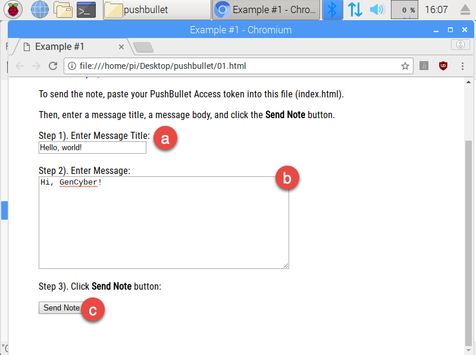

# An Introduction to Working With Pushbullet Using JavaScript

In this exercise, we will examine the Pushbullet service. Pushbullet allows us to connect our mobile devices together and then send data such as notes, messages, links, etc. to our mobile devices. This is a handy cross-platform solution for sharing information between devices such as desktop computers and cellphones. 

## Objective

- ·Use the Pushbullet Application Programming Interface (API) to send a message to your mobile device. 

## First Principles

This exercise covers the following first principle(s):

1. Minimization

## Part 1: Registering for Pushbullet and Obtaining an API Access Key

1. Browse to [www.pushbullet.com](http://www.pushbullet.com) 

2. Register for a new account or sign into an existing account. 

3. Once registered, obtain a new Access Token so we can work with the Pushbullet API:

   a.     Click on your profile picture

   b.     Click **My Account**

4. Scroll down and click **Create Access Token** beneath *Access Tokens* 

5. This will create a new access token, which will we will use later (note: only part of the token is shown in the screenshot below).

6. Leave the window or tab displaying your Pushbullet access token open and proceed to Part 2. We’ll need this Access Token, so make sure you don’t close the browser tab or window! 

## Part 2: Install Pushbullet on Your Mobile Device

1. Open the **App Store** or the **Google Play Store**
2. Browse for **Pushbullet** and install.

## Part 3: Tinkering with Pushbullet in the Web Browser

1. Download the **pushbullet.zip** file to your RaspberryPi’s desktop. by [clicking on this link.](includes/pushbullet.zip)
2. Unzip the file by right-clicking on the file and then clicking **Extract Here**

3. Open the **pushbullet** folder by double-clicking on the folder icon.
4. Open the **01.html** file in *Text Editor*:
   a. Right-click on **01.html** 
   b. Click **Text Editor**

5. Find the line of code that begins with **PushBullet.APIKey** as shown below.

6. Return to your browser and find your Pushbullet Access Token  

7. Copy the Push Bullet access token and replace text ***KEY_HERE*** – make sure to keep the two sets of double quotes on each end of the access token. Your final result should look like what’s shown in the next image – note how the ***KEY_HERE*** text has been replaced with the value of the access token. 
   a. **Note** how the double quotes at the beginning and the end of the text are still there – it’s very important not to remove the quotes or add additional quotes.

8. Save **01.html** and exit *Text Editor*:
   a. Click **File > Save**
   b. Click **File > Quit**
9. Open **01.html** in your web browser by double-clicking on the file.  It should look like the image below:

10. Let’s use Pushbullet’s web services to push a message to our cellphone:
      a. Enter a message into the **Title** field.
      b. Enter a message into the **Message** field.
      c. Click **Send Note**
      b. Click **File > Quit**

11. The alert should appear on your mobile device and other other device(s) associated with your Pushbullet account. The image below shows an example of how your push alert might appear on your mobile device. Note how the note title appears on the home screen. In the PushBullet application, both the note title and the note content appear. 

12. Congratulations! You have successfully used the Pushbullet Application Programming Interface (API) to push a message to your cellphone using Pushbullet web services.

## Part 4: Pushbullet Responses

1. After sending your message to Pushbullet, you should see a message appear at the bottom of the page.
2. If your key was correct and your message successfully pushed through Pushbullet, the response will be similar to the response shown below. The response is a **J**ava**S**cript **O**bject **N**otation or *JSON* object. We won’t get into the details of *JSON* other than to say it’s a lightweight format to send information across the Internet. The *JSON* object shows the server pushed the message and it returns information about your message, the message recipient, and your Pushbullet account.

3. In the event your API key was incorrect and your message was not successfully pushed through Pushbullet, the response will be similar to the response shown below.  As with the response indicating success, the response indicating failure is a *JSON* object.

## First Principles Discussion

The opening page of this exercise states this exercise covers the principle of **minimization.**  

1. The goal of *minimization*is to simplify and decrease the number of ways software can be exploited. How does requiring an access token to interact with the Pushbullet service accomplish this?