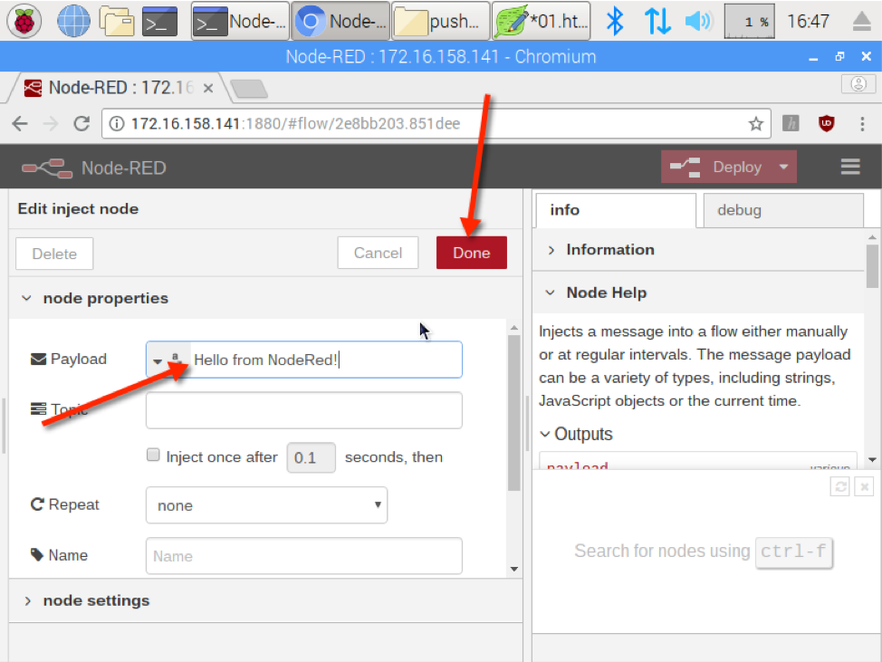

# An Introduction to Working With Pushbullet Using NodeRed

In this exercise, we will examine the Pushbullet service using NodeRed. Unlike the previous exercise, there will be node coding involved; however, pay attention to how easy NodeRed makes it to interact with a web service without needing to know much about the service.

## Objective

* Use NodeRed to interact with the Pushbullet Application Programming Interface (API) to send a message to your mobile device.

## First Principles

This exercise covers the following first principle(s):

1. Minimization
2. Simplicity

## Adding the Pushbullet node to the NodeRed Palette

1. To use Pushbullet with NodeRed, we will have to add a new *node* to our NodeRed palette:
   a. In NodeRed, click on the “more” or “hamburger” menu icon.
   b. Click **Manage palette**

2. When the *User Settings* screen appears, click the **Install** tab.

3. In the *Search Nodes* field, type ``pushbullet``

4. ``node-red-node-pushbullet`` should appear in the list of available palettes. Click the **install** button to install the palette.

5. If the following dialog appears, click **Install**

6. Once the new palette has been installed, click **Close.**

7. Two new *pushbullet* palettes should appear in the *mobile* group in NodeRed.

>NOTE: If the new palettes do not appear, shut down Node Red and close the Node Red tab or Window in your browser. Then, restart the Node Red server and browse to Node Red in a new tab or browser window.

8. Draf a *pushbullet* **push** node on to your Flow canvas - a *push* node will have a small box on the left-hand side of the node.

9. Double-click on the *pushbullet* push node to display the node edit pane.

10. Let's add a new pushbullet config. To do this, click the **pencil** incon.

11. Return to the browser tab or window displaying your Pushbullet Access Token.
12. Highlight and copy the Access Token.

>NOTE: If you closed Pushbullet, you can also find the access token in **01.html** from the previous exercise! If you copy the access token from **01.html** -- copy only the text *inside* the quotation marks - do not copy the quotation marks.

13. Switch back to the broswer tab or window displaying NodeRed.
14. Let's update our *pushbullet* configuration:
      a. Enter a name in the **Name** field.
      b. Paste the Pushbullet Access Token into the *API-key* field.
      c. Click **Update**

> NOTE: If Chromium prompts you to, "...save your password for this side?" - click **Never.**

15. In the *Edit pushbullet node* panel:
      a. Select a device from the *Device ID* dropdown - note: if no devices appear, your API Access Token may be incorrect!
      b. Select **Note** from the *Type* drop down.
      c. Enter a message title – this is the title of the message that will appear on your mobile device.
      d. Optional: Enter a name for the specific Pushbullet node.
      e. When finished, click ** Done**

> NOTE:  If you were pushing an image from a PI camera, you would want to use the File type to pass the image taken by the camera to your mobile device via Pushbullet.

16. We need to trigger an event in order to push an event through Pushbullet. The easiest way to do this is to add an *inject* node.  In NodeRed look for the the **input** panel and drag an inject node on to your canvas.

17. Let's edit the *inject* node. To do this, double-click on the new *inject* node - this will display the *Edit inject node* panel.
18. Select **string** from the *Payload* drop down.

19. Type the content of your Pushbullet note into the *Payload* text field. Then, click **Done.**

21. Now, connect the two nodes by clicking the box on the right-hand side of the *inject* node and dragging down to the box on the left-hand side of the *pushbullet* node.

23. Let's save our flow by clicking the **Deploy** button.

24. When successfully saved, a message will appear at the top of the browser.

25. Let's test our flow. To do this, trigger the inject by clicking on the box to the left of the *inject* node.

26. On successfully pushing to Pushbullet, you should see a message appear at the top of the browser.

27. Congratulations! You have successfully used NodeRed to push a message to your cellphone using Pushbullet web services!

## First Principles Discussion

The opening page of this exercise states this exercise covers the principles of **minimization** and **simplicity.**

1. The goal of *minimization*is to simplify and decrease the number of ways software can be exploited. How does requiring an access token to interact with the Pushbullet service accomplish this?
2. The goal of *simplicity* is to make things simpler - if something is less complicated, it’s likely to have problems and easier to troubleshoot and fix. Compare the previous exercise to this exercise? Which was simpler? Which was simpler for you to understand? As we add more nodes to a flow in NodeRed, and our flows become more complicated, what threats lie in the increased complexity?